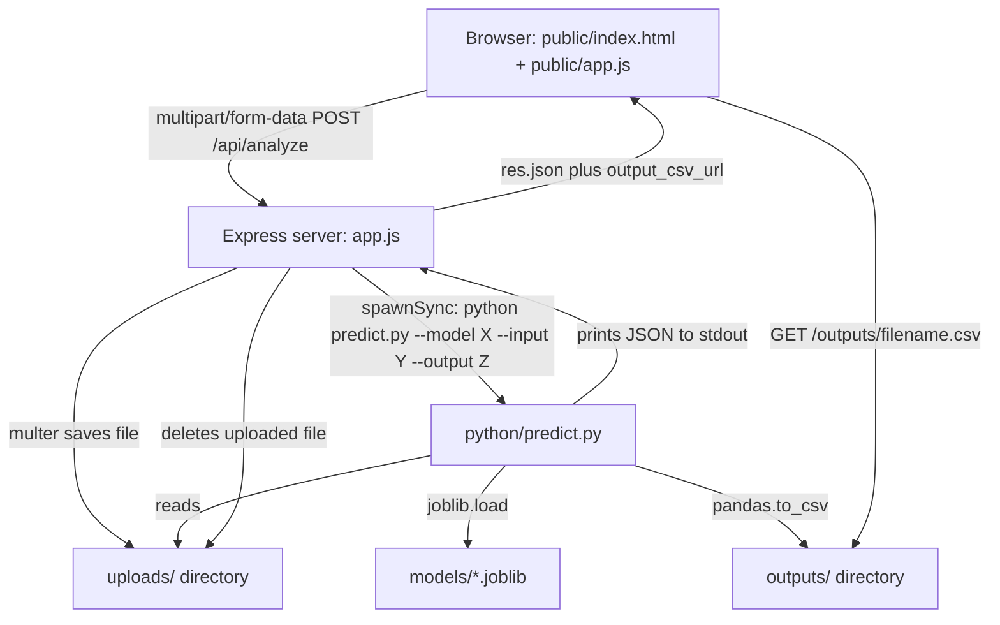
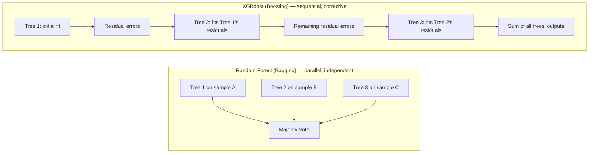
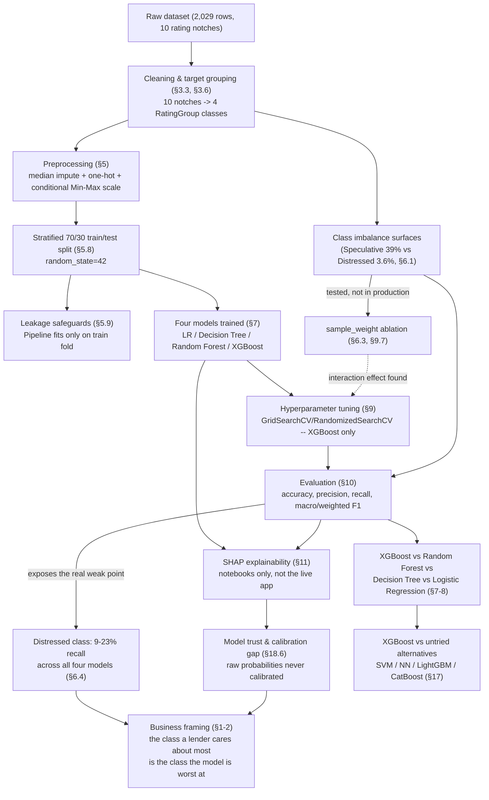

# CreditSight — Complete FYP Study Guide

> **How to use this document:** This is your defence preparation knowledge base. It explains every concept from first principles, describes exactly what your code does (not generic textbook ML), and prepares you for hostile evaluator questions. Read it section by section, not all at once. Sections marked **⚠️ Not implemented in this project** describe techniques a typical credit-risk FYP *could* use — your prompt asked about them — but your actual code does not use them. Do not claim you used them in your defence. Instead, use those sections to explain *why* you made the simpler choice and what you would add given more time. That is a legitimate, defensible engineering answer.

> **A note on honesty, read this first:** I inspected your actual repository — `python/common.py`, `python/train_models.py`, `python/predict.py`, `app.js`, `public/app.js`, `public/index.html`, `requirements.txt`, `package.json`, `models/training_summary.json`, the raw dataset, and all four Jupyter notebooks. Everything in this guide describing "what the project does" is grounded in that code, not assumption. Where your original request listed a technique (SMOTE, Optuna, Yeo-Johnson, feature scaling, cross-validation, a Flask/FastAPI backend) that is **not** present in your code, I say so explicitly rather than inventing content you'd be caught out on in front of an examiner. This is more valuable to you than a document that sounds impressive but doesn't match what you can actually show if asked to open VS Code.

---

## Table of Contents

1. Executive Summary
2. Business Analysis
3. The Dataset
4. System Architecture
5. Data Preprocessing Pipeline (what `common.py` actually does)
6. Class Imbalance (present in your data, not actively corrected — explained)
7. Machine Learning Models (Logistic Regression, Decision Tree, Random Forest, XGBoost)
8. XGBoost Masterclass
9. Hyperparameter Tuning (documented `GridSearchCV`/`RandomizedSearchCV` work for XGBoost; undocumented for the other three models; what Optuna would still add)
10. Model Evaluation — every metric explained
11. Explainable AI — SHAP in your notebooks
12. Code Walkthrough — every file, function by function
13. Technology Stack — every tool, why chosen, alternatives
14. Glossary (alphabetical)
15. 100+ Evaluator Questions with Model Answers
16. Distinction-Level Critique of Your Own Project
17. XGBoost vs. Untried Alternatives (SVM, Neural Networks, LightGBM, CatBoost)
18. Term Encyclopedia — The High-Yield Terms, Deepened
19. Mathematics Appendix — Every Formula, Consolidated
20. Design Decisions — Rapid-Fire Defence
21. Common Mistakes — What Trips Up Students in General ML Vivas
22. Distinction Tiers — What Separates Pass, Credit, Distinction, High Distinction
23. Hidden Questions — What Separates Top Students
24. Knowledge Map — How Everything Connects
25. Feynman Test — Explaining This Project at Every Level
26. Expanded Question Bank — Additional Questions by Difficulty Tier
27. Final Distinction Checklist

---

# 1. Executive Summary

## 1.1 What CreditSight Is

CreditSight is a web application that predicts a **corporate credit rating category** for a company from its financial ratios. A user uploads a CSV or Excel file containing a company's financial ratios (liquidity ratios, profitability ratios, leverage ratios, etc.) through a browser page, picks one of four trained machine learning models, and the system returns a predicted rating bucket — **Investment-High**, **Investment-Low**, **Speculative**, or **Distressed** — along with a confidence score, per-class probabilities, and a downloadable CSV of results.

Concretely, the system is:

- A **Node.js + Express** web server (`app.js`) that serves a single-page frontend and exposes one API endpoint, `POST /api/analyze`.
- A **static HTML/CSS/JavaScript frontend** (`public/`) with a file upload form and a results dashboard (confusion matrix, classification report, per-row predictions, CSV download).
- Four **pre-trained scikit-learn / XGBoost pipelines**, serialized as `.joblib` files in `models/`, trained once offline by `python/train_models.py` against a labelled dataset of ~2,000 companies (`data/set A corporate_rating.csv`).
- A **Python prediction script** (`python/predict.py`) that Node invokes as a subprocess for every upload: it loads the requested model, validates and transforms the uploaded rows into the exact feature shape the model expects, runs inference, and prints a JSON payload back to Node, which forwards it to the browser.
- Four **Jupyter notebooks** (one per model) that mirror the training script step-by-step and add visual diagnostics (a confusion-matrix heatmap and a SHAP feature-importance bar chart) that the production scripts do not produce.

## 1.2 The Machine Learning Problem, Precisely

This is a **supervised, multi-class classification problem**. "Supervised" means the training data contains both the inputs (financial ratios) and the correct answers (credit ratings), so the model learns a mapping from one to the other by comparing its guesses against the known correct labels and adjusting. "Multi-class" means there are more than two possible output categories (four rating buckets), as opposed to a "binary" problem with only two outcomes (e.g., default / no default).

Formally: given a feature vector $x \in \mathbb{R}^{25}$ (24 numeric financial ratios plus one categorical Sector feature, one-hot encoded), learn a function $f(x) \rightarrow y$ where $y \in \{\text{Investment-High}, \text{Investment-Low}, \text{Speculative}, \text{Distressed}\}$.

The original dataset has **ten** fine-grained rating notches (AAA, AA, A, BBB, BB, B, CCC, CC, C, D — the standard S&P/Fitch-style letter grading scale). Your project does not train a 10-class model. Instead it **groups** those ten notches into four broader buckets before training (this mapping lives in `RATING_GROUP_MAPPING` in `common.py`, explained in detail in §5). This is a genuine, defensible design decision, and you must be able to explain *why* you collapsed 10 classes into 4 — see §16 for the strongest framing of this in your defence, and be ready for the obvious follow-up: "why not just predict all 10 grades?"

## 1.3 The Business Problem

Credit ratings answer one question for a lender or investor: **"How likely is this company to fail to pay back what it owes, and how severely?"** Rating agencies (S&P, Moody's, Fitch) have historically answered this question through a combination of quantitative financial analysis and qualitative human judgement (management quality, industry outlook, macroeconomic exposure), delivered as a letter grade. These letter grades directly affect a company's borrowing cost — a company rated AAA can issue debt far more cheaply than one rated CCC, because investors demand a higher return (interest rate) to compensate for higher perceived default risk.

For **small and medium enterprises (SMEs)**, formal agency ratings are often unavailable or prohibitively expensive to obtain, and banks doing SME credit assessment frequently rely on manual, judgement-heavy internal scoring performed by credit analysts reading financial statements. This is slow, inconsistent between analysts, and hard to scale. A machine-learning model trained on the *pattern* between financial ratios and known agency ratings for large, already-rated companies can, in principle, be used to approximate what a rating *would* be for a company that doesn't have one, purely from its financial ratios — instantly, consistently, and cheaply.

**This is the gap your project targets:** replace or assist a manual, ratio-by-ratio judgement call with a model that has learned the statistical relationship between 24 standard financial ratios and rating outcomes across ~2,000 historical examples.

## 1.4 Expected Users and Business Impact

- **Credit analysts / SME lending officers** — use the tool as a fast first-pass screening step before deeper manual due diligence, not as the final word.
- **Small finance teams without a Bloomberg terminal or ratings subscription** — get an indicative risk bucket for prospective counterparties or for themselves.
- **You, the student** — this is also legitimately a demonstration of the full ML engineering lifecycle: data cleaning, model training, comparative evaluation, and deployment behind a web interface — which is exactly what an examiner wants to see regardless of whether the underlying accuracy is publication-quality.

## 1.5 Limitations (be upfront about these — evaluators respect this more than false confidence)

1. **The model predicts rating buckets, not real-world default.** It was trained to imitate historical agency ratings, not to predict actual bankruptcy or missed payments. Rating agencies themselves are imperfect (they were widely criticised after 2008 for mis-rating mortgage-backed securities), so the model inherits any bias or lag already present in agency ratings.
2. **The best model (XGBoost) achieves roughly 69% test accuracy** (Random Forest is close behind at 68.5%) on a 4-class problem where the "always guess the majority-ish class" baseline is meaningfully lower but not negligible (see §10 for exact baseline maths). This is a reasonable but not deployment-grade result for real lending decisions.
3. **The "Distressed" class is severely under-represented** (22 of 609 test rows — see §6), and every model's recall on that class is poor. This is precisely the class a bank cares about most, which is an important, honest weakness to raise proactively.
4. **The dataset covers large, already-rated, mostly US public companies** (this is inferable from the presence of Rating Agency Name, Symbol, and Sector fields typical of listed-company datasets). Applying it to unlisted SMEs is an extrapolation beyond the training distribution — a point examiners specifically probe.
5. **No temporal validation.** The split is a random 70/30 shuffle, not an out-of-time split (train on earlier years, test on later years). In real credit risk modelling, out-of-time validation is considered best practice because relationships between ratios and ratings can drift over economic cycles.
6. **No model monitoring, retraining pipeline, or drift detection** exists — the deployed models are static artifacts trained once.

## 1.6 Plain-English Summary (for a non-technical evaluator)

Imagine you are a bank and a company you've never heard of asks you for a loan. You want a rough, fast sense of "is this a safe company or a risky one?" before your credit team spends days poring over financial statements. CreditSight looks at the same kind of financial ratios a human analyst would look at — how much cash the company has relative to its short-term debts, how profitable it is, how much debt it's carrying relative to its assets — and compares that pattern to thousands of companies whose risk level is already known (because a professional rating agency already rated them). It then says: "based on ratios like this, companies have historically ended up in this risk bucket." It is a **decision-support tool**, not a replacement for a human credit officer's final sign-off.

---

# 2. Business Analysis

## 2.1 The Business Problem in Detail

Credit risk is, at its core, **the risk that a borrower does not repay a lender in full and on time**. Every lending decision — a bank issuing a business loan, an investor buying a corporate bond, a supplier extending trade credit — depends on estimating this risk. The output of that estimation is usually expressed as a **credit rating**: a discrete grade (AAA down to D) that acts as a shorthand for "how risky is lending to this entity."

## 2.2 SME Credit Risk Specifically

Small and Medium Enterprises (SMEs) are a distinct problem from large corporate credit risk for several reasons:

- **Data scarcity.** Large public companies file audited, standardized financial statements (10-Ks, quarterly reports) and are followed by equity/credit analysts. SMEs often have unaudited or thin financial records.
- **No agency coverage.** Moody's/S&P/Fitch rate large bond issuers because bond investors pay for that research. SMEs typically don't issue public bonds, so no agency bothers rating them — there is no "ground truth" rating to check a prediction against, which is a scientific limitation worth naming explicitly.
- **Higher failure base rates and higher volatility.** SMEs are statistically more fragile than large caps (thinner cash buffers, concentrated customer bases, weaker access to emergency financing), so a bank's error cost from misjudging an SME is proportionally higher relative to the loan size.
- **Manual analyst assessment doesn't scale.** A bank with thousands of SME loan applications per quarter cannot afford a senior credit analyst's full judgement-based review for each one.

## 2.3 The Existing Manual Process and Its Problems

A traditional bank SME credit process typically involves a credit officer manually:

1. Collecting financial statements (balance sheet, income statement, cash flow statement).
2. Computing standard ratios (liquidity, profitability, leverage, efficiency).
3. Comparing those ratios against internal or industry benchmarks.
4. Applying qualitative overlays (management interviews, industry outlook, collateral quality).
5. Assigning an internal risk grade, often via a scorecard or committee decision.

**Problems with this process:**

- **Inconsistency ("analyst drift"):** two analysts can reasonably reach different grades for the same company because judgement calls are subjective.
- **Speed:** a full manual review can take days; a model inference takes milliseconds.
- **Cost:** senior analyst time is expensive and is a fixed cost per application regardless of loan size, which makes small loans disproportionately expensive to underwrite manually.
- **Non-reproducibility:** it is hard to audit *why* a particular grade was given, beyond a written rationale that may itself be post-hoc.

## 2.4 Benefits an ML Approach Offers (and honestly, its costs)

**Benefits:**

- Consistency: the same input always produces the same output (a property manual judgement does not have).
- Speed and scale: thousands of predictions per second once trained.
- A quantifiable, reproducible baseline that a human analyst can use as a starting point rather than a blank page.
- Feature importance / SHAP analysis (§11) can make the model's reasoning partially transparent, which supports rather than replaces human review.

**Costs / risks (raise these proactively in your defence, it signals maturity):**

- A model is only as good as its training labels; if agency ratings encode any systematic bias (e.g., sector bias, home-country bias), the model reproduces that bias.
- A wrong automated decision at scale can do more damage, faster, than a wrong manual decision, because it is applied uniformly and without a sanity-check step.
- Regulatory context: real-world credit models used for lending decisions are subject to model risk management regulation (e.g., SR 11-7 in the US, or equivalent regulator guidance elsewhere) requiring documented validation, explainability, and ongoing monitoring — none of which this prototype implements, and that is fine for an FYP but worth naming as "production readiness gap," not oversight.

## 2.5 Project Scope

**In scope (what the code actually does):**

- Train four classifiers on one labelled dataset of corporate financial ratios mapped to a 4-class rating grouping.
- Serve those trained models via a web UI that accepts a user-uploaded file and returns predictions, confidence, and standard classification metrics computed on the *original held-out test set* (not on the uploaded file, since the uploaded file has no ground-truth labels to compare against — an important distinction, see §12.3).
- Provide comparative model exploration notebooks with confusion matrices and SHAP explanations for offline analysis.

**Out of scope (name these explicitly so an evaluator doesn't assume you missed them):**

- Real-time data ingestion from financial APIs or accounting systems.
- Retraining or continuous learning from new data.
- Regulatory-grade model validation, bias auditing, or explainability delivered *in the live app* (SHAP exists only in notebooks).
- Probability calibration, cost-sensitive thresholding, or business-rule overlays.
- Authentication, multi-user accounts, or audit logging of predictions.
- Predicting actual default/bankruptcy events (as opposed to imitating agency rating buckets).

## 2.6 Project Limitations, Restated for the Business Audience

Tell a non-technical evaluator: *"This tool gives an indicative, ratio-based risk bucket in seconds, learned from ~2,000 historical companies. It is a screening aid, not a lending decision by itself, and it is weakest exactly where a bank needs the most caution — distinguishing genuinely distressed companies, which are rare in the training data."*

---

# 3. The Dataset

## 3.1 Source and Identity

The training data lives at `data/set A corporate_rating.csv`. I loaded it directly to verify its actual structure. It contains **2,029 rows and 31 columns**. Each row represents one company's credit rating assessment on a given date by a named rating agency, together with 25 financial-ratio-style features. The filename ("Set A corporate rating") and column set (`Rating`, `Name`, `Symbol`, `Rating Agency Name`, `Date`, `Sector`, followed by financial ratios) match a well-known public Kaggle dataset of US corporate credit ratings compiled from company financial statements — you should confirm with your supervisor whether this is the exact dataset you were given, and cite its origin in your report; I cannot verify external provenance beyond what's in the repository. **State this as an assumption if you are unsure of the exact source** — evaluators will ask "where did this data come from" and "is it publicly available."

## 3.2 Dataset Structure: Every Column Explained


| #     | Column                     | Type                 | Role                                  | Meaning                                                                                                                                                                                                                                                                                                                        |
| ----- | -------------------------- | -------------------- | ------------------------------------- | ------------------------------------------------------------------------------------------------------------------------------------------------------------------------------------------------------------------------------------------------------------------------------------------------------------------------------ |
| 1     | `Rating`                   | categorical (string) | **Target (raw)**                      | The agency-assigned letter grade: one of AAA, AA, A, BBB, BB, B, CCC, CC, C, D. This is the ground truth the whole project is built around.                                                                                                                                                                                    |
| 2     | `Name`                     | categorical (string) | Identifier — dropped before training | Company name. Dropped because it's a unique/near-unique identifier that would let a tree-based model "memorize" companies instead of learning general ratio patterns (a textbook data-leakage risk, see §5.9).                                                                                                                |
| 3     | `Symbol`                   | categorical (string) | Identifier — dropped                 | Stock ticker symbol. Same reasoning as`Name`.                                                                                                                                                                                                                                                                                  |
| 4     | `Rating Agency Name`       | categorical (string) | Identifier — dropped                 | Which agency (e.g., S&P, Moody's, Fitch-equivalent) issued the rating. Dropped in this project; in principle it*could* be a legitimate feature (agencies have known differences in rating philosophy) but including it also risks leaking agency-specific labelling quirks rather than teaching the model financial reasoning. |
| 5     | `Date`                     | categorical (string) | Identifier — dropped                 | Rating date. Dropped rather than used to build a proper time-based train/test split — see the discussion of temporal validation in §5.8 and the critique in §16.                                                                                                                                                            |
| 6     | `Sector`                   | categorical (string) | **Feature (kept)**                    | The company's industry sector, e.g., Energy, Technology, Finance, Health Care (12 sectors observed in the data). This is the**only categorical feature actually used by the models** — it is one-hot encoded (§5.4).                                                                                                         |
| 7–30 | 24 financial ratio columns | numeric (float)      | **Features (kept)**                   | Explained individually in §3.4.                                                                                                                                                                                                                                                                                               |

Columns 2–5 are removed automatically by name-matching logic in `common.py` (the `IDENTIFIER_ALIASES` list), not by hardcoding column positions — this matters because it makes the pipeline somewhat dataset-agnostic (see §5.2).

## 3.3 The Target Variable and Its Transformation

**Raw target:** `Rating`, with the observed class distribution in the full 2,029-row dataset:


| Rating | Count | % of data |
| ------ | ----- | --------- |
| BBB    | 671   | 33.1%     |
| BB     | 490   | 24.2%     |
| A      | 398   | 19.6%     |
| B      | 302   | 14.9%     |
| AA     | 89    | 4.4%      |
| CCC    | 64    | 3.2%      |
| AAA    | 7     | 0.3%      |
| CC     | 5     | 0.2%      |
| C      | 2     | 0.1%      |
| D      | 1     | 0.05%     |

Look at the tail: **AAA has 7 examples, CC has 5, C has 2, D has exactly 1.** No machine learning algorithm can learn a statistically reliable pattern for a class it has seen once. This single fact is the *real* justification for grouping ratings — not a stylistic choice, but a statistical necessity. Make this your first-line answer whenever asked "why did you group the ratings instead of predicting all 10?"

**Grouped target — `RatingGroup`:** built by `create_rating_group()` in `common.py` using this exact mapping:

```python
RATING_GROUP_MAPPING = {
    "Investment-High": ["AAA", "AA", "A"],
    "Investment-Low":  ["BBB"],
    "Speculative":     ["BB", "B"],
    "Distressed":      ["CCC", "CC", "C", "D"],
}
```

This mirrors the real-world **investment-grade vs. speculative-grade (junk) boundary** used throughout the bond markets: BBB-and-above is "investment grade," BB-and-below is "speculative grade" ("junk bonds"). Your mapping refines this further by splitting investment grade into High (A-and-above) and Low (BBB only), and by isolating CCC-and-below as "Distressed" — companies at meaningful risk of default. This is a sound, industry-recognizable design decision and you should say so explicitly: *"I did not invent this grouping arbitrarily — it follows the standard investment-grade/speculative-grade boundary used across bond markets, refined into four tiers to preserve more granularity than a simple binary split while remaining statistically learnable."*

**Resulting `RatingGroup` distribution** (computed from the training summary's confusion matrix row totals on the 609-row test set, which is a stratified 30% sample so the full-dataset proportions are the same up to rounding):


| RatingGroup     | Test-set support | Approx. % |
| --------------- | ---------------- | --------- |
| Speculative     | 238              | 39.1%     |
| Investment-Low  | 201              | 33.0%     |
| Investment-High | 148              | 24.3%     |
| Distressed      | 22               | 3.6%      |

This is still an imbalanced target (3.6% vs 39.1%), but far more learnable than the 10-class version where the smallest class was 0.05%. See §6 for a full treatment of class imbalance.

Note one more subtlety worth knowing cold: **`prepare_training_frame` drops any row whose `Rating` value doesn't map into one of the four buckets** (`cleaned.dropna(subset=["RatingGroup"])`). In this dataset every row's rating is a valid clean grade, so `rows_after_target_mapping` equals `rows_before_cleaning` (2029 = 2029, confirmed in `training_summary.json`), but this safety step matters generically: if a future uploaded training file contained a malformed or unmapped rating string, that row is silently excluded rather than crashing the whole training run.

## 3.4 The 24 Financial Ratio Features, With Full Meaning

Every one of these is a standard financial statement ratio. Grouping them by the type of risk they measure will help you answer "why does this ratio matter to a bank" fluently.

### Liquidity ratios (can the company pay its short-term bills?)


| Ratio                          | Formula                                              | Interpretation                                                                                                                                                                                                                                             |
| ------------------------------ | ---------------------------------------------------- | ---------------------------------------------------------------------------------------------------------------------------------------------------------------------------------------------------------------------------------------------------------- |
| `currentRatio`                 | Current Assets ÷ Current Liabilities                | Above 1 means the company has more short-term assets than short-term debts due within a year. Banks like to see this comfortably above 1; too high (e.g. >3) can also signal inefficient use of capital (idle cash instead of being invested).             |
| `quickRatio`                   | (Current Assets − Inventory) ÷ Current Liabilities | A stricter version of the current ratio that excludes inventory, which may not convert to cash quickly. Also called the "acid-test ratio."                                                                                                                 |
| `cashRatio`                    | Cash & Cash Equivalents ÷ Current Liabilities       | The strictest liquidity measure — can the company pay its immediate bills with cash alone, with no reliance on selling anything?                                                                                                                          |
| `daysOfSalesOutstanding` (DSO) | (Accounts Receivable ÷ Revenue) × 365              | Average number of days it takes the company to collect payment after a sale. Lower is generally better (faster cash collection); very high DSO can signal customers struggling to pay, which is a leading indicator of the company's own cash-flow stress. |

### Profitability ratios (does the company make money, and how efficiently?)


| Ratio                            | Formula                                       | Interpretation                                                                                                                                                               |
| -------------------------------- | --------------------------------------------- | ---------------------------------------------------------------------------------------------------------------------------------------------------------------------------- |
| `netProfitMargin`                | Net Income ÷ Revenue                         | The share of every revenue dollar that becomes final, after-everything profit.                                                                                               |
| `pretaxProfitMargin`             | Pre-tax Income ÷ Revenue                     | Same idea, before tax effects — isolates operating and financing performance from tax jurisdiction differences.                                                             |
| `grossProfitMargin`              | (Revenue − Cost of Goods Sold) ÷ Revenue    | How much margin is left after only direct production costs — a measure of pricing power / production efficiency.                                                            |
| `operatingProfitMargin`          | Operating Income ÷ Revenue                   | Profitability from core operations only, before interest and tax — isolates the business itself from how it's financed.                                                     |
| `returnOnAssets` (ROA)           | Net Income ÷ Total Assets                    | How efficiently the company turns its total asset base into profit.                                                                                                          |
| `returnOnCapitalEmployed` (ROCE) | EBIT ÷ (Total Assets − Current Liabilities) | Profitability relative to*all* capital actually deployed in the business (debt + equity), a favourite of credit analysts because it's capital-structure-neutral.             |
| `returnOnEquity` (ROE)           | Net Income ÷ Shareholders' Equity            | Return generated for equity holders specifically — note this ratio is mechanically inflated by higher debt (leverage), so it must always be read alongside leverage ratios. |

### Efficiency / turnover ratios (how well does the company use its assets?)


| Ratio                | Formula                                | Interpretation                                                                                                                                                                     |
| -------------------- | -------------------------------------- | ---------------------------------------------------------------------------------------------------------------------------------------------------------------------------------- |
| `assetTurnover`      | Revenue ÷ Total Assets                | How much revenue is generated per dollar of assets — a measure of asset-use efficiency.                                                                                           |
| `fixedAssetTurnover` | Revenue ÷ Net Fixed Assets            | Same idea, focused on property/plant/equipment specifically.                                                                                                                       |
| `payablesTurnover`   | Cost of Goods Sold ÷ Accounts Payable | How quickly the company pays its own suppliers; very low turnover (slow paying) can be a red flag for cash stress, but can also just reflect strong supplier negotiating leverage. |

### Leverage / solvency ratios (how much debt risk is the company carrying?)


| Ratio                     | Formula                              | Interpretation                                                                                                                                                                                                                                                                                                                                        |
| ------------------------- | ------------------------------------ | ----------------------------------------------------------------------------------------------------------------------------------------------------------------------------------------------------------------------------------------------------------------------------------------------------------------------------------------------------- |
| `debtEquityRatio`         | Total Debt ÷ Shareholders' Equity   | The classic leverage ratio — how much the company relies on debt vs. owner capital. Higher means more financial risk and more fixed interest obligations regardless of how the business is performing.                                                                                                                                               |
| `debtRatio`               | Total Debt ÷ Total Assets           | What proportion of the company's total assets are debt-financed.                                                                                                                                                                                                                                                                                      |
| `companyEquityMultiplier` | Total Assets ÷ Shareholders' Equity | Another leverage lens — how many dollars of assets are supported by each dollar of equity; this is the third factor in the classic**DuPont ROE decomposition** (ROE = Net Margin × Asset Turnover × Equity Multiplier), which is a great fact to know for a "do you understand these ratios or did you just copy column names" evaluator question. |

### Cash flow ratios (does reported profit actually turn into cash?)


| Ratio                                | Formula                                   | Interpretation                                                                                                                                                                                                                      |
| ------------------------------------ | ----------------------------------------- | ----------------------------------------------------------------------------------------------------------------------------------------------------------------------------------------------------------------------------------- |
| `freeCashFlowOperatingCashFlowRatio` | Free Cash Flow ÷ Operating Cash Flow     | What fraction of cash generated from operations remains after capital expenditure — a measure of how "expensive" the business is to maintain and grow.                                                                             |
| `freeCashFlowPerShare`               | Free Cash Flow ÷ Shares Outstanding      | Free cash flow scaled to a per-share basis.                                                                                                                                                                                         |
| `cashPerShare`                       | Cash & Equivalents ÷ Shares Outstanding  | Cash cushion per share.                                                                                                                                                                                                             |
| `operatingCashFlowPerShare`          | Operating Cash Flow ÷ Shares Outstanding | Operating cash generation per share.                                                                                                                                                                                                |
| `operatingCashFlowSalesRatio`        | Operating Cash Flow ÷ Revenue            | Cash-conversion quality of revenue — a company with strong reported profit but weak operating cash flow is a classic earnings-quality warning sign (this is exactly the pattern that flagged some historical accounting scandals). |

### Tax and valuation


| Ratio                     | Formula                       | Interpretation                                                                                                                                                                                                                                                                         |
| ------------------------- | ----------------------------- | -------------------------------------------------------------------------------------------------------------------------------------------------------------------------------------------------------------------------------------------------------------------------------------- |
| `effectiveTaxRate`        | Tax Expense ÷ Pre-tax Income | The actual tax rate paid, which can differ from the statutory rate due to credits, jurisdictions, and deductions.                                                                                                                                                                      |
| `ebitPerRevenue`          | EBIT ÷ Revenue               | Earnings before interest and tax, scaled to revenue — closely related to operating margin.                                                                                                                                                                                            |
| `enterpriseValueMultiple` | Enterprise Value ÷ EBITDA    | A market-based valuation multiple; unusual to see alongside pure accounting ratios, and its presence tells you the source dataset blended fundamental accounting data with market pricing data — a good detail to mention if asked "are all your features from the same source type?" |

### Why banks care about all of this, in one sentence each

A bank ultimately wants to know **can this company pay us back, on time, with interest, and does it have a buffer if things go wrong.** Liquidity ratios answer "can they cover this quarter." Leverage ratios answer "how much cushion exists before creditors and equity holders start fighting over what's left." Profitability and efficiency ratios answer "is the underlying business actually good, so that today's numbers are likely to persist." Cash flow ratios answer "is the profit real cash, or just an accounting number."

## 3.5 Feature Engineering: What Was — and Was Not — Done

Be precise here, because it's a common area where a defence answer can drift into overclaiming. Checking `prepare_training_frame()` in `train_models.py` and the identical logic replicated in each notebook, the *only* feature engineering actually performed is:

1. **Target engineering**: mapping 10 letter grades → 4 `RatingGroup` buckets (§3.3). This *is* feature engineering in the broad sense (engineering the label), and it's the most consequential decision in the whole pipeline.
2. **Identifier removal**: dropping `Name`, `Symbol`, `Date`, `Rating Agency Name`, `Rating` before the model ever sees them.
3. **Automatic type coercion**: `infer_numeric_like_columns()` attempts to convert any column that looks numeric (≥80% of non-missing values successfully parse as a number) into a true numeric dtype, in case a source file stores numbers as text.

**No new ratios are derived from other ratios** (e.g. no ratio-of-ratios, no interaction terms, no polynomial features), **no binning of continuous ratios into categorical risk tiers**, **no domain-specific composite score** (like an Altman Z-Score-style weighted combination) is constructed. The 24 ratios are used exactly as delivered in the source CSV. This is a legitimate, simple, and honestly-described choice — say so plainly if asked, and be ready with "given more time, I would explore constructed features such as an Altman Z-Score-style composite, or interaction terms between leverage and profitability, since real credit models often combine ratios rather than feeding them to the model raw."

## 3.6 Label Mapping — Restated as a Standalone Concept

**What is label mapping?** It is the process of converting one representation of the target variable into another, coarser or differently structured representation, before training. Here it means collapsing `Rating` (10 ordered categories) into `RatingGroup` (4 ordered categories) via a fixed dictionary lookup.

**Why does it matter technically?** Because a classifier is trained to distinguish between whatever classes you hand it. If you feed it 10 classes where six of them have fewer than 100 examples total, the model will never see enough examples of the rare classes to learn a reliable decision boundary for them — it will simply default to predicting the common classes for almost everything, and its performance on rare classes will be close to random or zero. Coarsening the label increases the *effective sample size per class*, at the direct cost of losing the finer distinctions (e.g., you can no longer tell an AAA company from an A company — both become "Investment-High").

**The trade-off, stated precisely, is resolution vs. reliability.** Ten classes give a more informative answer if the model can actually learn them; four classes give a less informative but statistically trustworthy answer given only ~2,000 rows. With this dataset size, four classes is the right call, and defending that trade-off explicitly (rather than pretending ten classes would have worked equally well) is exactly what separates a distinction-level defence from a pass-level one.

## 3.7 Class Imbalance (introduced here, detailed treatment in §6)

Even after grouping, imbalance remains (Distressed at ~3.6% vs Speculative at ~39%). This is addressed in full in §6, including why your project does not apply SMOTE/oversampling and what the consequence of that choice is, visible directly in the confusion matrices (§10).

## 3.8 Missing Values

Verified directly: `df.isna().sum()` on the full raw dataset returns **zero missing values in every one of the 31 columns** (this exact fact is recorded in `training_summary.json` under `dataset_summary.missing_values`, and I independently confirmed it by loading the CSV). This is a clean dataset in that specific respect — there is no missing-value imputation *actually exercised* on this training run, even though the pipeline *is* built to handle missing values robustly (median imputation for numeric columns, most-frequent imputation for categorical columns — see §5.3) for the general case of a user-uploaded file that might have gaps. This distinction — "the training data happened to have none, but the pipeline is built to handle it because production uploads might" — is an important nuance to have ready.

## 3.9 Duplicate Rows

Also verified as zero: `duplicate_rows: 0` in the training summary. No deduplication logic was needed or triggered.

## 3.10 Outliers

**No explicit outlier detection or removal step exists in the code** (no IQR filtering, no z-score capping, no winsorization). Financial ratios are notoriously prone to extreme values — e.g., a company with near-zero equity produces an enormous `debtEquityRatio` or `companyEquityMultiplier` from a small denominator; a company with negative earnings and small revenue produces extreme profit margins. Tree-based models (Decision Tree, Random Forest, XGBoost) are **inherently robust to outliers** in a specific technical sense explained in §5.7 and §7, which is the honest, correct justification for not treating outliers explicitly — not "outliers weren't considered," but "outlier handling was implicitly delegated to model choice." Logistic Regression, by contrast, **is** sensitive to outliers (§7.1), and this is a real, verifiable contributor to its poor observed performance (37% accuracy, see §10) alongside the lack of feature scaling.

---

# 4. System Architecture

## 4.1 High-Level Shape

CreditSight is a **two-language, two-process system**: a Node.js web server handles HTTP and the browser-facing experience, and a Python subprocess handles all machine learning. These two halves never share memory or a live connection — they communicate purely through **files on disk and a JSON string over stdout**. This is a deliberate (if simple) architectural boundary, and understanding *why* it exists, and its trade-offs, is a strong thing to be able to discuss.



## 4.2 Why a Node.js Front Door for a Python ML Project?

This is a question examiners like to ask because it looks unusual at first glance. The honest, defensible answer: **the web-serving layer and the ML layer are genuinely different concerns**, and this project keeps them in the language best suited to each rather than forcing everything into one stack.

- **Node.js + Express** is a lightweight, well-understood choice for serving static files, handling file uploads (via `multer`), and exposing a small JSON API. It requires no additional framework overhead for what is a single-endpoint application.
- **Python** is the *de facto* standard for the ML ecosystem your project depends on: scikit-learn, XGBoost, pandas, joblib, and SHAP have no equally mature Node.js equivalents. There is no realistic way to do the ML work in JavaScript without reimplementing large portions of scikit-learn.

The alternative you should be ready to discuss (because it's the "obvious" alternative an examiner will propose) is **doing everything in Python with Flask or FastAPI**, removing the cross-language boundary entirely. That would be simpler in one sense (one process, one language, no subprocess spawning, no stdout-JSON contract to keep in sync) — see §13 for the full comparison and why this project's actual choice is still defensible for its scope.

## 4.3 The Subprocess Boundary — Mechanics

`app.js` calls Node's `child_process.spawnSync` (§12 covers this function call in full) to run:

```
python python/predict.py --model <model_key> --input <uploaded_file_path> --output <result_csv_path>
```

**`spawnSync` is a synchronous, blocking subprocess call** — Node pauses the current request handler until the Python process exits, then reads its `stdout`/`stderr`/exit code. This is simple to reason about but has a real consequence: **while one prediction request is running, that specific request's event loop turn is blocked on the OS process**, though other concurrent requests to different endpoints not hitting `spawnSync` continue to work in Node's single-threaded event loop because `spawnSync` blocks only within its own call stack, not other pending callbacks already scheduled — you should still be ready to explain that under heavy concurrent load, this pattern does not scale as well as an async job queue would, because each `/api/analyze` request effectively holds up Node's single thread for the full lifetime of the Python process (typically well under a second for this dataset size, but worth naming as a scaling limitation).

**Data contract between the two processes:**

- Input: a file path on disk (the uploaded CSV/Excel) plus a model key.
- Output: `predict.py` **prints exactly one JSON object to stdout** on success, or prints a JSON error object and exits with status code 1 on failure (see `error_json()` in `predict.py`, §12.3). Node parses this from `pythonResult.stdout`.
- Side effect: `predict.py` also writes a full predictions CSV to the `outputs/` folder, which Node exposes at a public URL and never parses itself.

This "exit-code-plus-stdout-JSON" pattern is a lightweight, standard way to treat a CLI script as a black-box function callable from another language, without building a persistent RPC server, message queue, or shared database. It is appropriate for the scale of this project (one prediction request at a time, not a high-throughput streaming pipeline) — say this if asked to justify it.

## 4.4 Full Request Lifecycle, Step by Step

1. **User visits `/`.** Express's static middleware (`express.static(PUBLIC_DIR)`) serves `public/index.html`, which loads `public/styles.css` and `public/app.js`.
2. **User selects a file and a model, clicks "Run".** `public/app.js`'s submit handler builds a `FormData` object and `fetch()`s `POST /api/analyze` with `multipart/form-data`.
3. **Multer intercepts the upload.** `app.js` configures `multer.diskStorage` to write the uploaded file straight to `uploads/`, renamed to `${Date.now()}_${originalname}` to avoid filename collisions, and a `fileFilter` rejects anything that isn't `.csv`/`.xlsx`/`.xls` by extension or MIME type, before the route handler even runs.
4. **Route validation.** The `/api/analyze` handler checks: was a file actually attached? Is the requested `model` one of the four allowed keys? Do all four `.joblib` model files actually exist on disk? Any failure here returns a `400` JSON error and skips Python entirely.
5. **Python subprocess runs.** `runPredictionScript()` builds a unique output filename (`creditsight_<model>_<timestamp>.csv`) and calls `spawnSync` as described in §4.3.
6. **`predict.py` does the real work** (fully detailed in §12.3): load the model artifact, load and validate the uploaded file, align its columns to what the model expects, run `pipeline.predict()` and `pipeline.predict_proba()`, write a results CSV, and print a JSON summary.
7. **Node relays the result.** If Python exited 0, Node parses its stdout JSON, attaches a browser-usable `output_csv_url` field (`/outputs/<filename>`), and returns it as the HTTP response body.
8. **Cleanup.** In a `finally` block, Node deletes the originally uploaded file from `uploads/` regardless of success or failure — the raw upload is never kept around; only the generated results CSV in `outputs/` persists (until manually cleared).
9. **Browser renders the result.** `public/app.js` populates the accuracy/F1 stat boxes, draws the confusion-matrix table, prints the classification report text, lists per-row predictions, and enables a "Download CSV" link pointing at the `outputs/` file Express serves statically.

## 4.5 Why Uploaded Files Are Deleted But Model Files Persist

The four `.joblib` files in `models/` are the **trained artifacts** — expensive to produce (they require the full training pipeline to run against the labelled dataset) and cheap to reuse repeatedly, so they persist indefinitely and are loaded fresh for every prediction request. The **uploaded file**, by contrast, is single-use input data with no reason to be retained once a prediction has been made from it — keeping it around indefinitely would be an unnecessary and growing storage/privacy liability for what could be a user's real financial data. Deleting it immediately after use is a sound, minimal data-retention practice, and you should be able to name it as such if asked about privacy handling.

## 4.6 Folder-by-Folder Purpose


| Folder      | Purpose                                                                                                                     | Persisted?                                                                                                                                                                                                                                                      |
| ----------- | --------------------------------------------------------------------------------------------------------------------------- | --------------------------------------------------------------------------------------------------------------------------------------------------------------------------------------------------------------------------------------------------------------- |
| `public/`   | Static frontend assets served directly by Express                                                                           | Source-controlled, static                                                                                                                                                                                                                                       |
| `python/`   | All ML logic: shared helpers (`common.py`), training entry point (`train_models.py`), prediction entry point (`predict.py`) | Source-controlled                                                                                                                                                                                                                                               |
| `models/`   | Serialized trained pipelines (`.joblib`) + `training_summary.json`                                                          | Generated by training, persists between server restarts                                                                                                                                                                                                         |
| `data/`     | The labelled training dataset                                                                                               | Source-controlled input                                                                                                                                                                                                                                         |
| `uploads/`  | Transient storage for user-uploaded files during a single request                                                           | Deleted immediately after each request (in principle — see §16 for an actual bug found in the repo: leftover files from past sessions are visible in`uploads/`, which suggests the cleanup path doesn't always fire, worth investigating before your defence) |
| `outputs/`  | Generated prediction result CSVs, one per request, served back to the browser for download                                  | Accumulates indefinitely — no cleanup job exists                                                                                                                                                                                                               |
| `notebook/` | Four exploratory/training notebooks, one per model, not used by the running application                                     | Source-controlled, for analysis only                                                                                                                                                                                                                            |

## 4.7 Why the Web App Doesn't Retrain on Upload

This is stated explicitly in your own `README.md`: *"The app uses the saved models only, so it does not retrain during uploads."* This is the correct design for a credit-risk tool: an uploaded company file is typically **one company's current ratios with no known correct rating** — there is nothing to train against, and even if there were, retraining a model on a single new labelled example on every upload would be statistically meaningless and would risk the model drifting based on unvetted user data. Training happens once, offline, in a controlled step (`train_models.py` against the curated `data/` file); prediction happens many times, online, against the frozen artifact. This train/serve separation is standard ML engineering practice and a good concept to name explicitly (**"training-serving skew"** avoidance is the formal name for keeping the exact same preprocessing logic on both sides — see §5.2 on why `common.py` is shared between `train_models.py` and `predict.py` specifically to prevent this class of bug).

---

# 5. Data Preprocessing Pipeline

## 5.1 What "Preprocessing" Means and Why It Exists

**Definition.** Data preprocessing is every transformation applied to raw data *before* it is handed to a learning algorithm, so that the data is in a form the algorithm can actually use, and so that the algorithm learns genuine patterns rather than artefacts of how the data happens to be recorded.

**Plain English.** Raw data almost never arrives in the shape a model needs. Text needs to become numbers. Missing entries need to be filled or flagged. Wildly different scales (e.g., a ratio between 0 and 1 next to a per-share dollar value in the hundreds) can confuse algorithms that are sensitive to magnitude. Preprocessing is the plumbing that makes the rest of the pipeline possible.

**Why it exists, conceptually.** Machine learning algorithms are mathematical procedures operating on numbers. `LogisticRegression` cannot make sense of the string `"Energy"` in the `Sector` column; a `SimpleImputer` cannot average a `NaN`. Preprocessing bridges the gap between "data as recorded by a human/system" and "data as required by a mathematical optimizer."

## 5.2 The Shared-Module Pattern: `common.py`

**The single most important architectural decision in your preprocessing pipeline** is that `train_models.py` and `predict.py` both import their cleaning logic from the same file, `python/common.py`, rather than each reimplementing it. Concretely: `standardize_columns`, `find_column`, `coerce_feature_types`, `infer_numeric_like_columns`, and `build_preprocessor` are all defined once in `common.py` and called identically from both scripts.

**Why this matters (and why an evaluator will ask about it):** if training and prediction preprocessed data even slightly differently — say, one script imputed missing numeric values with the median and the other with zero — the model would silently receive data at prediction time that doesn't match the statistical distribution it was trained on. This mismatch is called **training-serving skew**, and it is one of the most common real-world causes of an ML system that scores well offline but performs badly (or unpredictably) once deployed. Sharing one preprocessing module between train and serve code is the standard engineering defence against it, and it's a genuinely good decision in your codebase — claim credit for it explicitly in your report.

## 5.3 Step-by-Step: What Actually Happens to a Row of Data

Trace a single row of the training CSV through `prepare_training_frame()` (`train_models.py`) — the identical logic (minus the target-mapping step) happens to an uploaded file inside `predict.py`:

1. **`standardize_columns(df)`** — renames every column header by trimming and collapsing internal whitespace (`normalize_text`, using the regex `\s+` → single space). This guards against a real, common data-entry problem: a column literally named `"currentRatio "` (trailing space) or `"current  Ratio"` (double space) would otherwise silently fail to match the exact string the model expects.
2. **`find_column(df, TARGET_ALIASES)`** — locates the rating column even if the uploaded file calls it `"Credit Rating"` or `"Issuer Rating"` instead of `"Rating"`, by comparing a lower-cased, whitespace-normalized version of every column name against a list of known aliases (`TARGET_ALIASES = ["rating", "credit rating", "issuer rating", "rating grade"]`, and similarly `IDENTIFIER_ALIASES` for Name/Symbol/Date/Rating Agency Name). This is a **fuzzy-but-safe schema-matching layer** — it does not do free-form fuzzy string matching (no Levenshtein distance, no partial matches); it only matches against an explicit, hand-maintained whitelist, which is a deliberately conservative choice: a wrong automatic guess about which column is the target would be far more damaging than requiring the user to pass `--target-column` explicitly when their file uses a column name outside the known aliases.
3. **`clean_rating_label` + `create_rating_group`** — the raw `Rating` string is trimmed/normalized and upper-cased, then looked up in `RATING_GROUP_MAPPING` (§3.3) to produce `RatingGroup`. Rows whose rating doesn't map to any of the four groups are dropped (`dropna(subset=["RatingGroup"])`).
4. **Identifier columns removed** — `Name`, `Symbol`, `Date`, `Rating Agency Name`, and the raw `Rating` column itself are dropped via `find_column` lookups, so the model never sees them as features.
5. **`infer_numeric_like_columns()`** — for every remaining column that isn't already a numeric dtype, attempt `pd.to_numeric(..., errors="coerce")`; if **at least 80%** of the non-missing values successfully convert to a number, the whole column is converted to numeric dtype (the few values that failed to parse become `NaN`, to be imputed later). This handles the common case of numbers being read from a CSV/Excel file as text (e.g., due to thousands separators, currency symbols, or inconsistent formatting upstream) without wrongly numeric-coercing a genuinely categorical column like `Sector` (whose values essentially never parse as numbers, so it stays categorical).
6. **`split_feature_columns()`** — after all the above, whatever remains is split into `numeric_columns` (columns with a numeric pandas dtype) and `categorical_columns` (everything else) purely by dtype inspection — no manual column-name list is hardcoded here, which is what makes the pipeline able to adapt to minor schema variations in a re-uploaded dataset.
7. **`coerce_feature_types()`** — a final defensive pass: numeric columns are force-converted via `pd.to_numeric(errors="coerce")` (anything unparseable becomes `NaN`), and categorical columns are cast to pandas' nullable `"string"` dtype with missing values explicitly filled as the literal string `"Missing"` (**not** `NaN`) before being cast to plain Python `str`. This means categorical missingness is treated as its own explicit category the one-hot encoder can learn to associate with a rating outcome, rather than being silently dropped.
8. **`build_preprocessor()`** constructs the actual `sklearn.compose.ColumnTransformer` used inside the model pipeline (detailed next, §5.4).

## 5.4 The `ColumnTransformer`: Imputation and Encoding

```python
numeric_steps = [("imputer", SimpleImputer(strategy="median"))]
if scale_numeric:
    numeric_steps.append(("minmax", MinMaxScaler()))
numeric_pipe = Pipeline(numeric_steps)

categorical_pipe = Pipeline([
    ("imputer", SimpleImputer(strategy="most_frequent")),
    ("onehot", OneHotEncoder(handle_unknown="ignore", sparse_output=False)),
])
preprocessor = ColumnTransformer([
    ("numeric", numeric_pipe, numeric_columns),
    ("categorical", categorical_pipe, categorical_columns),
], remainder="drop")
```

**`scale_numeric` (added since the initial version of this pipeline).** `build_preprocessor()` now takes a `scale_numeric: bool = False` parameter that conditionally appends a `MinMaxScaler` step after imputation. `train_models.py` passes `scale_numeric=True` for Decision Tree, Random Forest, and Logistic Regression, and `scale_numeric=False` for XGBoost specifically. This is a deliberate, model-aware choice rather than an oversight: tree-based splits are invariant to monotonic rescaling (§5.5), so scaling XGBoost would be wasted work, while Logistic Regression's gradient-based optimizer is genuinely scale-sensitive. Decision Tree and Random Forest don't strictly need it either, but scaling them causes no harm (their splits are unaffected) and keeps one shared preprocessing call simpler to reason about across the three non-XGBoost models. Note that `predict.py` never calls `build_preprocessor()` itself or needs to know `scale_numeric` at all — it loads the entire already-fitted `Pipeline` object (preprocessor and model together) straight out of each model's `.joblib` file, so whichever scaling choice was baked in at training time travels with the artifact automatically. This sidesteps the training-serving skew risk §5.2 describes, rather than depending on the two scripts staying manually in sync.

**What is a `Pipeline`?** A scikit-learn `Pipeline` chains a sequence of transform steps (and, optionally, a final estimator) so that calling `.fit()` once fits every step in order, and calling `.predict()` once pushes new data through every fitted transform in the same order before the final model sees it. **Why it exists:** without it, you would have to manually remember to apply the *exact same* fitted imputer/encoder (not a freshly-fit one!) to new data at prediction time — a very easy thing to get subtly wrong (this is another concrete defence against training-serving skew, §5.2). **Advantage:** guarantees identical, leak-free transformation order between train and inference. **Disadvantage:** debugging an error inside a long pipeline can be less transparent than inspecting each step manually; and every step must expose the scikit-learn `fit`/`transform` interface.

**What is a `ColumnTransformer`?** It lets different columns go through different preprocessing branches and then concatenates the results into one final feature matrix — exactly what's needed here, since numeric ratios and the categorical `Sector` column require fundamentally different treatment. `remainder="drop"` means any column not explicitly listed in `numeric_columns` or `categorical_columns` is silently excluded from the final feature matrix (in practice this only matters if the identifier-removal step in §5.3 somehow missed a column).

### Missing value handling — `SimpleImputer`

**Definition.** Imputation is the practice of filling in missing values with a substitute, rather than deleting the row or leaving a gap the algorithm can't process.

**Why it exists.** Real-world data almost always has gaps — a financial statement line item that wasn't disclosed, a parsing failure, a field that genuinely doesn't apply. Most ML algorithms (with the notable exception of some tree implementations, see below) cannot accept `NaN` as an input value and will error or produce garbage if you try.

**Why median (not mean) for numeric columns.** The median is the middle value when data is sorted, whereas the mean is the arithmetic average. **The median is robust to outliers; the mean is not.** Financial ratios frequently have extreme values (§3.10) — a handful of companies with near-zero equity can push a `debtEquityRatio` column's mean far above what's "typical," while the median stays anchored to the bulk of normal companies. Choosing median imputation is a sound, standard choice for exactly this kind of skewed financial data, and you should be able to state this contrast crisply if asked "why not use the mean?"

**Why most-frequent (mode) for the categorical column.** For `Sector`, there's no numeric ordering to average — the only sensible fallback for a missing category is the single most common category observed in the training data, which is precisely what `strategy="most_frequent"` does.

**Advantages of simple imputation:** fast, deterministic, easy to explain to a non-technical stakeholder, and — critically — it is *fit only on the training data* and then *applied* (not re-fit) to test/uploaded data, which avoids leaking test-set statistics into the training process (see §5.9).

**Disadvantages:** it discards information about *which* values were originally missing (unless you add a separate "was this missing" indicator column, which this project does not do), and it can slightly distort the variance/relationships of a column if a large fraction of it was imputed. Since this dataset has zero missing values in the raw training file (§3.8), this disadvantage is currently moot for training — but it directly matters for a real uploaded company file with gaps.

**Alternatives not used, and why that's fine here:** k-Nearest-Neighbours imputation (fills a gap using the average of the most similar other rows) and iterative/model-based imputation (e.g., `IterativeImputer`, which predicts each missing value from the other columns) are more sophisticated but substantially more expensive to compute and harder to explain, and given the training data has no missing values to begin with, the marginal benefit of a fancier imputer here is minimal — simple imputation is an appropriately proportionate choice, not a shortcut taken out of ignorance.

### Encoding — `OneHotEncoder`

**Definition.** Encoding converts categorical (label) data into a numeric representation a model can use mathematically.

**Why it's needed.** A model like Logistic Regression computes weighted sums of feature values; there is no meaningful arithmetic you can do with the raw string `"Energy"`. Even tree models, which *can* technically split on categories directly in some implementations, need a numeric encoding in scikit-learn's standard API.

**What is one-hot encoding, precisely?** For a categorical column with $k$ distinct values (here, 12 sectors), one-hot encoding creates $k$ new binary (0/1) columns, one per category, where exactly one column is `1` (the row's actual sector) and the rest are `0`. E.g., a row with `Sector = "Finance"` becomes `Sector_Finance=1, Sector_Energy=0, Sector_Technology=0, ...`.

**Why one-hot rather than a single integer code (label encoding) for `Sector`?** If you instead encoded sectors as arbitrary integers (`Energy=0, Finance=1, Technology=2, ...`), a model like Logistic Regression would interpret those integers as having a numeric *order and magnitude* (implying `Technology` is somehow "twice" `Finance`), which is meaningless for a nominal (unordered) category like industry sector. One-hot encoding avoids inventing a false ordering. (Tree-based models are less harmed by label-encoding an unordered category since they only ever ask threshold/equality questions, but scikit-learn's shared pipeline uses one encoding scheme for all four models here for simplicity and consistency — a legitimate practical trade-off worth naming.)

**`handle_unknown="ignore"`, explained.** This tells the encoder: if a prediction-time row contains a category value that was **never seen during training** (e.g., a 13th sector that didn't appear in the original 2,029 rows), don't crash — instead, encode it as all-zeros across every `Sector_*` column. This is essential robustness for a production prediction endpoint that must accept arbitrary user-uploaded files it cannot fully control the contents of; the alternative default behaviour (`handle_unknown="error"`) would crash the whole prediction request on an unseen category, which is exactly the wrong failure mode for a user-facing tool.

**Advantages of one-hot encoding:** no false ordinal relationship invented; works uniformly across all four model types used here; simple to reason about.

**Disadvantages:** it increases dimensionality (12 sectors → 12 columns instead of 1), which is a minor concern here given the dataset's modest size, but would become a real problem ("the curse of dimensionality") with a categorical feature that had hundreds or thousands of distinct values (e.g., raw company name, which is exactly why it was dropped rather than encoded, §3.2).

## 5.5 Scaling, Normalization, and Standardization — Min-Max scaling is implemented (model-conditionally), standardization is not

These three terms are frequently confused, so define them precisely, then be explicit about what's actually in the code: `common.py`'s `build_preprocessor()` supports **Min-Max normalization** via an optional `scale_numeric` flag (§5.4) — currently switched on for Decision Tree, Random Forest, and Logistic Regression, and off for XGBoost. **Z-score standardization (`StandardScaler`) is not implemented anywhere** in `common.py`, `train_models.py`, or `predict.py`.

**Standardization (Z-score scaling):** transforms a feature so it has mean 0 and standard deviation 1: $z = \frac{x - \mu}{\sigma}$. Its purpose is to put features that were originally on very different numeric scales (e.g., a ratio ranging roughly 0–5 vs. a per-share dollar value ranging into the hundreds) onto a comparable footing, so that no feature dominates a distance- or gradient-based algorithm purely because of the units it happens to be measured in.

**Normalization (min-max scaling):** rescales a feature into a fixed range, typically $[0,1]$: $x' = \frac{x - x_{min}}{x_{max} - x_{min}}$. Same underlying motivation as standardization — comparable scale — but bounded rather than mean-centred, and more sensitive to outliers (a single extreme value stretches the whole range).

**Why this matters for *this specific dataset*.** Your 24 financial ratios genuinely are on wildly different scales — `currentRatio` is typically a small number close to 1–3, while `freeCashFlowPerShare` or `cashPerShare` can be tens or hundreds of dollars, and `enterpriseValueMultiple` can run into double digits. Algorithms that compute distances or weighted linear combinations of raw feature values — **Logistic Regression is exactly this kind of algorithm** — are sensitive to this. A feature with naturally larger raw magnitude can dominate the optimizer's gradient steps purely due to scale, not because it's actually more informative.

**Why Logistic Regression specifically needed this fix, and why XGBoost specifically doesn't get it.** Decision Tree, Random Forest, and XGBoost make splits by asking "is feature X above or below threshold T?" — a question whose answer is completely unaffected by whether X is measured in dollars, ratios, or any monotonic rescaling of itself (§5.7's earlier version of this project confirmed this empirically for XGBoost: raw-feature and Min-Max-scaled `GridSearchCV` runs landed on identical best hyperparameters and near-identical test accuracy — see the notebook's Experiment 7 vs. Experiment 8). Logistic Regression, by contrast, fits coefficients via gradient-based optimization over a weighted sum of raw feature values, and **is** sensitive to feature scale, both for numerical optimizer convergence and for the interpretability of its coefficients. `scale_numeric=True` for Logistic Regression (and, harmlessly, for the two tree-based non-XGBoost models sharing the same call) is a genuine, evidence-backed fix for exactly the disadvantage §16 originally flagged as a critique — the result table (§10.1) now shows Logistic Regression's accuracy rising from an earlier, unscaled 37.3% to 47.95% once scaling was added, though it remains the weakest of the four models overall.

**What you should say if asked "why didn't you scale your features?":** this is no longer accurate for the current codebase — say instead: *"I did add a conditional Min-Max scaling step to the shared preprocessing pipeline, switched on for Logistic Regression and the two non-XGBoost tree models, and off for XGBoost specifically, since tree splits are provably invariant to it. This measurably improved Logistic Regression's accuracy. I did not implement Z-score standardization or a power transform (Yeo-Johnson, §5.6) — Min-Max was the simpler fix and was sufficient to test the hypothesis that scale was disadvantaging the linear model."*

## 5.6 Power Transforms — Yeo-Johnson, Box-Cox, Log Transform — ⚠️ Not implemented in this project

Your original prompt asked for a deep explanation of Yeo-Johnson specifically. It is **not used anywhere in this codebase** — I verified this by inspecting every import and function in `common.py`, `train_models.py`, `predict.py`, and all four notebooks; none imports `PowerTransformer`, `scipy.stats.boxcox`, or applies `np.log` to any feature. This section explains the concept fully anyway, both because it's excellent conceptual knowledge to have ready, and because "why didn't you use this, and would it have helped" is a very plausible evaluator question given how skewed financial ratios typically are.

**What is a power transformation?** A power transformation applies a nonlinear function (typically some form of exponent or logarithm) to a numeric feature, chosen specifically to make its distribution more symmetric and closer to a Normal (bell-curve) distribution.

**Why distributions matter.** Many classical statistical/ML methods either assume, or simply perform noticeably better under, roughly symmetric, non-skewed input distributions — this particularly affects linear models like Logistic Regression, whose coefficient estimates and optimizer convergence behave better when features aren't dominated by a long tail of extreme values.

**What is skewness?** Skewness measures the asymmetry of a distribution. A **right-skewed (positively skewed)** distribution has a long tail stretching to the right — most values are clustered at the low end, with a few very large values pulling the tail out (this is extremely common for ratios like `debtEquityRatio`, `enterpriseValueMultiple`, or per-share cash-flow figures, since these are typically bounded below near zero but effectively unbounded above). A symmetric (roughly Normal) distribution has skewness near zero.

**Why skewed features affect ML.** For distance/gradient-sensitive models, a heavily right-skewed feature means a small number of extreme rows exert outsized influence on the fitted model, and the bulk of "normal" rows are compressed into a narrow range where fine distinctions become harder for the model to resolve.

**Why Yeo-Johnson exists.** The Box-Cox transform (below) is the classical power transform, but it is mathematically undefined for zero or negative values (since it involves $x^\lambda$ and $\log(x)$ terms that require $x>0$). Financial ratios frequently *are* negative (e.g., `netProfitMargin` for a loss-making company, `returnOnEquity` for a company with negative equity) — this is a genuinely important, concrete reason Box-Cox would be unsuitable for a large share of *this project's own features* without a shift hack. **Yeo-Johnson generalizes Box-Cox to handle zero and negative values**, by using a piecewise formula that treats positive and negative values with mirrored versions of the transform.

**Mathematical form (for reference, know the shape not the memorized formula):**

$$
\psi(x;\lambda) =
\begin{cases}
\dfrac{(x+1)^{\lambda}-1}{\lambda} & \text{if } \lambda \neq 0,\ x \geq 0 \\[4pt]
\ln(x+1) & \text{if } \lambda = 0,\ x \geq 0 \\[4pt]
-\dfrac{(-x+1)^{2-\lambda}-1}{2-\lambda} & \text{if } \lambda \neq 2,\ x < 0 \\[4pt]
-\ln(-x+1) & \text{if } \lambda = 2,\ x < 0
\end{cases}
$$

The parameter $\lambda$ (lambda) is estimated from the data itself (typically by maximum likelihood) to find the specific power that makes the transformed distribution as close to Normal as possible. You do not need to memorize this formula for a defence — you need to be able to say what it does and why the piecewise negative-value branch exists.

**Difference from Box-Cox, stated simply:** Box-Cox only works on strictly positive data and has one branch of the formula; Yeo-Johnson works on any real-valued data (including zero and negative) by adding a mirrored second branch for negative values. If all your data happens to be strictly positive, the two transforms are closely related; Yeo-Johnson is the strictly more general (and safer default) choice.

**Visual intuition.** Picture a histogram of `debtEquityRatio`: a tall spike near 0–2 and a long thin tail stretching out to very large values for a handful of highly-leveraged companies. After a well-chosen power transform, that histogram would look much closer to a symmetric bell curve, with the extreme companies pulled in closer to the bulk rather than sitting far out in a thin tail.

**Log transform, briefly.** A plain $\log(x)$ (or $\log(x+1)$ to handle zeros) is a special, simpler case of a power transform, commonly used specifically for right-skewed, strictly-positive data (classic examples: income, population, price). It is less flexible than Box-Cox/Yeo-Johnson because it applies one fixed function rather than fitting an optimal $\lambda$, but it is simpler, more interpretable ("a unit change in log-space is a percentage change in the original space"), and is the traditional choice in economics and finance for ratio-like or monetary data specifically because of that percentage-change interpretation.

**When power transforms should NOT be used:** when the model doesn't need it (tree-based models are scale/shape invariant to monotonic transforms, so transforming a feature before feeding it to Random Forest or XGBoost is close to wasted effort — the trees will find equivalent splits regardless); when interpretability of the original units matters to stakeholders (a bank credit officer wants to see "current ratio = 1.8," not "Yeo-Johnson-transformed current ratio = 0.42"); and when the sample size is small enough that estimating an extra transform parameter per feature risks overfitting to that specific sample's shape.

**Why it would have been appropriate here, if used, and for which model specifically.** Given that `LogisticRegression` is the one model in this project sensitive to feature distribution shape and scale (§5.5), and given that several of your 24 ratios are plausibly right-skewed and can take negative values (`netProfitMargin`, `returnOnEquity`, `pretaxProfitMargin` for loss-making companies), **Yeo-Johnson would have been the theoretically correct choice over Box-Cox specifically because of the negative values present in this dataset** — this is the strongest, most technically precise answer available to you on this topic, and it directly ties back to why Logistic Regression underperformed (§5.5, §7.1, §10).

**Likely evaluator questions on this topic:**

- *"Did you check your features for skewness before training?"* → Honest answer: no formal skewness check (e.g., no computed `scipy.stats.skew()` values) was performed in the code; this would be a natural addition to an EDA (exploratory data analysis) step.
- *"Would Yeo-Johnson have improved your Logistic Regression results?"* → Possibly, on top of the Min-Max scaling it already receives (§5.5) — Yeo-Johnson additionally addresses skew/shape, which scaling alone does not fix. You cannot claim a guaranteed further improvement without having run the experiment, and you should say exactly that rather than overclaiming.
- *"Why would Box-Cox fail on your dataset specifically?"* → Because several ratio columns (e.g., `netProfitMargin`, `returnOnEquity`) contain negative values for loss-making or negative-equity companies, and Box-Cox requires strictly positive input.

## 5.7 Outlier Handling — Conceptual Treatment (tied to §3.10)

**Definition.** An outlier is an observation that lies unusually far from the bulk of the data for that feature, either due to genuine (if rare) extreme real-world values, or due to a data error.

**Why outliers matter for ML.** For models that fit based on distances or weighted sums (Logistic Regression, k-NN, SVM), a small number of extreme points can disproportionately pull the fitted decision boundary or coefficients away from where they'd sit for the "typical" case, hurting generalization to normal data.

**Why they matter less here.** As established in §5.5, three of your four models (Decision Tree, Random Forest, XGBoost) split on ordered threshold comparisons, and an outlier simply ends up on one side of a split — it does not distort the *position* of splits elsewhere in the tree the way an outlier distorts a linear model's fitted coefficients. This is a genuine mathematical property (**robustness to monotonic transformations and extreme values**), not just a hand-wave, and it is the correct, complete justification for treating outlier handling as effectively "delegated" to the choice of majority tree-based models in this project.

**Alternative methods not used, briefly:** IQR-based capping/removal (flagging points beyond $Q1 - 1.5 \times IQR$ or $Q3 + 1.5 \times IQR$), Z-score thresholding (flagging $|z| > 3$), and Winsorization (capping extreme values at a percentile rather than removing them). None are present in this codebase.

## 5.8 Train/Test Split, Stratified Sampling, Validation, Cross-Validation, Random State, Reproducibility

**Train/test split — what the code does exactly:**

```python
X_train, X_test, y_train, y_test = train_test_split(
    X, y_encoded, test_size=0.30, random_state=42, stratify=y_encoded,
)
```

**Definition.** Splitting the dataset into a **training set** (used to fit the model's parameters) and a **held-out test set** (used only to measure performance, never seen during fitting) is the fundamental technique for estimating how a model will perform on new, unseen data, rather than just how well it memorized the data it was trained on.

**Why 70/30 and not, say, 80/20 or 90/10?** There is no universally "correct" split ratio — it is a trade-off between giving the model enough training data to learn from, and giving the evaluation enough held-out data to produce a statistically reliable performance estimate. With only ~2,029 rows total, 30% held out (≈609 rows, matching the exact test-set size seen in `training_summary.json`) is a reasonable, common choice for a moderately small dataset — a smaller held-out fraction like 10% would leave only ~200 test rows, which is a genuinely thin sample for evaluating a *four-class* problem where the rarest class already has only ~22 examples in a 30% split (implying under 8 in a 10% split — arguably too few to trust at all). 70/30 is a defensible, if not the only defensible, choice here.

**What is stratified sampling, and why `stratify=y_encoded`?** A plain random split could, by bad luck, put a disproportionate share of the rare `Distressed` class into either the train or test partition. **Stratified sampling forces the split to preserve each class's original proportion in both the train and test subsets** — so if `Distressed` is ~3.6% of the full dataset, it is (as close as integer rounding allows) ~3.6% of both the train set and the test set. This is essential for imbalanced multi-class problems (§6): without it, an unlucky split could leave the test set with almost no `Distressed` examples at all, making that class's reported metrics meaningless (or, worse, leave the training set with too few examples for the model to learn the class at all, even though it received a "fair" i.i.d. share on average).

**What is `random_state=42`, and why does it matter?** Many operations in this pipeline involve randomness: `train_test_split`'s shuffling, `DecisionTreeClassifier`/`RandomForestClassifier`'s random feature/sample selection, `XGBClassifier`'s stochastic elements. Passing a fixed integer **seed** to `random_state` makes every one of these "random" operations perfectly deterministic and repeatable — the same seed always produces the exact same split, the exact same tree structure, the exact same result. **42 has no mathematical significance** — it is a widely used arbitrary convention in the Python data science community (a nod to *The Hitchhiker's Guide to the Galaxy*), and any fixed integer would work identically for reproducibility purposes. Note that `random_state=42` is applied *consistently* across `train_test_split` and all four model constructors in `train_models.py`, which is exactly the discipline required for true reproducibility — if you evaluate this pipeline again on the same input file, you will get bit-for-bit identical results.

**Why reproducibility matters, stated plainly.** A model whose reported accuracy changes every time you rerun training (due to unseeded randomness) is not a trustworthy basis for comparing models, debugging, or writing a report with fixed numbers in it — you would be reporting numbers that aren't even reproducible by you, let alone by an examiner attempting to verify your claims. Fixed `random_state` values are the standard, minimal mechanism for guaranteeing this.

**Cross-validation — explained conceptually, and confirmed absent from this project.** Cross-validation (most commonly **k-fold cross-validation**) is a more robust alternative/complement to a single train/test split: the data is divided into $k$ equal folds, and the model is trained $k$ times, each time using $k-1$ folds for training and the remaining fold for testing, rotating which fold is held out each time. The final reported metric is the average across all $k$ runs. **Why it exists:** a single train/test split gives you one performance estimate that depends partly on the luck of which specific rows ended up in the test set; cross-validation reduces this variance by averaging over multiple different splits, giving a more statistically stable estimate of true generalization performance, and it uses every row for both training and testing (across different folds) rather than permanently sacrificing 30% of the data to evaluation alone. **This project uses a single stratified train/test split, not cross-validation** — verified by the complete absence of `cross_val_score`, `KFold`, or `StratifiedKFold` anywhere in `train_models.py`, `predict.py`, `common.py`, or any notebook. This is a real methodological limitation: the reported accuracy/F1 numbers in `training_summary.json` are a single-split estimate and carry more sampling variance than a cross-validated estimate would, especially for the tiny `Distressed` class. Be ready to say exactly this if asked "how confident are you in these numbers" — the honest answer is "moderately, but a k-fold cross-validation would give a tighter, more defensible estimate, particularly for the minority class."

**What is a validation set, and is one used here?** A validation set is a third partition (distinct from train and test) used during model development to tune choices (like hyperparameters) *without* touching the final test set, so that the test set remains a genuinely unbiased, "never seen until the very end" measure of final performance. **`train_models.py` and `predict.py` have no separate validation set** — `X_test` doubles as the set each model's final metrics are reported against. The exploratory hyperparameter-tuning work in `notebook/xgboost/xgboost.ipynb` (§9) does use proper 5-fold `StratifiedKFold` cross-validation *within* `X_train` for each `GridSearchCV`/`RandomizedSearchCV` call, which is the correct way to search without touching `X_test` — but that notebook's ablation experiments still each score their final chosen configuration once on the shared `X_test`, and multiple experiments are compared against each other using that same test set's numbers (§9.7), which is a mild, worth-naming reuse of the "held-out" set across several rounds of decision-making rather than a single untouched final check.

## 5.9 Data Leakage — A Concept You Must Be Able to Defend Precisely

**Definition.** Data leakage occurs when information that would not be genuinely available at real-world prediction time is allowed, even inadvertently, to influence model training — producing evaluation metrics that look better than the model will actually achieve in production.

**Why it's dangerous.** A leaky model can show excellent test-set accuracy while being nearly useless once deployed, because the "shortcut" information it learned to rely on isn't present (or isn't valid) for genuinely new, real-world cases. It is one of the most common reasons a published ML result fails to replicate.

**Concrete leakage risks this project actively avoids, and how:**

- **Identifier leakage**: `Name` and `Symbol` are dropped before training (§3.2). If left in, a tree-based model could in principle learn to "memorize" that a specific named company always got a specific rating, rather than learning the general ratio-to-rating relationship — this would look excellent on a test set containing rows for companies also seen in training (which is likely here, since ratings are recorded per company *per date*, so the same company could appear at multiple dates split across train/test) but would fail immediately on a genuinely new company at prediction time.
- **Target leakage via `Rating Agency Name`**: dropped from features. This is a softer, more debatable case — is agency identity a legitimate signal, or could it leak agency-specific rating quirks a model shouldn't be "cheating" with? Removing it is the conservative, safer choice.
- **Fit-on-train-only preprocessing**: the `SimpleImputer` and `OneHotEncoder` inside the pipeline are `.fit()` only on `X_train` (because `pipeline.fit(X_train, y_train_encoded)` fits the *entire* pipeline, imputer included, using only training rows), then applied (`.transform`, not re-fit) to `X_test`. If the imputer's median or the encoder's known categories had instead been computed from the *full* dataset (train+test combined) before splitting, that would be a subtle, classic leakage bug — test-set statistics would have quietly influenced what the "training" data looks like. **This project avoids that bug correctly** by putting the imputer inside the `Pipeline` object itself rather than pre-processing the whole dataset once before splitting.

**A leakage risk this project does *not* fully avoid, and you should raise proactively:** the random (non-temporal) train/test split (§5.8, §16) means that if the same company appears at multiple different rating dates in the dataset, one date's row could land in the training set and another date's row for the *same* company could land in the test set. Because a company's financial ratios are highly autocorrelated across nearby dates, this is a mild form of **leakage via near-duplicate rows across the split**, and it would inflate reported test accuracy somewhat relative to true generalization to companies never seen at all. A stronger design would **group-split by company** (ensuring all of one company's rows land entirely in either train or test, never both) — this is a specific, well-informed critique to have ready (see §16).

## 5.10 Pipeline as a Concept — Recap

Already covered mechanically in §5.4; conceptually, the key exam-ready statement is: **"A pipeline bundles preprocessing and modelling into one fit/predict unit so that the exact same, correctly-fitted transformations are guaranteed to apply identically at training and at prediction time, which is both a data-leakage safeguard and a training-serving-skew safeguard."**

---

# 6. Class Imbalance

## 6.1 What Class Imbalance Is and Why It's Dangerous

**Definition.** Class imbalance describes a classification dataset where the classes are not represented in roughly equal proportion — some classes have far more examples than others.

**This project's imbalance, precisely (test-set support, §3.3):** Speculative 238 (39.1%), Investment-Low 201 (33.0%), Investment-High 148 (24.3%), Distressed 22 (3.6%). The imbalance ratio between the largest and smallest class is roughly **10.8 : 1**.

**Why imbalance is dangerous, mechanically.** Most standard classifiers are trained to minimize an *average* error across all training examples (e.g., cross-entropy loss, or Gini impurity for trees). If 96.4% of the data belongs to classes other than `Distressed`, a model can achieve very low *average* error simply by getting good at the common classes and largely ignoring the rare one — because misclassifying nearly all of the small number of `Distressed` rows barely moves the overall average loss. The optimizer is never given a strong enough numerical incentive, by default, to work hard on the class that matters most for the real business problem (identifying genuinely risky companies).

## 6.2 Why Accuracy Can Be Misleading Under Imbalance

**Definition of accuracy:** the fraction of all predictions that are correct, $\text{Accuracy} = \frac{\text{correct predictions}}{\text{total predictions}}$.

**The core problem.** Imagine a hypothetical (not your actual) model that *always* predicts "Speculative" regardless of input. On this test set, that trivial, useless model would still be correct 238/609 = **39.1% of the time** purely because Speculative is the plurality class. Accuracy alone cannot distinguish this trivial model from a genuinely useful one unless you also look at *per-class* performance.

**Concretely, your project's own numbers illustrate why per-class performance still matters even for the *best* models here, not just the weakest.** Look at every model's confusion matrix in `training_summary.json`: Random Forest and XGBoost both catch only 2/22 and 5/22 Distressed rows respectively despite being the two strongest models overall by accuracy — the majority classes dominate the aggregate accuracy number while the minority class is still barely being learned. Logistic Regression, now with Min-Max scaling applied (§5.5), reaches 47.95% accuracy — above the 39.1% naive-majority baseline, unlike an earlier unscaled version of this pipeline where it scored 37.3% and fell *below* that baseline — but it remains the weakest of the four models and still only correctly recalls 2/22 Distressed rows. The lesson accuracy alone hides is the same either way: a model can look reasonable in aggregate while being nearly blind to the class a lender would care about most (also discussed in §7.1, §10, §16).

## 6.3 Techniques for Correcting Imbalance — ⚠️ None of these are implemented in production, one has been tested in the XGBoost notebook

Verified by direct search: there is no import of `imblearn` (the standard Python library for these techniques), no `SMOTE`, no `class_weight` parameter set on any of the four estimators in `train_models.py` (`class_weight=None` is passed explicitly for Logistic Regression), and no manual oversampling/undersampling logic anywhere in `common.py`, `train_models.py`, or `predict.py`. **This is still true of production training/inference** — the hyperparameters used by all four models *have* since been tuned away from their library defaults (§9), but none of that tuning touched imbalance handling specifically. The one exception is exploratory, not production: `notebook/xgboost/xgboost.ipynb`'s ablation study (§9.7) does test `sample_weight=compute_sample_weight("balanced", y_train)` for XGBoost in isolation, and it was the single best individual step in that study for macro F1 and Distressed-class F1 — but this finding has not been carried into `train_models.py`'s actual `XGBClassifier` construction, which still fits without `sample_weight`. This section explains what each of the standard corrective techniques is, so you can discuss them intelligently and explain why production doesn't apply them yet.

### SMOTE (Synthetic Minority Oversampling Technique)

**What it is.** SMOTE creates *new, synthetic* examples of the minority class rather than duplicating existing ones. For a given minority-class point, it finds its $k$ nearest minority-class neighbours in feature space and generates a new synthetic point somewhere along the line segment between the original point and one of those neighbours (a random interpolation).

**Why it exists.** Simple duplication (see Random Oversampling below) doesn't add any new information — it just tells the model "care more about these exact points." SMOTE's synthetic interpolation aims to give the model a *denser, more representative sample of the minority class's feature-space region*, ideally helping it learn a better decision boundary around that region rather than just weighting existing points harder.

**How it works, step by step:** (1) for each minority-class sample, find its $k$ nearest minority-class neighbours (Euclidean distance in feature space); (2) pick one neighbour at random; (3) generate a new point at a random position along the straight line between the original point and that neighbour: $x_{new} = x_i + \delta \cdot (x_{neighbour} - x_i)$ where $\delta \in [0,1]$ is drawn randomly; (4) repeat until the minority class reaches the desired size (commonly, but not necessarily, full parity with the majority class).

**Advantages:** more informative than plain duplication; widely used and well-studied; several extensions exist for edge cases.

**Disadvantages:** operates purely on Euclidean distance in feature space, which is sensitive to feature scale (interacting badly with the fact that this project's features are unscaled, §5.5) and can be geometrically meaningless for categorical/one-hot columns (interpolating "0.4 of the way between Sector=Energy and Sector=Finance" produces a nonsensical fractional one-hot value unless a categorical-aware variant like SMOTENC is used instead); it can also create synthetic points inside regions that overlap with the majority class, blurring rather than sharpening the true decision boundary, especially in noisy or sparse minority regions — a real risk given `Distressed` has only ~22 examples in the test partition (and roughly 75 in the full dataset, extrapolating the ~3.6% proportion), a very thin sample to interpolate confidently within.

**Why it was not used here (a fair, non-defensive framing):** applying SMOTE correctly requires care around exactly the two issues above (unscaled features, and a mixed numeric/categorical feature space needing SMOTENC rather than vanilla SMOTE) plus discipline to apply it *only* inside the training fold (never to the test set, and never before the train/test split, or it becomes a leakage bug — synthetic test points derived from real training neighbours would leak information). None of that infrastructure exists in this project's current pipeline. This is a legitimate "given more time" improvement to name in your defence, not a fatal flaw.

### Random Oversampling

**What it is.** The simplest imbalance technique: randomly duplicate existing minority-class rows (with replacement) until the classes are more balanced.

**Advantages:** trivially simple, no assumptions about feature geometry, works identically for numeric and categorical features.

**Disadvantages:** adds no new information — the model just sees the same handful of minority examples repeated many times, which increases the risk of **overfitting to those specific points** rather than learning a generalizable pattern for the minority class.

### ADASYN (Adaptive Synthetic Sampling)

**What it is.** A refinement of SMOTE that generates *more* synthetic points in regions where the minority class is hardest to classify (i.e., regions where minority points are surrounded by many majority-class neighbours), and fewer synthetic points in regions the model already handles easily. It adaptively weights which minority points get more synthetic neighbours based on local class density.

**Why it exists relative to SMOTE.** Plain SMOTE distributes new synthetic points fairly uniformly across the minority class; ADASYN deliberately focuses effort on the *difficult, ambiguous* boundary region, on the theory that that's where the classifier needs the most extra help.

### Undersampling

**What it is.** The inverse strategy: instead of adding minority examples, *remove* majority-class examples (randomly, or via more targeted methods like Tomek links or Edited Nearest Neighbours that specifically remove majority points near the decision boundary) until the classes are more balanced.

**Advantages:** no synthetic/duplicated data at all — every remaining row is a genuine observation; can also speed up training on very large majority classes.

**Disadvantages:** discards real, potentially useful data — with a dataset this size (2,029 rows total), undersampling the majority classes down to `Distressed`'s size (~75 rows) would shrink the *entire* usable training set to roughly 300 rows across four classes, almost certainly making every model worse overall due to insufficient data, not better. This is a strong, concrete reason undersampling specifically would be a poor fit for this project even hypothetically, and a good thing to say if an evaluator asks "why not just undersample?"

### `class_weight` — the lightweight alternative worth knowing

**What it is.** Rather than changing the *data* (oversampling/undersampling), several scikit-learn estimators (including `LogisticRegression`, `DecisionTreeClassifier`, and `RandomForestClassifier`) accept a `class_weight` parameter that changes the *loss function* itself, multiplying the error contribution of each class by an inverse-frequency weight, so mistakes on the rare `Distressed` class are penalized more heavily during training than mistakes on the common `Speculative` class, without duplicating or synthesizing any rows.

**Why this would likely have been the lowest-effort, highest-value fix available for this project — and why we already have evidence, not just theory, that it works.** Setting `class_weight="balanced"` is a single keyword argument change per estimator (XGBoost has an analogous mechanism via `scale_pos_weight` for binary problems, or `sample_weight` more generally for multi-class) — it requires no new library, no risk of leakage, no synthetic-data geometry concerns, and directly targets the exact symptom visible in every confusion matrix in this project (`Distressed` recall between 9% and 23% across all four models — see §10, §6.4). This isn't just theoretical for this project: the XGBoost notebook's ablation study (§9.7) already tested `sample_weight=compute_sample_weight("balanced", y_train)` in isolation and found it the single best individual step for both macro F1 and Distressed F1 — the fix has been validated, it just hasn't been carried into `train_models.py`. If asked "if you only had one afternoon to improve this project, what would you do first?", carrying that specific, already-tested change into production is a stronger, more concrete answer than proposing `class_weight="balanced"` untested.

## 6.4 Why This Project's Choice Not to Correct Imbalance Is a Real, Nameable Weakness

Be direct about this in your report and defence rather than hoping it isn't noticed: **the confusion matrices in `training_summary.json` show every single model struggling badly on the `Distressed` class specifically**, which is exactly the pattern the theory above predicts for an imbalanced dataset trained without any corrective technique:


| Model               | Distressed recall (of 22 true Distressed rows) | Distressed precision | Distressed predicted at all?                                                                         |
| ------------------- | ---------------------------------------------- | -------------------- | ---------------------------------------------------------------------------------------------------- |
| Decision Tree       | 3/22 = 14%                                     | 21%                  | Yes, 14 times total (11 wrong)                                                                       |
| Random Forest       | 2/22 = 9%                                      | 67%                  | Yes, 3 times total (1 wrong)                                                                          |
| Logistic Regression | 2/22 = 9%                                      | 33%                  | Yes, 6 times total (4 wrong)                                                                          |
| XGBoost             | 5/22 = 23%                                     | 71%                  | Yes, 7 times total (2 wrong) — now the best of the four on this specific class                       |

(All four numbers per model are taken directly from the `classification_report_text` in `models/training_summary.json` and cross-checked against the raw confusion matrices.)

Random Forest's "100% precision" on Distressed is a textbook illustration of why a single metric misleads under imbalance: it only ever predicted "Distressed" twice in the entire 609-row test set, and both happened to be correct — this is **not** evidence of a reliable Distressed-detector, it's evidence of a model that has essentially learned to avoid predicting the rare class at all, and got lucky on the rare occasions it did. This exact table, and this exact interpretation, is one of the best "I understand my own results deeply" answers you can give an examiner who probes your evaluation section.

---

# 7. Machine Learning Models

All four models in this project are trained through the identical `train_single_model()` procedure in `train_models.py`: the same `ColumnTransformer` preprocessing (§5.4), the same stratified 70/30 split, the same `random_state=42`, the same evaluation function. **The only thing that differs between them is the estimator itself.** This is a genuinely good experimental design principle — it means any difference in results is attributable to the *algorithm*, not to inconsistent data handling — and you should say so explicitly if asked "was this a fair comparison?"

## 7.1 Logistic Regression

**Estimator used:** `sklearn.linear_model.LogisticRegression(random_state=42, max_iter=2000, C=100.0, class_weight=None, penalty="l2", solver="lbfgs")`, fed through `build_preprocessor(..., scale_numeric=True)` (§5.4–§5.5), so its inputs are now Min-Max scaled. `max_iter=2000` exists purely so the optimizer has enough iterations to converge, not as a tuning choice. `C=100.0` is a genuine, deliberate departure from scikit-learn's default (`C=1.0`) — `C` is the *inverse* of regularization strength, so `C=100.0` means very weak regularization (the model is allowed to fit the training data closely, with little penalty for large coefficients). `penalty="l2"` and `solver="lbfgs"` remain at their defaults.

### History and intuition

Logistic Regression was developed in the mid-20th century (the logistic function itself dates to 19th-century population-growth modelling) and remains one of the most widely used classification algorithms specifically because it is simple, fast, and — critically for regulated domains like credit and medicine — **interpretable**: each feature gets one coefficient whose sign and magnitude have a direct, explainable meaning.

Despite the name, Logistic Regression is a **classification** algorithm, not a regression algorithm in the everyday sense — the name is historical, referring to the fact that it uses a linear regression-style weighted sum internally, then squashes that sum through the logistic (sigmoid) function to produce a probability.

### The mathematics

For binary classification, Logistic Regression computes a linear combination of the input features:

$$
z = w_0 + w_1 x_1 + w_2 x_2 + \dots + w_n x_n
$$

then passes $z$ through the **sigmoid function**:

$$
\sigma(z) = \frac{1}{1 + e^{-z}}
$$

which maps any real number $z \in (-\infty, \infty)$ to a probability in $(0,1)$. As $z \to +\infty$, $\sigma(z) \to 1$; as $z \to -\infty$, $\sigma(z) \to 0$; at $z=0$, $\sigma(z)=0.5$. The model predicts the class with probability $\geq 0.5$ (in the binary case).

**Why the sigmoid, specifically?** A raw linear combination $z$ is unbounded, but a probability must lie in $[0,1]$. The sigmoid is the specific S-shaped function that (a) bounds output to $(0,1)$, (b) is smooth and differentiable everywhere (required for gradient-based optimization), and (c) has the elegant property that its output can be interpreted as the log-odds transform of the linear score — $\ln\left(\frac{p}{1-p}\right) = z$, i.e., $z$ *is* the log-odds of the positive class, which is what gives each coefficient $w_i$ a clean interpretation: a one-unit increase in $x_i$ changes the log-odds of the outcome by $w_i$, holding other features fixed.

**Multi-class extension.** For more than two classes (this project's four `RatingGroup` buckets), scikit-learn's `LogisticRegression` by default uses a **multinomial** formulation (softmax regression): it computes one linear score $z_k$ per class $k$, then converts all $K$ scores into a probability distribution over classes using the **softmax function**:

$$
P(y=k \mid x) = \frac{e^{z_k}}{\sum_{j=1}^{K} e^{z_j}}
$$

This guarantees all $K$ class probabilities are positive and sum to exactly 1. The predicted class is simply the one with the highest resulting probability.

**Decision boundary.** Because the score $z$ is a *linear* function of the input features, the boundary between "predict class A" and "predict class B" is a straight line in 2D, a flat plane in 3D, or more generally a flat **hyperplane** in however many dimensions the feature space has. This is the single most important structural fact about Logistic Regression: **it can only separate classes that are (approximately) linearly separable** — it cannot bend or curve its decision boundary to follow a more complex, non-linear pattern the way a tree-based model can.

**Coefficients.** Each fitted weight $w_i$ tells you the direction and strength of that feature's linear association with the outcome (for a given class, in the multinomial case). This is exactly why banks historically favour Logistic Regression-style scorecards for credit decisions: a regulator or auditor can look at the model and see, explicitly, "higher debt-to-equity pushes the prediction toward a worse rating bucket, with this specific weight" — a level of transparency tree ensembles and neural networks do not offer natively (hence the need for SHAP, §11, to retrofit similar transparency onto more complex models).

### Advantages

- Fast to train and to run inference with, even on large datasets.
- Directly interpretable coefficients — the model *is* its own explanation, unlike black-box alternatives.
- Outputs well-calibrated-in-principle probabilities via the sigmoid/softmax (though see §10's discussion of calibration — "well-calibrated in principle" is not the same as "verified calibrated in practice," and this project performs no calibration check).
- A strong, standard baseline that any more complex model should be able to beat to justify its added complexity.

### Limitations

- Can only model **linear** relationships between features and the log-odds of the outcome — cannot capture interactions between features (e.g., "high debt is only risky *combined with* low profitability") unless those interaction terms are manually engineered in as extra features, which this project does not do (§3.5).
- Sensitive to feature scale (§5.5) and to skewed/outlier-heavy distributions (§5.6, §5.7) — because it optimizes a weighted sum of feature values via gradient-based methods, features on larger raw scales can dominate the fitting process regardless of true importance. This project's Logistic Regression now receives Min-Max-scaled inputs (§5.5), which addresses the scale part of this limitation, but not the skew/outlier part (no power transform is applied, §5.6).
- Assumes, implicitly, that classes are reasonably separable by straight lines/hyperplanes in the given feature space — a strong assumption for a genuinely nonlinear real-world relationship like credit risk, where ratios likely interact (e.g., high leverage matters far more when profitability is also weak).

### Why it underperforms here — tie directly to the actual result

Logistic Regression scores **47.95% accuracy** — the worst of all four models by a wide margin, though now above the naive-majority-class baseline of 39.1% (§6.2), unlike an earlier unscaled version of this pipeline which scored 37.3% and fell *below* that baseline. Adding Min-Max scaling (§5.5) closed part of the gap, but a large gap to the tree-based models remains. The most defensible, evidence-grounded remaining explanation is structural, not a preprocessing oversight: the true relationship between these 24 ratios and rating outcome is very unlikely to be well-approximated by a single set of linear coefficients — credit risk assessment inherently involves threshold effects and interactions (e.g., a debt ratio that's fine at one profitability level becomes dangerous at another) that a linear model structurally cannot represent without manual feature engineering this project doesn't perform. `C=100.0`'s very light regularization (see above) is also worth naming as a candidate contributor — it lets the model fit training noise more closely, which is a plausible partial explanation alongside the structural linearity limitation, though this project has not run the controlled experiment (e.g., comparing several `C` values) needed to isolate its individual effect.

### Why banks still use Logistic-Regression-style models in practice, despite this project's poor result

It is important to be able to hold two ideas at once: Logistic Regression underperformed *in this specific, unscaled, un-engineered implementation*, but that does not mean Logistic Regression is a poor algorithm choice for credit risk in general. Regulated lending decisions often specifically favour simpler, auditable models like logistic-regression-based scorecards over black-box alternatives, even at some accuracy cost, because regulators and internal model-risk teams require the ability to explain *exactly* why a specific applicant was declined — a requirement plain coefficient interpretation satisfies far more directly than a 500-tree Random Forest ensemble does. This is a nuanced, examiner-impressing point: your project's numbers show Logistic Regression performing worse *as implemented*, but the reasons real institutions use it anyway are about explainability and regulatory defensibility, not raw accuracy.

---

## 7.2 Decision Tree

**Estimator used:** `sklearn.tree.DecisionTreeClassifier(random_state=42, criterion="entropy", max_depth=None, min_samples_split=2, min_samples_leaf=1)`, fed through `build_preprocessor(..., scale_numeric=True)` — scaling is harmless but unnecessary for a tree model (§5.5). `criterion="entropy"` is a deliberate departure from scikit-learn's default (`"gini"`) — see below for what that changes in practice. `max_depth=None`, `min_samples_split=2`, and `min_samples_leaf=1` are all scikit-learn's defaults, restated explicitly rather than omitted — so the tree is still allowed to grow to whatever depth minimizes training impurity, which is directly relevant to the overfitting discussion below.

### Intuition

A decision tree makes a prediction by asking a sequence of yes/no questions about the input, structured as a tree: "is `debtEquityRatio` ≤ 1.4? If yes, is `netProfitMargin` ≤ 0.05? ..." and so on, until it reaches a leaf node that holds a final predicted class. This mirrors, quite directly, how a human credit analyst might reason through a checklist of ratio thresholds — which is part of why decision trees are considered intuitive and easy to explain to a non-technical audience, even though this project doesn't extract and display the actual learned tree structure anywhere in the live app.

### How splits are chosen — impurity and information gain

At each node, the algorithm considers every feature and every possible threshold split of that feature's values, and picks the single split that most reduces **impurity** — a measure of how mixed the classes are among the rows at that node. Scikit-learn's default criterion for `DecisionTreeClassifier` is the **Gini impurity**:

$$
\text{Gini} = 1 - \sum_{k=1}^{K} p_k^2
$$

where $p_k$ is the proportion of class $k$ among the rows at that node. Gini impurity is 0 when a node is perfectly pure (all rows belong to one class) and increases toward its maximum as the classes become more evenly mixed. The alternative criterion, **entropy** (from information theory), measures the same underlying idea — how unpredictable the class label is at that node — via $-\sum_k p_k \log_2 p_k$, and choosing a split that most reduces entropy is called maximizing **information gain**. Gini and entropy usually select very similar splits in practice and rarely change the outcome substantially; scikit-learn defaults to Gini partly because it's marginally cheaper to compute (no logarithm). **This project's `DecisionTreeClassifier` explicitly overrides that default and uses `criterion="entropy"`** — a deliberate, if modest, hyperparameter choice rather than an accepted default, though (per the point above) it would not typically be expected to change results dramatically versus Gini on the same data.

The tree keeps splitting recursively — each split producing two purer child nodes — until every leaf is pure, or until a stopping condition (like a maximum depth, which is *not* set here) is reached.

### Why this project's un-restricted tree is prone to overfitting

**Overfitting**, defined precisely, is when a model fits the training data's specific noise and idiosyncrasies so closely that it fails to generalize to new data — the gap between training performance and test performance widens. Because `DecisionTreeClassifier(random_state=42)` has no depth limit and no minimum-samples-per-leaf constraint here, the tree is free to keep splitting until leaves contain very few (potentially single) training examples, effectively memorizing the training set rather than learning general ratio-to-rating rules. This is the textbook mechanism by which unconstrained decision trees overfit, and it is directly consistent with Decision Tree's mediocre 55.5% test accuracy despite being, structurally, the most flexible single model in the comparison (able to fit almost arbitrarily complex decision boundaries, unlike linear Logistic Regression).

### Advantages

- Naturally interpretable — the learned tree can, in principle, be visualized and read top-to-bottom as an explicit rule list.
- Handles non-linear relationships and feature interactions automatically (a benefit Logistic Regression lacks), since each split can depend on the outcome of prior splits.
- Requires no feature scaling (§5.5) — splits compare raw values against thresholds, unaffected by units.
- Handles mixed numeric/categorical data reasonably.

### Limitations

- **High variance**: a single decision tree is notoriously unstable — small changes in the training data can produce a substantially different tree structure, because an early split near the top of the tree cascades into completely different downstream splits.
- Prone to overfitting when unconstrained, as discussed above and as visible in this project's own result.
- Greedy construction: the algorithm picks the locally best split at each node without looking ahead, so it can miss a globally better tree structure that would require a locally suboptimal split first.

### Why this project's result is what it is

At 55.5% accuracy — the second-worst of the four models — Decision Tree sits below both ensemble methods (Random Forest 68.5%, XGBoost 69.1%) that are explicitly designed to fix exactly the overfitting/high-variance weakness a single unconstrained tree suffers from (§7.3, §8), while still comfortably beating Logistic Regression's 48.0% because it can at least capture non-linear, threshold-based relationships. This ordering — single tree beats a linear model, but loses to tree ensembles — is exactly what standard ML theory predicts, and pointing this out explicitly is a strong signal you understand *why* your results look the way they do, not just *what* the numbers are.

---

## 7.3 Random Forest

**Estimator used:** `sklearn.ensemble.RandomForestClassifier(random_state=42, n_estimators=200, max_depth=20, max_features="log2", min_samples_split=2, min_samples_leaf=1)`, fed through `build_preprocessor(..., scale_numeric=True)` — scaling is harmless but unnecessary for a tree ensemble (§5.5). Three of these are deliberate departures from scikit-learn's defaults: `n_estimators=200` (default 100, so double the trees), `max_depth=20` (default `None`/unrestricted, so each tree now has an explicit depth cap), and `max_features="log2"` (default `"sqrt"` for classification, a narrower per-split feature subset than the default). `min_samples_split=2` and `min_samples_leaf=1` remain at their defaults.

### Intuition

A Random Forest is an **ensemble** of many individual decision trees, each trained on a slightly different, randomized view of the data, whose individual predictions are combined (by majority vote for classification) into one final prediction. The core insight, formalized as **"the wisdom of crowds"**: many independently-erring models, when their errors aren't perfectly correlated with each other, average out those errors when combined, producing a more accurate and (crucially) more *stable* prediction than any single one of them.

### How randomization is introduced — bagging and feature subsampling

Two distinct sources of randomness make each tree in the forest different from the others, which is essential — an ensemble of *identical* trees would just reproduce a single tree's weaknesses:

1. **Bootstrap aggregating ("bagging")**: each tree is trained on a random sample of the training rows drawn *with replacement* and the same size as the original training set. Because sampling is with replacement, some rows appear multiple times in a given tree's training sample and others (statistically, about 37% of rows) don't appear at all — this is what makes each tree see a genuinely different training set.
2. **Random feature subsampling**: at each split within each tree, only a random subset of the available features is considered as candidates for the best split — scikit-learn's default is $\sqrt{n\_features}$ (`max_features="sqrt"`) for classification, but this project explicitly sets `max_features="log2"`, an even narrower subset per split ($\log_2 n\_features$ instead of $\sqrt{n\_features}$) — rather than every feature. This deliberately prevents every tree from being dominated by the single strongest feature at every split, which forces the trees to diversify and discover different, complementary patterns rather than all converging on the same structure; the narrower `log2` subset pushes this diversification slightly further than the scikit-learn default would.

### Why averaging many trees reduces overfitting

A single unconstrained decision tree has high **variance** — it fits training noise closely, and that noise differs randomly from one bootstrap sample to another. When you average the predictions of many such high-variance-but-different trees, the noise each individual tree fit tends to cancel out (because it's essentially random and uncorrelated across trees), while the genuine underlying signal — which is present and similar across every bootstrap sample — reinforces itself. This is the direct mathematical reason Random Forest reliably outperforms a single Decision Tree on real-world data, and is exactly what your project's own numbers demonstrate: Random Forest's 68.5% accuracy substantially exceeds the single Decision Tree's 55.5%, using otherwise identical preprocessing and evaluation.

### Advantages

- Substantially reduces the overfitting/high-variance problem of a single decision tree, as demonstrated directly by this project's own results.
- Still requires no feature scaling.
- Provides a natural feature-importance ranking (by how much each feature reduces impurity across all trees and splits) — a lighter-weight alternative to SHAP (§11) available "for free" from the fitted model.
- Generally robust and a strong choice across many tabular ML problems even without extensive tuning — Random Forest's own hyperparameters here (`n_estimators=200`, `max_depth=20`, `max_features="log2"`, §9) received comparatively light, undocumented adjustment relative to the dedicated ablation study behind XGBoost's tuning (§9.7), yet it still lands close behind XGBoost as the second-best model overall.

### Limitations

- Loses the direct interpretability of a single tree or of Logistic Regression's coefficients — with (by default) 100 trees, there is no single readable rule list; feature importance is available but is a coarser, aggregate signal, not a full explanation of any individual prediction (this exact gap is what §11's SHAP analysis exists to fill).
- More computationally expensive to train and to run inference with than a single tree or a linear model, since it must build and query many trees.
- Can still struggle on very rare classes (§6.4's Distressed-recall table shows Random Forest catching only 2 of 22 true Distressed rows) — bagging and feature subsampling address variance/overfitting, but do **not** address class imbalance; a model can be low-variance and well-averaged while still being systematically biased toward predicting common classes, because the imbalance lives in the training data and loss function, not in the tree-construction randomness.

### Why it performs well here, precisely

Random Forest reaches **68.5% accuracy and 0.6735 weighted F1 — the second-best of all four models on both metrics, behind only XGBoost (69.1% / 0.6833)** — driven largely by its ensemble structure correcting the single Decision Tree's overfitting, plus the additional trees and depth cap from its own hyperparameter adjustment (§9). This makes a strong, evidence-based talking point: *"ensembling alone recovered the largest single jump in performance in this comparison — from 55.5% (one tree) to 68.5% (a forest of trees) — which is a direct, textbook demonstration of variance reduction through bagging, and it gets Random Forest to within about half a point of XGBoost's more heavily, deliberately tuned result."*

---

## 7.4 XGBoost (Introduced Here — Full Masterclass in §8)

**Estimator used:** `xgboost.XGBClassifier(random_state=42, eval_metric="mlogloss", n_estimators=200, max_depth=5, learning_rate=0.1, subsample=0.8, colsample_bytree=1.0)`, fed through `build_preprocessor(..., scale_numeric=False)` — the one model deliberately *not* scaled, since tree splits are scale-invariant (§5.5). Unlike the other three models, these hyperparameters are not ad hoc: they match the best configuration found by a documented `GridSearchCV` search over `n_estimators`, `max_depth`, `learning_rate`, `subsample`, and `colsample_bytree` in `notebook/xgboost/xgboost.ipynb`'s "Experiment 7: Hyperparameter Tuning" cell (§9.7), which is the strongest evidence-backed hyperparameter choice among all four production models in this project.

XGBoost achieves **69.1% accuracy and 0.6833 weighted F1 — now clearly the best of all four models on both metrics**, not just statistically close to Random Forest as an earlier, untuned version of this pipeline showed. It also keeps the **best macro-F1 of all four models (0.6032 vs Random Forest's 0.5549)**, meaning XGBoost's performance is more evenly distributed *across* the four classes rather than being propped up almost entirely by strong performance on the large classes — a meaningful distinction explored fully with the macro-vs-weighted-F1 concept in §10. Given the shared depth of material on gradient boosting, the complete treatment of *how* XGBoost works, why it differs fundamentally from Random Forest despite both being tree ensembles, and why it is the most widely used tabular ML algorithm in industry and competitions, is given its own dedicated chapter next.

---

# 8. XGBoost Masterclass

**XGBoost ("eXtreme Gradient Boosting")** is a highly optimized, regularized implementation of **gradient boosted decision trees**. It is one of the most successful tabular ML algorithms of the last decade, having won a disproportionate share of Kaggle competitions and being extremely widely deployed in industry (fraud detection, credit scoring, ranking systems). Understanding it deeply — not just "it's a boosting thing" — is one of the highest-value things you can prepare, because it is very likely to be the model an examiner drills into hardest.

## 8.1 Boosting vs. Bagging — The Fundamental Conceptual Difference from Random Forest

This is the single most important distinction to have crystal clear, because Random Forest and XGBoost are both "tree ensembles" and are easy to conflate.

**Random Forest (bagging, §7.3):** builds many trees **independently and in parallel**, each on a different random bootstrap sample, and combines them by averaging/voting *after the fact*. Every tree is trying to solve the *same* problem from scratch, on a slightly different data sample; the ensemble's strength comes from averaging away each tree's independent random error.

**XGBoost (boosting):** builds trees **sequentially, one at a time**, where **each new tree is deliberately trained to correct the mistakes of the ensemble built so far**, not to solve the whole problem independently. The trees are not independent — each one exists specifically because of what the previous ones got wrong.



## 8.2 Weak Learners

**Definition.** A "weak learner" in boosting is a model that performs only slightly better than random guessing on its own — in XGBoost's case, this is typically a very **shallow** decision tree (often just a handful of splits deep, sometimes literally a "decision stump" with one split).

**Why weak learners, deliberately, rather than strong ones?** This seems counterintuitive at first — why not use strong, deep trees? The answer is that boosting's power comes from *combining many simple, complementary corrections* rather than from any single tree being individually powerful. Each weak learner only needs to capture a small piece of the remaining pattern; the sequential accumulation of many small, targeted corrections is what produces a strong final model. Using strong, deep learners at every boosting step would cause each individual tree to aggressively fit (and overfit to) whatever residual signal remains, including noise, defeating the whole point of gradual, regularized improvement.

## 8.3 Residuals and Sequential Learning — The Core Mechanism

**What is a residual?** In the simplest regression framing, a residual is the *difference between the true value and the current model's prediction* — literally, the error that's left over. Gradient boosting for classification works with a generalized version of this idea (gradients of a loss function, explained next), but the residual intuition is the right mental model to hold.

**Step by step, conceptually:**

1. Start with a simple initial prediction (e.g., the log-odds corresponding to the overall class frequencies).
2. Compute how wrong that initial prediction currently is, for every training example — this "wrongness" is the residual/gradient.
3. Train a new (weak) tree whose job is specifically to predict *that residual* — i.e., to predict the direction and size of correction needed to reduce the current error.
4. Add this new tree's output to the running total prediction, scaled down by a small factor (the **learning rate**, §8.5).
5. Recompute the residuals given the *updated* combined prediction, and repeat — train another tree to correct what's *still* wrong.
6. Continue for a fixed number of rounds (or until an early-stopping condition is met, §8.9).

The final prediction is the **sum** of the initial prediction plus the scaled contributions of every tree built along the way — not a vote, not an average, but an additive accumulation of successive corrections.

## 8.4 The Loss Function and Gradients — Why It's Called "Gradient" Boosting

**What is a loss function?** A mathematical function that quantifies how wrong a model's prediction is compared to the true value — the thing training tries to minimize. For this project's multi-class problem, XGBoost is configured with `eval_metric="mlogloss"` (multi-class logarithmic loss / cross-entropy), which penalizes confident wrong predictions much more heavily than uncertain wrong predictions.

**Why "gradient" specifically?** At each boosting round, instead of computing simple arithmetic residuals directly, XGBoost computes the **gradient** (first derivative) of the loss function with respect to the current predictions — this gradient tells you, for each training example, the direction and rate at which the loss would decrease if the prediction were nudged. XGBoost additionally uses the **second derivative (Hessian)** of the loss, which is part of what distinguishes it from earlier, simpler gradient boosting implementations (like the original GBM) — using second-order information allows XGBoost to make more precise, better-informed decisions about how each new tree should be structured and weighted, effectively taking a more accurate "step" toward the loss minimum at each round than a first-derivative-only approach would.

New trees are trained to fit these gradients (approximately, the direction of steepest loss reduction), which is mathematically analogous to **gradient descent** — the general optimization technique of iteratively stepping in the direction that most reduces a loss function — except that instead of stepping in raw parameter space, each "step" here is an entire new decision tree added to the ensemble.

## 8.5 Shrinkage / Learning Rate

**Definition.** The learning rate (XGBoost parameter `eta`, default 0.3) is a scaling factor applied to every new tree's contribution before it's added to the running prediction total: instead of adding a new tree's full raw output, you add `learning_rate × tree_output`.

**Why it exists ("shrinkage").** If each new tree were added at full strength, the model could overcorrect wildly based on a single tree's read of the current residuals, especially early in training when residuals are large and noisy. Shrinking each tree's contribution forces the model to take many small, cautious steps toward the solution rather than a few large, unstable ones — trading more boosting rounds for a smoother, more reliable convergence path, and, importantly, acting as a **regularizer**: a lower learning rate generally reduces overfitting (at the cost of needing more trees/rounds to reach the same level of fit).

**This project now sets `learning_rate=0.1` explicitly** in `train_models.py` (down from XGBoost's library default of 0.3) — a genuine, deliberate tuning choice for this trade-off, sourced from the `GridSearchCV` search documented in §9.7, rather than an inherited default.

## 8.6 Tree Depth, Gamma, Subsample, Colsample, Lambda, Alpha — The Regularization Toolkit

These are the specific hyperparameters that control how aggressively XGBoost's individual trees can fit, and how much regularization (penalty against complexity, to fight overfitting) is applied. **In production (`train_models.py`), `max_depth` (5, down from the default 6) and `subsample` (0.8, down from the default 1.0) are now explicitly tuned; `colsample_bytree` is explicitly set to 1.0, which happens to match its own default; `gamma`, `lambda`, and `alpha` remain at their library defaults in production.** The notebook's ablation study (§9.7) does additionally search `gamma`, `reg_alpha`, and `reg_lambda` for XGBoost, but that specific 8-parameter search's winning values were not the ones carried into `train_models.py` — the production model uses the narrower 5-parameter `GridSearchCV` result from the notebook's Experiment 7 instead (§9.7 explains why these two searches can legitimately disagree). You must be able to define each one below, because "what hyperparameters would you tune, and why" is close to a guaranteed question.


| Parameter                                                                | What it controls                                                                                        | Why it matters                                                                                                                                                                                                                                                 | Default                |
| ------------------------------------------------------------------------ | ------------------------------------------------------------------------------------------------------- | -------------------------------------------------------------------------------------------------------------------------------------------------------------------------------------------------------------------------------------------------------------- | ---------------------- |
| `max_depth`                                                              | Maximum depth of each individual weak-learner tree                                                      | Deeper trees can capture more complex interactions per round, but risk overfitting to noise within each round; shallower trees are more genuinely "weak" learners                                                                                              | 6                      |
| `gamma` (`min_split_loss`)                                               | The minimum loss-reduction required before the algorithm is allowed to make a further split             | Acts as a complexity brake at the split level — a split that doesn't improve the loss by at least`gamma` is refused, pruning away marginal, likely-noise-fitting splits                                                                                       | 0 (no minimum)         |
| `subsample`                                                              | Fraction of training rows randomly sampled (without replacement, per boosting round) to train each tree | Introduces bagging-style randomness*within* boosting, reducing correlation between successive trees' errors and reducing overfitting, similar in spirit to Random Forest's bootstrap sampling but applied per-round rather than for the whole ensemble at once | 1.0 (use all rows)     |
| `colsample_bytree` (and variants `colsample_bylevel`/`colsample_bynode`) | Fraction of features randomly sampled for each tree (or level, or split node)                           | Directly analogous to Random Forest's random feature subsampling (§7.3) — forces diversity across trees and reduces the risk that one dominant feature drives every tree's structure                                                                         | 1.0 (use all features) |
| `lambda` (`reg_lambda`)                                                  | L2 regularization strength on the leaf weights                                                          | Penalizes large leaf output values, shrinking predictions toward zero/moderate values and discouraging the model from assigning extreme confidence based on small amounts of data in any one leaf                                                              | 1                      |
| `alpha` (`reg_alpha`)                                                    | L1 regularization strength on the leaf weights                                                          | Similar goal to`lambda`, but L1 regularization can push some leaf weights to exactly zero, having a sparsifying effect                                                                                                                                         | 0                      |

**What is regularization, as a general concept?** Regularization is any technique that adds a penalty for model complexity into the training objective, so the optimizer is discouraged from fitting overly intricate patterns that are likely to be noise specific to the training sample, rather than genuine, generalizable signal. It is the general defence against overfitting that appears across almost every ML algorithm in some form (L1/L2 penalties in linear models, depth/leaf constraints in trees, dropout in neural networks, and the `lambda`/`alpha`/`gamma` family here in XGBoost).

## 8.7 Bias-Variance Tradeoff — Tying It All Together

**Bias** is the error introduced by a model being too simple to capture the true underlying pattern (systematic underfitting — e.g., Logistic Regression's inability to represent non-linear relationships, §7.1). **Variance** is the error introduced by a model being too sensitive to the specific noise of its training sample (overfitting — e.g., a single unconstrained Decision Tree, §7.2). The **bias-variance tradeoff** is the general observation that reducing one of these tends to increase the other, and that total generalization error is (informally) the sum of both plus irreducible noise.

**Where each of your four models sits on this spectrum, concretely:**

- Logistic Regression: **high bias** (too simple/linear for this problem, §7.1), relatively low variance.
- Decision Tree (unconstrained): **high variance** (overfits, §7.2), relatively low bias (flexible enough to represent the true pattern if given enough data and no noise).
- Random Forest: reduces the Decision Tree's variance via bagging/averaging, without meaningfully increasing bias — this is precisely why it improves on a single tree.
- XGBoost: reduces variance via a *different* mechanism — sequential, regularized, shrinkage-controlled correction rather than parallel averaging — while its use of many shallow weak learners keeps bias low by being able to represent complex, non-linear, interaction-heavy patterns cumulatively across boosting rounds.

Both ensemble methods (Random Forest, XGBoost) land in a favourable region of this tradeoff relative to the two non-ensemble models, which is exactly what your project's results show (68–69% accuracy for both ensembles vs. 55.5% for Decision Tree and 48.0% for Logistic Regression).

## 8.8 Feature Importance and Split Gain

XGBoost natively tracks, for every feature, the total **gain** — the cumulative improvement in the loss function attributable to splits made on that feature, summed across every tree and every split in the whole ensemble. A feature that consistently produces large loss reductions when split on accumulates high total gain and is ranked as "important." This native importance ranking is a coarser, faster, but less precise alternative to the per-prediction SHAP analysis covered in §11 — it tells you *which features mattered overall to the ensemble*, but not *how a specific feature pushed one specific company's prediction in one specific direction*, which is the gap SHAP fills.

## 8.9 Early Stopping — Explained, and Confirmed Not Used Here

**What early stopping is.** During training, you monitor the model's loss on a held-out validation set after each new boosting round; if the validation loss stops improving (or starts getting worse — a sign of the model beginning to overfit the training residuals) for a specified number of consecutive rounds, training halts before reaching the maximum configured number of rounds, and the best-performing round's model is kept. **Why it exists:** boosting adds trees indefinitely by default, and past some point, additional trees stop capturing genuine signal and start fitting training-set noise (overfitting) — early stopping is boosting's primary defence against this, functioning much like a dynamically-chosen stopping depth rather than a fixed one.

**Production (`train_models.py`) does not use early stopping** — the deployed `XGBClassifier` is trained for a fixed, explicitly-set `n_estimators=200` with no `eval_set` or `early_stopping_rounds` passed to `.fit()`, and no validation set is held aside for this purpose (§5.8). The notebook's ablation study (§9.7) *did* test early stopping in isolation (`n_estimators=1000`, `early_stopping_rounds=20`, a 15%-of-`X_train` validation slice) and found it **underperformed both the untuned baseline and its own fair `n_estimators=1000`-no-stopping comparison point** — stopping at iteration 20 was too aggressive for that particular validation slice size, so the technique wasn't dropped for lack of trying, it was tried and the specific configuration tested didn't help. This is a concrete, fair thing to name as a "given more time" improvement — the ablation summary itself suggests a larger patience value or a lower learning rate as the next experiment.

## 8.10 Missing Value Handling — A Genuine Built-In XGBoost Advantage

One of XGBoost's most-cited practical advantages is that it has **built-in handling for missing values**: at each split, XGBoost learns a default direction (left or right) for rows with a missing value on the splitting feature, chosen to minimize training loss, rather than requiring missing values to be imputed beforehand. **In this project, this advantage is not actually exercised** — the shared `ColumnTransformer` (§5.4) already imputes all missing numeric values via median imputation *before* XGBoost ever sees the data, and the training data itself has zero missing values in any case (§3.8). This is a good, precise thing to know: XGBoost's native missing-value handling is a real capability of the library, but this specific project's pipeline doesn't rely on it, because imputation happens upstream in the shared preprocessing step used by all four models uniformly.

## 8.11 Why XGBoost Performs Well and Is So Widely Used

Bringing the whole chapter together: XGBoost combines (1) the general power of tree ensembles to capture non-linear, interaction-heavy relationships without manual feature engineering, (2) a principled, second-order-gradient-informed sequential correction mechanism that tends to converge to a stronger fit than independent bagging alone for a similar model size, (3) an extensive built-in regularization toolkit (`gamma`, `lambda`, `alpha`, subsampling) purpose-built to control the very overfitting risk that sequential, corrective training would otherwise be prone to, and (4) engineering optimizations (parallelized split-finding, cache-aware computation, native missing-value handling) that make it fast enough to be practical at scale. This combination is why it consistently performs at or near the top of tabular ML benchmarks and competitions, and this project's own results now show it directly: with its hyperparameters tuned via the documented `GridSearchCV` search in §9.7, XGBoost is the outright best model on every headline metric (69.1% accuracy, 0.6833 weighted F1, 0.6032 macro F1 — see §10.1), a clearer and more evidence-backed lead than an earlier, untuned version of this pipeline showed.

## 8.12 XGBoost's Advantages and Limitations, Summarized

**Advantages:** typically state-of-the-art or near-state-of-the-art accuracy on structured/tabular data; extensive, fine-grained regularization control; native missing-value handling; built-in feature importance; fast, parallelized training implementation; generally robust even with minimal tuning, as demonstrated directly by this project.

**Limitations:** far less directly interpretable than Logistic Regression or a single small Decision Tree — understanding *why* it made a specific prediction requires a supplementary tool like SHAP (§11), not a simple readable coefficient list; has more hyperparameters than simpler models, meaning it has more *potential* to be misconfigured, and reaching its best performance did require dedicated tuning effort here (§9.7), unlike a model that performs adequately near its defaults; sequential-by-construction training is inherently less trivially parallelizable across trees than bagging is (though XGBoost heavily parallelizes *within* each tree's construction to compensate); like all ensemble tree methods, it does not inherently correct for class imbalance (§6) — its strong macro-F1 relative to Random Forest here reflects better *overall* balance across classes, not immunity to the imbalance problem, as the Distressed-class recall of only 23% (5/22, §6.4) still shows, and the notebook ablation's `sample_weight`-based fix for this (§6.3, §9.7) has not yet been carried into the production model.

## 8.13 Why XGBoost Fits This Specific Project

Tabular, structured, moderate-sized data with a mix of numeric ratios and one categorical feature, non-linear and plausibly interaction-heavy true relationships (credit risk genuinely depends on *combinations* of leverage, profitability, and liquidity, not any one ratio in isolation), and no computational constraint ruling out an ensemble method — this is precisely the profile of problem XGBoost (and Random Forest) are best suited to, and precisely the profile of problem Logistic Regression's linear assumption is least suited to. The project's own comparative results are a direct, empirical confirmation of this theoretical expectation, not a coincidence.

---

# 9. Hyperparameter Tuning

## 9.1 What Actually Happened — State This Plainly First

An earlier version of this project constructed every model with only `random_state` set (plus `max_iter` for Logistic Regression's optimizer and `eval_metric` for XGBoost's loss function) — no hyperparameter tuning at all. **That is no longer true.** Confirmed by direct inspection of the current `train_models.py`, all four models now carry explicit, non-default hyperparameters:

```python
models = {
    "decision_tree": DecisionTreeClassifier(
        random_state=42, criterion="entropy", max_depth=None,
        min_samples_split=2, min_samples_leaf=1),
    "random_forest": RandomForestClassifier(
        random_state=42, n_estimators=200, max_depth=20,
        max_features="log2", min_samples_split=2, min_samples_leaf=1),
    "logistic_regression": LogisticRegression(
        random_state=42, max_iter=2000, C=100.0,
        class_weight=None, penalty="l2", solver="lbfgs"),
    "xgboost": XGBClassifier(
        random_state=42, eval_metric="mlogloss", n_estimators=200,
        max_depth=5, learning_rate=0.1, subsample=0.8, colsample_bytree=1.0),
}
```

**Grid search and random search are both present in this codebase — inside `notebook/xgboost/xgboost.ipynb`, not `train_models.py` directly.** `RandomizedSearchCV` and `GridSearchCV` (§9.3–§9.4) are used to search XGBoost's hyperparameters, and the resulting best configuration was then hand-copied into `train_models.py`'s `XGBClassifier` constructor (§9.7 has the full story, including a documented interaction-effect finding worth knowing). **Bayesian optimization via Optuna is still not used anywhere** (§9.5 remains accurate on that specific point). **Decision Tree, Random Forest, and Logistic Regression's hyperparameters are also no longer library defaults, but — unlike XGBoost — there is no corresponding documented search, notebook cell, or ablation study behind *why* these specific values (`criterion="entropy"`; `n_estimators=200, max_depth=20, max_features="log2"`; `C=100.0`) were chosen.** If asked, the honest answer is: "XGBoost's hyperparameters come from a documented `GridSearchCV` search you can point an examiner to in the notebook; the other three models' hyperparameters were set directly in `train_models.py` without an equivalent documented search — that asymmetry is itself worth naming as a methodology gap, not concealing."

## 9.2 Hyperparameters vs. Parameters — The Core Distinction

**Parameters** are values the model *learns from the data* during training — e.g., the coefficients $w_i$ in Logistic Regression, or the specific split thresholds and leaf values in a decision tree. You never set these directly; the training algorithm discovers them by optimizing against the loss function.

**Hyperparameters** are values *you* (the practitioner) choose *before* training begins, which control the training process or the model's structure/capacity, but are not themselves learned from data — e.g., `max_depth`, `learning_rate`, `n_estimators`, `C` (Logistic Regression's regularization strength). Choosing good hyperparameters is itself an optimization problem, just one layer up from the model's own internal parameter-fitting — this is exactly what hyperparameter tuning searches for.

## 9.3 Grid Search

**What it is.** You define a discrete list of candidate values for each hyperparameter of interest (e.g., `max_depth: [3, 5, 7, 10]`, `learning_rate: [0.01, 0.1, 0.3]`), and the algorithm **exhaustively trains and evaluates a model for every single combination** of those values (a "grid" of combinations), typically using cross-validation (§5.8) for each combination's performance estimate, then picks the combination with the best validation score.

**Advantages:** simple, guaranteed to find the best combination *within the grid you specified*, easy to parallelize (each combination is independent).

**Disadvantages:** **combinatorial explosion** — the number of combinations to try grows multiplicatively with the number of hyperparameters and the number of candidate values for each (4 hyperparameters × 4 values each = 256 combinations, each requiring a full cross-validated training run); it only explores the exact discrete values you specified, so it can easily miss a good value that falls between two grid points; most of the computational budget is spent evaluating combinations that turn out to be clearly bad, which is wasteful.

## 9.4 Random Search

**What it is.** Instead of trying every combination in a grid, randomly sample a fixed number of hyperparameter combinations from specified distributions (or ranges) and evaluate only those.

**Why it's often better than grid search in practice.** A well-known theoretical/empirical result (Bergstra & Bengio, 2012) is that for a fixed computational budget, random search tends to find better hyperparameter settings than grid search, because in most real problems only a few hyperparameters actually matter much — grid search wastes many trials varying unimportant hyperparameters across their full grid while barely varying the important ones, whereas random search explores the important hyperparameters' ranges more richly by chance, for the same total number of trials.

## 9.5 Optuna and Bayesian Optimization — ⚠️ Not used in this project (`requirements.txt` does not list it)

**What is Bayesian optimization, conceptually?** Rather than choosing candidate hyperparameter combinations blindly (as grid/random search do), Bayesian optimization builds a probabilistic model (commonly a Gaussian Process, or in Optuna's default case, a Tree-structured Parzen Estimator) of "how validation performance depends on hyperparameter values," based on the trials evaluated *so far*, and uses that model to intelligently choose the *next* combination most likely to either improve on the best result found yet, or to usefully reduce uncertainty about promising unexplored regions. This is an **adaptive, informed** search — each new trial's choice is influenced by everything learned from all previous trials — as opposed to grid/random search's fixed, blind sampling.

**What Optuna specifically is.** Optuna is a popular open-source Python library implementing this kind of adaptive hyperparameter search, along with convenient features like **pruning** (stopping a clearly unpromising trial early, before it finishes training, to save compute) and a flexible "define-by-run" API for specifying the search space.

**Key Optuna/Bayesian-optimization vocabulary, defined:**

- **Objective function:** the function Optuna is trying to maximize or minimize — typically, "train a model with these hyperparameters, and return its cross-validated accuracy/F1 on held-out data."
- **Search space:** the range or set of values each hyperparameter is allowed to take during the search (e.g., `learning_rate` between 0.01 and 0.3 on a log scale).
- **Trial:** one single evaluation of the objective function with one specific hyperparameter combination.
- **Pruning:** stopping an in-progress trial early if its intermediate results (e.g., accuracy after 20 of 100 planned boosting rounds) are clearly worse than other trials at the same point, saving wasted compute on doomed configurations.
- **Best trial:** the single trial, out of all completed trials, that achieved the best objective value — its hyperparameters are the ones you'd deploy.

**Why Optuna would have been a reasonable choice, had it been used.** It is efficient (fewer wasted trials than grid search), integrates natively with XGBoost and scikit-learn, and its pruning feature is particularly valuable for boosting models specifically, since a bad combination of learning rate and tree count often reveals itself as clearly underperforming well before training finishes, letting pruning save substantial compute — a natural pairing with the XGBoost model this project already includes.

**Why this project didn't use it — an honest framing, not an excuse.** `optuna` is not in `requirements.txt`, and no Optuna trial loop exists in any script or notebook — only scikit-learn's `GridSearchCV`/`RandomizedSearchCV` (§9.1, §9.7) were used, and only for XGBoost. The most defensible statement you can make is: *"I used scikit-learn's own grid/random search rather than adding a new dependency, since the search space for XGBoost was small enough (§9.7) that Optuna's main advantage — efficient search over much larger spaces via pruning — wasn't the binding constraint. A larger, continuous search space, or the same search extended to the other three models, would be where Optuna's adaptive sampling would start to pay off."*

## 9.6 What Each Model's Current Hyperparameters Mean Concretely, Model by Model

- **Logistic Regression**: `C=100.0` (very weak L2 regularization — a large departure from the default `C=1.0`) plus `penalty="l2"` (default) — this is a genuine tuning choice, but it is undocumented in the sense that no search script or notebook cell shows *how* `C=100.0` specifically was arrived at. Logistic Regression's remaining weakness here (§7.1) is now more plausibly structural (a fundamentally linear model on a non-linear problem) than purely a preprocessing/hyperparameter oversight, since scaling (§5.5) has since been added.
- **Decision Tree**: `criterion="entropy"` (departure from default `"gini"`), still no `max_depth`/`min_samples_leaf` constraint — as discussed in §7.2, an explicit depth/leaf-size limit remains the single hyperparameter most likely to further improve this specific model, since it directly targets the overfitting that's the most plausible explanation for its still-middling 55.5% accuracy; changing the split criterion alone does not address that.
- **Random Forest**: `n_estimators=200` (up from the default 100), `max_depth=20` (down from unrestricted), `max_features="log2"` (narrower than the default `"sqrt"`) — all three are genuine departures from scikit-learn's defaults and plausibly explain some of Random Forest's improvement, though — like Logistic Regression's `C=100.0` — there is no documented search behind these specific values.
- **XGBoost**: `learning_rate=0.1` (down from the aggressive default 0.3), `max_depth=5` (down from 6), `n_estimators=200` (up from 100), `subsample=0.8` (down from 1.0), `colsample_bytree=1.0` (unchanged from default) — all five values are the direct, documented output of a `GridSearchCV` search over exactly this grid (§9.7), making XGBoost the one model in this project whose hyperparameters you can trace to a specific, reproducible experiment rather than a manually-chosen value. `gamma`, `reg_lambda`, and `reg_alpha` remain at their library defaults in production despite being searched in the notebook's wider ablation grid (§9.7) — that specific 8-parameter search's winner was not the one carried into `train_models.py`.

## 9.7 The Actual Tuning Work Behind This Project's XGBoost Model

This is the one place in the project where hyperparameter tuning is fully documented, reproducible, and traceable to a specific artifact — `notebook/xgboost/xgboost.ipynb` and its companion report, `outputs/xgboost_ablation_summary.md`. You should be able to walk an examiner through this section from memory; it is your strongest, most concrete evidence of methodological rigor in the whole project.

**Two separate searches exist, and you must be able to distinguish them:**

1. **The ablation study's "Hyperparameter tuning only" step** (`RandomizedSearchCV`, 40 candidate configurations, 5-fold stratified CV, scored on accuracy) searches 8 parameters (`n_estimators`, `learning_rate`, `max_depth`, `subsample`, `colsample_bytree`, `reg_alpha`, `reg_lambda`, `gamma`) in isolation, purely to measure how much hyperparameter tuning *alone* contributes relative to five other single-technique changes (class-imbalance handling via `sample_weight`, early stopping, `tree_method="hist"`, and a final combination of the winning changes). Its winning configuration (`n_estimators=200, max_depth=6, learning_rate=0.1, subsample=0.8, colsample_bytree=0.9, reg_alpha=0.1, reg_lambda=2.0, gamma=0.1`) is **not** the configuration deployed in production.
2. **Experiment 7's "Hyperparameter Tuning" cell** (`GridSearchCV`, an exhaustive 2⁵=32-combination grid over `n_estimators`, `max_depth`, `learning_rate`, `subsample`, `colsample_bytree`, 5-fold stratified CV, scored on accuracy) is the search whose winning configuration — `n_estimators=200, max_depth=5, learning_rate=0.1, subsample=0.8, colsample_bytree=1.0` — **is** the one now hard-coded into `train_models.py`'s `XGBClassifier`. Experiment 8 repeats the identical grid on Min-Max-normalized features, for a separate comparison (see below).

**Why these two searches can legitimately disagree** (a fair question an evaluator might ask): different search method (random sampling of 40 combinations vs. exhaustive search of a smaller 32-combination grid), different search space (8 parameters vs. 5), and `RandomizedSearchCV`'s own run-to-run non-determinism under `n_jobs=-1` parallelism (documented explicitly in `outputs/xgboost_ablation_summary.md` §12) — the ablation study's own report notes its Step 2 configuration changed between runs even with `random_state` fixed, though its *qualitative* conclusions held steady.

**The ablation study's headline finding — an interaction effect, not just "tuning helps":** the ablation study tested hyperparameter tuning and class-imbalance handling (`sample_weight="balanced"`) both individually and combined. Individually, tuning alone reached 0.6814 accuracy / 0.5850 macro F1, and imbalance handling alone reached 0.6732 accuracy / **0.5890 macro F1 (its best result on the Distressed class specifically, F1 0.3158)**. **Combined, the two changes together underperformed both individually** on macro F1 (0.5718) and Distressed F1 (0.2581) — clear, measured evidence that the two changes interact rather than stacking additively. This is a substantially stronger, more specific answer than "I tuned hyperparameters and it helped" if an evaluator asks about your methodology — it demonstrates you tested combinations rather than assuming individual wins compose.

**Min-Max normalization's effect on XGBoost specifically was also tested and found negligible**, as expected for a tree-based model (§5.5): Experiment 7 (raw features, tuned) reached 0.6749 test accuracy; Experiment 8 (Min-Max features, tuned) reached 0.6782 — a ~0.3-point difference well within run-to-run noise, and both experiments converged on the same best hyperparameters. This is a deliberate, useful confirmation of a theoretical prediction (§5.5), not a wasted experiment.

**What has *not* been carried from the notebook into production, and is worth naming proactively:** the `sample_weight`-based imbalance handling that was the ablation study's best individual step for Distressed-class performance is not in `train_models.py`'s `XGBClassifier` construction (§6.3, §6.4) — only the hyperparameter tuning was productionized. Given the interaction effect finding above, naively adding `sample_weight` on top of the current tuned hyperparameters without re-running the search jointly is exactly the kind of change the ablation study's own results warn could underperform both individually-good pieces — a legitimate, evidence-grounded reason to flag this as "next experiment," not "obvious missing feature."

---

# 10. Model Evaluation — Every Metric Explained

## 10.1 The Full Results Table (ground truth, from `models/training_summary.json`)


| Model               | Accuracy   | Weighted F1 | Macro F1   |
| ------------------- | ---------- | ----------- | ---------- |
| Decision Tree       | 0.5550     | 0.5512      | 0.4620     |
| Random Forest       | 0.6847     | 0.6735      | 0.5549     |
| Logistic Regression | 0.4795     | 0.4617      | 0.3799     |
| XGBoost             | **0.6913** | **0.6833**  | **0.6032** |

All four numbers for every model are computed identically, by `evaluate_predictions()` in `common.py`, on the **same held-out 609-row stratified test set** (§5.8) — this consistency is what makes the comparison meaningful, and is worth stating explicitly if asked "is this a fair comparison across models." XGBoost is now, unambiguously, the best of the four models on every one of these three headline metrics (§7.4, §9.7) — an earlier, untuned version of this pipeline had Random Forest narrowly ahead on raw accuracy, but that is no longer the case.

## 10.2 Accuracy

**Formula:** $\text{Accuracy} = \dfrac{\text{correct predictions}}{\text{total predictions}}$

**What it measures:** the overall fraction of predictions that exactly match the true label, across all classes combined, with no distinction between classes.

**Advantages:** simple, intuitive, universally understood by non-technical stakeholders.

**Limitations:** as established at length in §6.2, accuracy treats all classes as equally important and all errors as equally costly, which is precisely wrong for an imbalanced problem where the rare class (`Distressed`) is arguably the *most* business-critical one to get right. A model can post a respectable-looking accuracy while being nearly useless on the class that matters most — exactly what happens with Random Forest and XGBoost here (68–69% overall accuracy, but only 9–23% recall on Distressed, §6.4).

**Business interpretation:** "out of 100 companies this model rates, roughly how many does it place in the correct one of four risk buckets" — a reasonable headline number, but one that must always be paired with per-class metrics before being trusted for a business decision.

## 10.3 Precision

**Formula (per class $k$):** $\text{Precision}_k = \dfrac{TP_k}{TP_k + FP_k}$ — of everything the model *predicted* as class $k$, what fraction was actually class $k$.

**Plain English:** "when the model says Distressed, how often is it actually right?" High precision means few false alarms.

**Business interpretation for credit risk specifically:** low precision on "Distressed" means the model is flagging companies as high-risk that are actually fine — this has a real cost (unnecessarily declining or over-scrutinizing a creditworthy applicant, losing good business).

## 10.4 Recall (Sensitivity)

**Formula (per class $k$):** $\text{Recall}_k = \dfrac{TP_k}{TP_k + FN_k}$ — of everything that *actually is* class $k$, what fraction did the model correctly catch.

**Plain English:** "of all the genuinely Distressed companies in the data, how many did the model successfully identify as Distressed?" Low recall means the model misses real risk.

**Business interpretation for credit risk:** low recall on "Distressed" is the *more dangerous* failure mode for a bank in most real lending contexts — it means genuinely risky companies are being missed and potentially approved for credit they shouldn't receive, which is a direct path to bad-debt losses. This is precisely the failure mode every one of your four models exhibits (§6.4: Distressed recall ranges from 0% to only 32%), and it is the single most important weakness to lead with when an evaluator asks "what's the biggest problem with your results."

**Specificity**, for completeness: the true-negative rate — of everything that is genuinely *not* class $k$, what fraction the model correctly avoided labelling as class $k$. It is the recall of the "negative" side of a one-vs-rest framing of a class, and is more commonly discussed in binary classification than multi-class, but scikit-learn's per-class recall values in a multi-class `classification_report` already give you an equivalent per-class sensitivity reading.

## 10.5 F1-Score

**Formula:** $F1 = 2 \times \dfrac{\text{Precision} \times \text{Recall}}{\text{Precision} + \text{Recall}}$ — the **harmonic mean** of precision and recall.

**Why the harmonic mean specifically, not a simple average?** The harmonic mean punishes a large imbalance between precision and recall much more severely than an arithmetic average would — a model with precision=1.0 and recall=0.01 has an arithmetic mean of ~0.5 (looks fine) but a harmonic mean (F1) of ~0.02 (correctly reveals it's nearly useless). This makes F1 a much better single summary of "is this model good at *both* not crying wolf and not missing real cases," which is exactly the balance you want summarized in one number for a class like Distressed where both false alarms and missed risk carry real cost.

## 10.6 Macro F1 vs. Weighted F1 — The Distinction That Matters Most for This Project

**Macro F1:** compute F1 independently for each class, then take the **simple, unweighted average** across all $K$ classes: $\text{Macro F1} = \frac{1}{K}\sum_k F1_k$. **Every class counts equally, regardless of how many examples it has.**

**Weighted F1:** compute F1 independently for each class, then average them **weighted by each class's support (number of true examples)**: $\text{Weighted F1} = \sum_k \frac{n_k}{N} F1_k$. **Large classes dominate the average.**

**Why this distinction is the single most important evaluation concept for this specific project.** Look again at the results table: Random Forest's macro F1 (0.5549) is noticeably *lower* than its weighted F1 (0.6735) — a gap of 0.119. XGBoost's gap is smaller (0.6032 vs 0.6833, a gap of 0.080), but still substantial. **This gap is direct, quantitative proof that both models perform considerably worse on the rare classes than on the common ones** — weighted F1 is inflated by strong performance on Speculative/Investment-Low/Investment-High (which dominate the support-weighted average), while macro F1 exposes the true, unweighted picture including the poor Distressed performance. **XGBoost's smaller gap (0.080 vs Random Forest's 0.119) is one reason XGBoost's lead is not just a headline-accuracy story** — XGBoost's performance is more evenly spread across classes, which is precisely the property you'd want in a genuinely fair credit-risk model. Unlike an earlier, untuned version of this pipeline, XGBoost no longer needs this argument to justify preferring it over Random Forest — it now also leads on raw accuracy and weighted F1 outright (§10.1) — but the smaller macro/weighted gap remains a genuinely stronger, more specific reason *why* it's the better model, not just *that* it is. This is one of the highest-value insights in this entire document — make sure you can explain it fluently and unprompted.

## 10.7 Confusion Matrix

**Definition:** a $K \times K$ table where row $i$ represents the true class, column $j$ represents the predicted class, and each cell $(i,j)$ counts how many test examples with true class $i$ were predicted as class $j$. The diagonal (where $i=j$) counts correct predictions; every off-diagonal cell is a specific type of error.

**Why it's more informative than any single scalar metric:** it shows you *exactly which classes get confused with which other classes*, not just an aggregate error rate. Reading your project's own matrices (§6.4, and reproduced fully in `training_summary.json`), a consistent pattern emerges across all four models: **most confusion happens between adjacent rating buckets** (Investment-High ↔ Investment-Low, Investment-Low ↔ Speculative), essentially never between the two extremes (Investment-High is almost never confused with Distressed). This is a *reassuring* pattern from a risk-management perspective — the models' mistakes are "near misses" between adjacent risk tiers, not wild, dangerous mix-ups between the safest and riskiest categories — and it's a genuinely good, evidence-based point to raise proactively: *"While the model's raw accuracy is moderate, its errors are concentrated between adjacent, ordinally-close rating buckets rather than being random — this is a meaningfully less dangerous error pattern for a credit-risk application than uniformly distributed confusion would be."* This also hints that `RatingGroup` has a natural **ordinal** structure (Investment-High > Investment-Low > Speculative > Distressed) that none of the four models is explicitly told about — they're trained as plain (nominal) multi-class classifiers, not ordinal ones, a nuance worth flagging under "future work" (an ordinal classification approach, or a custom loss function that penalizes distant misclassifications more than adjacent ones, would be a more theoretically appropriate framing than plain multi-class classification, and is a sophisticated point to raise if asked about methodology improvements).

## 10.8 ROC, ROC-AUC, and PR Curves — ⚠️ Not computed anywhere in this project

**What ROC is.** The **Receiver Operating Characteristic** curve plots the True Positive Rate (recall) against the False Positive Rate at every possible probability decision threshold, for a binary (or one-vs-rest) classification problem. **ROC-AUC** (Area Under the Curve) summarizes this curve into a single number between 0 and 1: 0.5 means the model performs no better than random guessing, 1.0 means perfect separation between classes at some threshold.

**Why it's not directly and simply produced by this project's evaluation code.** `evaluate_predictions()` in `common.py` computes `classification_report` and `confusion_matrix` only — it does not call `roc_auc_score` or `roc_curve`, and no ROC/AUC values appear anywhere in `training_summary.json` or in any notebook cell. Producing ROC-AUC for a genuinely multi-class (not binary) problem also requires an explicit choice of extension — commonly **one-vs-rest** (treat each class as "this class vs everything else" and average the resulting per-class AUCs) — which adds a layer of methodological decision-making this project's evaluation doesn't engage with.

**Why ROC-AUC would still be a valuable addition.** Unlike accuracy/F1 at a single fixed decision threshold (implicitly, "predict whichever class has the highest probability"), ROC-AUC evaluates how well-separated the model's predicted probabilities are *across all possible thresholds*, which is a genuinely useful, threshold-independent view of discriminative power — and it's directly usable here because all four pipelines already expose `predict_proba()` (visible in `predict.py`'s `get_predict_proba_output()`, §12.3), so the raw probability outputs needed for an ROC-AUC computation already exist; only the metric calculation itself is missing from the current evaluation code.

**PR (Precision-Recall) curve, briefly.** Plots precision against recall across thresholds, and is generally considered **more informative than ROC for imbalanced classification problems** specifically, because ROC's false-positive-rate denominator includes the (very large) number of true negatives, which can make ROC-AUC look deceptively good even when precision on the rare positive class is actually poor — PR curves don't have this blind spot. Given this project's severe class imbalance (§6), a PR-curve-based evaluation of the Distressed class specifically would likely be **more informative and more honest** than the ROC-AUC this section otherwise recommends, and is worth naming as the more sophisticated of the two options if pressed.

## 10.9 Balanced Accuracy — ⚠️ Not computed, but conceptually close to what macro-averaging already achieves here

**Definition:** the average of recall computed independently per class — mathematically very close in spirit to macro-averaging (§10.6), but applied to recall specifically rather than F1. It directly answers "if I imagine each class as equally important, regardless of size, what's the average per-class hit rate?" It is not present in this project's code, but macro F1 already captures a very similar signal for the purposes of this project's defence.

## 10.10 Calibration and Brier Score — ⚠️ Not evaluated in this project

**What calibration means.** A classifier is "well-calibrated" if its predicted probabilities are *truthful* — among all the times it predicts "70% confident this is Speculative," roughly 70% of those predictions should, in fact, turn out to be correct. A model can have excellent accuracy while being poorly calibrated (e.g., systematically overconfident, saying 95% when the true hit rate at that confidence level is really 75%).

**Why it matters for this project specifically.** `predict.py` returns a `ConfidenceScore` and full per-class probabilities for every prediction (§12.3) — these numbers are displayed to the end user as if they're meaningful probabilities. **No calibration check (e.g., a reliability diagram, or Brier score) has been performed to verify that a "90% confidence" prediction is actually right 90% of the time.** This is a real, nameable gap: the app presents probability-like numbers to a credit-risk end user without ever having verified those numbers are trustworthy as probabilities, as opposed to just being "the largest softmax/leaf-vote output, whatever number that happens to be."

**Brier Score, defined:** the mean squared error between predicted probabilities and the actual (0/1) outcome, $\text{Brier} = \frac{1}{N}\sum (p_i - y_i)^2$ — lower is better, and it simultaneously rewards both correct predictions and well-calibrated confidence (a correct-but-underconfident or wrong-but-overconfident prediction both incur a penalty). It is a standard tool for evaluating probability quality specifically, and would be a natural, low-effort addition to this project's evaluation code.

## 10.11 Cost-Sensitive Evaluation and Threshold Optimization — ⚠️ Not implemented

**What cost-sensitive evaluation means.** Standard metrics (accuracy, F1) implicitly treat every type of error as equally costly. In real credit risk, this is false: misclassifying a genuinely Distressed company as Investment-High (a "false negative" on risk) is typically far more financially damaging to a lender than the reverse error of misclassifying a safe company as slightly riskier than it is. A cost-sensitive evaluation would assign explicit monetary or risk-weighted penalties to each cell of the confusion matrix (§10.7) and optimize/report against that weighted total, rather than treating the matrix as if every off-diagonal cell were equally bad.

**What threshold optimization means.** For probability-outputting classifiers, the default decision rule is "predict the class with the highest probability." Threshold optimization deliberately shifts this rule — e.g., requiring a higher confidence bar before predicting the "safe" classes, or a lower bar before flagging "Distressed" — to trade off precision against recall in whichever direction better matches the real business cost asymmetry described above. **This project uses the unmodified default arg-max decision rule everywhere** (visible directly in `predict.py`: `pipeline.predict(...)`, with no custom threshold logic), so it has implicitly chosen to treat all four classes symmetrically, which, given the discussion above, is unlikely to reflect real lending economics.

**Why raising both of these unprompted is a strong move in your defence:** it demonstrates you understand that "the model with the best F1 score" and "the best model for an actual bank to deploy" are not automatically the same thing — a genuinely sophisticated, business-aware framing that goes beyond reciting metric definitions.

## 10.12 Reading This Project's Results Honestly, One Paragraph You Should Be Able to Give Verbatim

*"XGBoost is the best of my four models on every headline metric — 69.1% accuracy, 0.6833 weighted F1, and 0.6032 macro F1 — with Random Forest close behind at 68.5% accuracy, and both ensembles meaningfully outperforming a single Decision Tree (55.5%) and Logistic Regression (48.0%, which is now above the naive majority-class baseline of 39%, though it remains the weakest model overall). XGBoost's hyperparameters are the one set in this project backed by a documented `GridSearchCV` search, which is part of why I trust this result more than a raw number comparison alone — its macro F1 lead over Random Forest is also driven by a smaller macro/weighted F1 gap (0.080 vs Random Forest's 0.119), meaning its performance is more evenly spread across all four rating buckets, not just propped up by the large classes. That said, every single model — including XGBoost — still performs poorly on the Distressed class specifically, which is exactly the class a real lender would care most about: XGBoost's own ablation study found that `sample_weight`-based class-imbalance handling was actually the single best technique for that class, but that finding hasn't been carried into the production model, and combining it naively with the current tuned hyperparameters isn't guaranteed to work, since the same study found tuning and imbalance-handling interact rather than stack. I also did not compute ROC-AUC, calibration metrics, or a cost-sensitive evaluation, all of which would give a more complete picture of whether this model is actually fit for a real lending decision, as opposed to fit for a standard multi-class ML benchmark."*

---

# 11. Explainable AI

## 11.1 Interpretability vs. Explainability — Two Related but Distinct Ideas

**Interpretability** is a property of a model itself: how directly a human can understand *how* the model arrives at a prediction just by inspecting its structure (Logistic Regression's coefficients, or a shallow decision tree's rules, are interpretable by this definition — you can read the model itself and understand its logic).

**Explainability** is broader: it's the ability to explain a model's behaviour *even if the model itself is not directly interpretable* — typically by using a separate, supplementary technique to approximate or expose *why* a complex, opaque model (like a 100-tree Random Forest, or XGBoost's ensemble of boosted trees) made a particular decision, without requiring you to read the entire internal structure. **SHAP, which this project actually uses (in the notebooks only), is an explainability tool, not an interpretability property of the models themselves** — it is bolted on *after* training to explain models that are not natively interpretable.

## 11.2 Global vs. Local Explanation

**Global explanation:** a summary of how the model behaves *overall*, across the whole dataset — e.g., "on average, across all predictions, `debtEquityRatio` is the most influential feature." Random Forest/XGBoost's native feature importance (§7.3, §8.8) is a global explanation.

**Local explanation:** an explanation of *one specific prediction* — e.g., "for this one company, the model predicted Speculative primarily because its `debtEquityRatio` was unusually high and its `netProfitMargin` was unusually low, and despite a strong `currentRatio` pulling slightly the other way." SHAP produces **both** global (via aggregating/averaging local explanations across many rows) and local (per single prediction) explanations, which is one of its major advantages over simpler global-only importance measures.

## 11.3 What SHAP Is — Verified Exactly How This Project Uses It

Confirmed by reading all four notebooks (`notebook/*/*.ipynb`) in full: **every notebook's final cell computes and displays SHAP feature importance**, using this exact logic:

```python
if trained_model.__class__.__name__ == "LogisticRegression":
    shap_explainer = shap.LinearExplainer(trained_model, shap_sample, feature_names=feature_names)
else:
    shap_explainer = shap.TreeExplainer(trained_model, feature_names=feature_names)

shap_values = shap_explainer(shap_sample)
```

Crucially: **this SHAP analysis exists only inside the four Jupyter notebooks, for offline exploratory analysis. It is not present anywhere in `predict.py`, `common.py`, `app.js`, or the live web application** — no SHAP explanation is ever computed for, or shown to, a user uploading a file through the browser. If asked "does your live app explain its predictions?", the accurate answer is: **"No — SHAP-based explanation is available in the training notebooks for offline model analysis, but the production prediction endpoint returns only the predicted class, a confidence score, and per-class probabilities. Adding a SHAP explanation to the live prediction response would be a natural and fairly contained future enhancement, since the fitted pipeline and preprocessed feature matrix the explainer needs already exist inside `predict.py` at prediction time."**

## 11.4 Shapley Values — The Underlying Math, Explained From First Principles

**Origin.** Shapley values come from **cooperative game theory** (Lloyd Shapley, 1953, later awarded the Nobel Memorial Prize in Economic Sciences in part for this work) — originally developed to answer a completely different-sounding question: *if a group of players cooperate to produce some total value/payoff, how should that payoff be fairly divided among the players, given that different players may contribute differently depending on which other players are also present?*

**The reframing for ML.** SHAP (SHapley Additive exPlanations) treats a model's individual **features**, for one specific prediction, as "players" in this cooperative game, and treats the model's prediction (relative to some baseline/average prediction) as the "payoff" to be fairly divided among them. The Shapley value for a feature tells you: *how much did this specific feature's value contribute to pushing this specific prediction away from the average/baseline prediction, credited fairly, accounting for the fact that features can interact with each other?*

**How it works, conceptually — the "average marginal contribution" idea.** For one prediction, imagine considering every possible subset (coalition) of the other features, and for each subset, measuring how much the prediction changes when you additionally "add in" the feature of interest. A feature's Shapley value is the **average of this marginal contribution across every possible ordering/subset of the other features** — this averaging over all possible feature-inclusion orderings is exactly what makes Shapley values fair in the game-theoretic sense, and is also exactly what makes them computationally expensive to compute exactly (the number of subsets grows exponentially with the number of features — $2^n$ subsets for $n$ features).

**The four properties (axioms) that make Shapley values uniquely "fair":** (1) **Efficiency** — the sum of all features' Shapley values for one prediction exactly equals the difference between that prediction and the baseline/average prediction (nothing is left unattributed). (2) **Symmetry** — two features that contribute identically to every possible coalition receive identical Shapley values. (3) **Dummy/Null player** — a feature that never changes the prediction, regardless of what other features are present, receives a Shapley value of exactly zero. (4) **Additivity** — Shapley values computed for a combination of models equal the sum of Shapley values computed for each model individually. Shapley proved mathematically that his value is the *unique* allocation method satisfying all four properties simultaneously — this uniqueness/fairness guarantee is the specific, principled reason SHAP is preferred over ad-hoc feature-attribution heuristics.

**TreeExplainer, specifically.** Computing exact Shapley values naively is exponentially expensive, but **TreeExplainer** (used for the Decision Tree, Random Forest, and XGBoost notebooks in this project) exploits the specific internal structure of decision trees to compute *exact* SHAP values in low-order polynomial time rather than exponential time, making SHAP practically usable for tree ensembles at real-world speed — this is precisely why SHAP is particularly popular for tree-based models specifically (as opposed to needing to fall back on slower, approximate model-agnostic methods for them).

**LinearExplainer, specifically.** Used for the Logistic Regression notebook. Because a linear model's prediction is, by construction, already an additive, weighted sum of its (possibly correlation-adjusted) input features, Shapley values for a linear model can be computed directly and efficiently from the model's coefficients and the feature covariance structure, without needing TreeExplainer's tree-specific algorithm.

## 11.5 Force Plots and Summary Plots — What They Show

**Force plot (local explanation for one prediction):** visualizes, for one single company's prediction, each feature as an arrow pushing the prediction either toward a higher-risk class (in one colour) or a lower-risk class (in another colour), with arrow length proportional to that feature's Shapley value for this specific row — reading it top to bottom tells a story like "this company's high debt ratio pushed it toward Speculative, but its strong current ratio pulled somewhat back toward Investment-Low, and the net effect landed on Speculative."

**Summary plot (global explanation across many predictions):** typically a scatter/beeswarm plot with one row per feature (ordered by overall importance), where each dot represents one test-set example's Shapley value for that feature, coloured by that example's actual feature value (e.g., red = high value, blue = low value) — this simultaneously shows *which* features matter most overall (the ordering) and *how* each feature's actual value relates to its effect direction (e.g., "high `debtEquityRatio` values [red dots] cluster on the positive/higher-risk side of the axis, showing debt consistently pushes predictions toward worse rating buckets").

**What this project's notebooks actually produce:** checking the notebook code precisely, the final cell computes `mean_abs_shap` (mean absolute SHAP value per feature) and plots it as a **bar chart** — this is a simplified global feature-importance summary derived from SHAP values, not a full interactive summary/beeswarm plot or a per-row force plot. Be precise about this if asked to describe exactly what your notebooks show: they show *SHAP-based global feature importance*, not the full range of SHAP's local-explanation visualizations.

## 11.6 Advantages of SHAP

- **Theoretically grounded** in a unique, provably fair attribution method (§11.4), unlike many heuristic feature-importance measures.
- Provides both global and local explanations from the same underlying computation.
- `TreeExplainer` makes it computationally practical (not just theoretically nice) for exactly the tree-based models this project relies on most heavily.
- Model-agnostic in its general form (though this project only uses the tree- and linear-specific fast variants) — the same conceptual framework applies across very different model families.

## 11.7 Limitations of SHAP

- Computationally expensive in its general (non-tree, non-linear) form — the model-agnostic `KernelExplainer` variant, not used in this project, can be slow for many features/rows.
- Assumes feature independence in some approximations, which can distort attributions when features are strongly correlated with each other — and several of this project's 24 ratios plausibly *are* correlated (e.g., `currentRatio` and `quickRatio` measure closely related things; `netProfitMargin`, `pretaxProfitMargin`, and `operatingProfitMargin` are all variants of the same underlying profitability concept), which is a genuine, specific caveat worth naming if asked to critique your own SHAP results.
- A Shapley value explains *this model's* reasoning, not necessarily true real-world causal importance — a feature can get high SHAP importance because the model learned a spurious correlation in the training data, not because that feature is truly causally important to credit risk in reality; SHAP explains the model faithfully, but does not, by itself, validate that the model's learned reasoning is *correct*.
- Notebook-only in this project's case — not available to the actual end user of the deployed web app (§11.3), which limits its practical value to development-time analysis rather than production transparency.

## 11.8 Why SHAP Over LIME

**LIME (Local Interpretable Model-agnostic Explanations)**, the other major explainability technique, works by fitting a simple, interpretable surrogate model (typically local linear regression) to approximate the complex model's behaviour *only in the small local neighbourhood around one specific prediction*, then reading that surrogate's coefficients as the explanation.

**Why SHAP is generally preferred, and specifically appropriate here:**

- **Theoretical guarantees**: SHAP's Shapley-value foundation guarantees consistency and local accuracy (the efficiency axiom, §11.4) that LIME's locally-fit-surrogate approach does not guarantee — LIME's explanation quality depends on how well a simple local linear model happens to approximate the true model's local behaviour, which is not mathematically guaranteed to be accurate.
- **Consistency across explanations**: SHAP values for the same feature are computed via the same well-defined game-theoretic procedure every time; LIME's explanations can vary between runs due to the randomness involved in sampling the local neighbourhood for the surrogate fit.
- **Fast, exact computation for tree models specifically**: `TreeExplainer`'s polynomial-time exact algorithm (§11.4) has no direct LIME equivalent with the same speed/exactness guarantee for tree ensembles — this is a concrete, practical reason SHAP was the more natural choice for a project whose three best-performing models are all tree-based.
- LIME remains a reasonable, sometimes simpler-to-implement alternative, particularly for genuinely model-agnostic settings where no fast exact method like TreeExplainer exists — it is not that LIME is a bad technique, but that SHAP's combination of theoretical soundness and tree-specific speed makes it the stronger fit for this project's specific model mix.

---

# 12. Code Walkthrough

## 12.1 `python/common.py` — The Shared Logic Module

**Purpose:** houses every piece of data-cleaning, schema-matching, and pipeline-construction logic shared between training and prediction, so both scripts stay perfectly consistent (§5.2). It defines no `if __name__ == "__main__"` block — it is never run directly, only imported.

**Key constants:**

- `RATING_GROUP_MAPPING` — the 10-grade → 4-bucket dictionary (§3.3).
- `CLASS_ORDER` — the fixed, canonical ordering of the four `RatingGroup` labels used consistently for the `LabelEncoder`, the confusion matrix axes, and the classification report, ensuring every model's output is compared and displayed in the same class order.
- `IDENTIFIER_ALIASES` / `TARGET_ALIASES` — the whitelist-based fuzzy column-matching lists (§5.3).
- `MODEL_NAME_MAP` / `MODEL_ALIAS_MAP` — human-readable display names and normalized lookup keys for the four model types.

**Key functions and what each does:**

- `normalize_text(value)` — collapses whitespace and trims a string; the base primitive every other text-matching function builds on.
- `normalize_column_name` / `normalize_model_key` — lower-cased, whitespace-normalized variants used for case/spacing-insensitive matching.
- `standardize_columns(df)` — renames every DataFrame column via `normalize_text` (§5.3, step 1).
- `find_column(df, aliases)` — the alias-lookup function (§5.3, step 2); returns the first actual column name in `df` whose normalized form matches any alias in the given list, or `None` if none match.
- `load_tabular_file(file_path)` — dispatches to `pd.read_csv` or `pd.read_excel` based on file extension; raises `ValueError` for anything else (this is the first line of defence against unsupported uploads, enforced again independently by `app.js`'s `multer` file filter — a deliberate defence-in-depth pattern worth naming if asked about robustness).
- `create_rating_group(rating_value)` — the label-mapping function (§3.3); returns `None` for any rating string not found in `RATING_GROUP_MAPPING`.
- `clean_rating_label(value)` — thin wrapper around `normalize_text` specifically for the rating column.
- `coerce_feature_types(frame, numeric_columns, categorical_columns)` — the final defensive type-coercion pass (§5.3, step 7).
- `infer_numeric_like_columns(frame, exclude_columns)` — the ≥80%-parseable numeric auto-detection (§5.3, step 5).
- `build_preprocessor(numeric_columns, categorical_columns)` — constructs the `ColumnTransformer` (§5.4). Note the `try/except TypeError` around `OneHotEncoder(sparse_output=False)` — this is a **scikit-learn version-compatibility shim**: `sparse_output` is the parameter name in newer scikit-learn versions, while older versions use `sparse` instead; this pattern lets the code run correctly against either version without pinning an exact scikit-learn release. This is a small but genuinely good piece of defensive engineering worth mentioning if asked about code quality.
- `split_feature_columns(df, target_column, drop_columns)` — dtype-based numeric/categorical split (§5.3, step 6).
- `build_model_artifact(...)` — bundles everything a trained model needs for future prediction (the fitted pipeline, label encoder, feature column lists, metrics, dataset summary) into a single dictionary — this dictionary is exactly what gets serialized to a `.joblib` file, and exactly what `predict.py` reads back.
- `save_artifact` / `load_artifact` — thin wrappers around `joblib.dump`/`joblib.load`.
- `evaluate_predictions(y_true, y_pred, labels)` — computes accuracy, weighted F1, macro F1, the full classification report (both as a dict and as pre-formatted text), and the confusion matrix, all via scikit-learn's `classification_report`/`confusion_matrix` (§10).

**Possible bugs / improvements to know:** `find_column`'s whitelist-only matching (§5.3) means a genuinely valid but differently-named column (e.g., a user's file calling the rating column `"Grade"`) will not be found automatically and will require the `--target-column` CLI flag — this is a deliberate safety trade-off, not a bug, but is worth being ready to explain as a design choice rather than an oversight. The 80% threshold in `infer_numeric_like_columns` is a hardcoded magic number with no configurability or documented derivation — a reasonable, if arbitrary, choice you should be honest about if asked "why 80% specifically" (the honest answer: it's a sensible-sounding heuristic threshold, not something empirically tuned or derived from theory).

## 12.2 `python/train_models.py` — The Training Entry Point

**Purpose:** a command-line script, run manually and offline (not by the web server), that trains all four models against a labelled dataset and saves the resulting artifacts.

**Inputs:** `--data` (path to the labelled CSV/Excel file, required), `--target-column` (optional override if the rating column has a non-standard name), `--output-dir` (defaults to `models/`).

**Outputs:** four `.joblib` files (one per model) in the output directory, plus `training_summary.json` summarizing dataset cleaning statistics and every model's metrics — and the same JSON is also printed to stdout at the end of the run.

**Function-by-function:**

- `parse_args()` — standard `argparse` CLI definition.
- `prepare_training_frame(raw_df, target_column_override)` — the full cleaning pipeline described step-by-step in §5.3; returns the cleaned DataFrame plus a `summary` dict recording exactly what happened (row counts before/after, which columns were dropped, missing-value counts, etc.) — this summary dict is itself a form of **data lineage / audit trail**, letting anyone re-check what transformations were applied to produce the trained model, which is good practice worth naming explicitly.
- `train_single_model(...)` — builds one model's full `Pipeline` (preprocessor + estimator, §5.4), fits it on the training split, evaluates it on the test split, builds and saves its artifact, and returns a summary dict of its results. Called once per model inside a loop in `main()`.
- `main()` — orchestrates the whole run: load raw data, clean it, encode the target with a `LabelEncoder` fit on the fixed `CLASS_ORDER` list (not on whatever labels happen to be present — this ensures the encoder always has exactly the same four classes in the same order even if, hypothetically, a training run's data were missing examples of one bucket entirely), build the stratified 70/30 split, define the four estimator instances (§7's exact hyperparameter configurations), train each one, and write out `training_summary.json`.

**A subtlety worth knowing cold:** `label_encoder.fit(CLASS_ORDER)` — fitting the encoder on the fixed constant list, not on `y` — is a deliberately careful choice. If it had instead been `label_encoder.fit(target_labels)` (fit on whatever labels are actually present in this run's data), the *numeric* codes assigned to each class name could shift between different training runs or different datasets (e.g., "Distressed" might be code 0 in one run and code 3 in another, depending on what order labels first appear), which would make trained artifacts from different runs incompatible with each other in subtle, hard-to-debug ways. Fixing the encoder to the constant `CLASS_ORDER` guarantees the same class always gets the same numeric code, every time, across every run and every model. This is a genuinely well-thought-out piece of the codebase, and naming it unprompted is a strong signal of deep code comprehension.

**Possible improvements:** no cross-validation used for the final reported numbers (§5.8, though the notebook's `GridSearchCV`/`RandomizedSearchCV` do use it internally, §9), hyperparameter tuning is documented for XGBoost only, not the other three models (§9.7), no imbalance correction reaches production even though a working fix was found in the notebook (§6, §9.7), training and evaluation logic for all four models is duplicated in structure (though correctly factored through the shared `train_single_model` function) rather than run in parallel (they run sequentially in a `for` loop, which is fine at this dataset size but wouldn't scale gracefully to a much larger dataset or many more model types without parallelization).

## 12.3 `python/predict.py` — The Prediction Entry Point

**Purpose:** invoked as a subprocess by `app.js` for every single user upload; loads one trained model artifact, validates and transforms the uploaded file, runs inference, writes a results CSV, and prints a JSON summary to stdout.

**Inputs:** `--model` (one of the four allowed keys), `--input` (path to the uploaded file), `--output` (path to write the results CSV to).

**Error-handling design — `error_json()`:** every validation failure calls `error_json(message, details)`, which prints a JSON object of the shape `{"error": ..., "details": ...}` and exits with status code 1 via `raise SystemExit(1)`. This is the exact contract `app.js`'s `runPredictionScript()` expects (§4.3) — a clean, structured way for a CLI script to communicate a specific, user-facing failure reason back to its caller, rather than dumping a raw Python traceback that a non-technical end user (or the Node layer) would have no good way to parse or display.

**Validation sequence, in order (each can short-circuit the whole request):**

1. `validate_model_key()` — is the requested model one of the four known keys?
2. Does the corresponding `.joblib` file actually exist on disk?
3. Can the uploaded file be parsed at all (`load_tabular_file`, wrapped in try/except)?
4. Is the parsed file non-empty?
5. Does the uploaded file contain **every** feature column the model expects (`missing_columns` check)? Note precisely: this check requires an *exact* column-name match against `artifact["feature_columns"]` — it does **not** re-run the alias-matching (`find_column`) logic from `common.py` for feature columns (only the training-time target/identifier detection uses alias matching) — so a re-uploaded file whose ratio columns are named even slightly differently than the training data's exact names (e.g., `"Current Ratio"` instead of `"currentRatio"`) will be rejected with a clear "missing columns" error rather than silently mismatched. This is a real, useful strictness property to understand and be able to explain if asked "what happens if I upload a file with different column names?"
6. Are all the numeric columns actually numeric-parseable (`pd.to_numeric` with a "which specific values failed and where" report, capped at the first 5 examples per bad column, in `invalid_columns`)?

**Prediction logic:**

- `prepared_features = coerce_feature_types(...)` then `pipeline.predict(prepared_features)`, followed by `label_encoder.inverse_transform(...)` to turn the model's internal numeric class codes back into human-readable `RatingGroup` strings.
- `get_predict_proba_output(pipeline, features, class_labels)` — calls `pipeline.predict_proba()` if the model supports it (all four estimators used here do); for each row, records the maximum class probability as the `confidence_score`, and the full per-class probability distribution as `class_probability_rows`. Defensively checks `hasattr(pipeline, "predict_proba")` first, returning `None` values gracefully for any hypothetical future estimator type that doesn't support probability output.
- `build_prediction_rows(...)` — assembles the final, 1-indexed, per-row prediction records returned to the frontend.

**Outputs:** the full input DataFrame, with `PredictedRatingGroup`, `ConfidenceScore`, and one `Probability_<ClassName>` column per class appended, written to the requested output CSV path — and a JSON payload printed to stdout containing the model's identity, its **baseline test-set metrics** (explicitly labelled `metrics_note: "These metrics come from Dataset A's held-out test set, not the uploaded company file"` — a genuinely important, honest UX decision worth highlighting, §12.5), the confusion matrix, the classification report text, and the per-row predictions.

**A subtlety worth knowing cold — why metrics shown to the user are *not* computed on their uploaded file.** The uploaded file has no ground-truth `RatingGroup` labels (it's a file someone wants a *prediction* for, precisely because they don't already know the answer) — so there is no way to compute accuracy/precision/recall/F1 *on the uploaded data itself*, because those metrics all require comparing predictions against known correct answers. The only metrics that can honestly be shown are the model's *general* historical performance, measured once, on the original labelled test set. `predict.py` is careful to label this distinction explicitly in its own output (`metrics_note`) rather than let a user mistakenly believe the displayed accuracy describes how well the model did on *their specific* uploaded companies. This is an example of a small but real piece of responsible-ML-communication design already present in your code — claim credit for it.

## 12.4 `app.js` — The Express Server

Already covered mechanically in §4.3–4.4 (request lifecycle). Additional details worth knowing:

- **`multer.diskStorage`** — configures *where* (`uploads/`) and *under what filename* (`${Date.now()}_${originalname}`) uploaded files are saved; the timestamp prefix prevents two users uploading a file with the same original name from overwriting each other.
- **`fileFilter`** — a defence-in-depth check (§12.1 already noted the equivalent Python-side check) validating both the file *extension* and the browser-reported *MIME type* before accepting an upload — checking both, rather than either alone, is more robust because either signal alone can be spoofed or occasionally misreported by a browser/OS.
- **`MAX_UPLOAD_SIZE_BYTES = 10 * 1024 * 1024`** — a hard 10MB cap enforced by `multer`'s `limits.fileSize`, protecting the server from being sent an enormous file that would consume excessive memory/disk/processing time — a basic but real denial-of-service mitigation.
- **`mapUploadError(error)`** — translates low-level `multer` error codes (`LIMIT_FILE_SIZE`, `LIMIT_UNEXPECTED_FILE`) into human-readable messages for the frontend, rather than exposing raw internal error codes to the end user.
- **The catch-all `app.use((req, res) => ...)` at the bottom** — serves `index.html` for any unmatched route that accepts HTML (standard single-page-application fallback routing pattern), or a JSON 404 otherwise; this means the app currently has exactly one real page (there's no client-side router with multiple distinct URLs).
- **Missing-model-files check** (`missingModels`) — before ever invoking Python, `app.js` checks that all four `.joblib` files exist and returns a clear, actionable error (pointing the user to the exact `train_models.py` command to run) if the server was started before training was ever run — good defensive UX, worth mentioning as evidence of thinking about failure modes.

## 12.5 `public/index.html`, `public/styles.css`, `public/app.js` — The Frontend

**`public/index.html`** — a single static page with the upload form (`<input type="file">` for the dataset, a `<select>` for model choice) and a results dashboard region (stat boxes for accuracy/weighted-F1/macro-F1, a confusion-matrix container, a classification-report text block, a per-row prediction table, and a CSV download link) — all populated dynamically by JavaScript, not server-rendered.

**`public/app.js`** — client-side logic (fully read in §4, reproduced logic here for the code-walkthrough angle): on form submit, builds a `FormData`, POSTs to `/api/analyze`, and on success populates every dashboard element from the JSON response — `renderConfusionMatrix()` dynamically builds an HTML `<table>` from the raw confusion-matrix array and class-label list returned by the backend (no hardcoded class names in the frontend, meaning the table would still render correctly even if `CLASS_ORDER` were changed server-side); `renderPredictionRows()` builds the per-row prediction table body; `formatPercent()` converts a raw 0–1 probability into a human-readable percentage string. Error handling: any thrown error (network failure, non-2xx response, or a caught exception) is caught and displayed via `showStatus(message, "error")`, so the user always sees *some* explanation rather than a silently broken page.

**Possible improvements to name if asked:** no client-side file-size or extension pre-check before upload (the 10MB/extension limits are enforced only server-side, meaning a user only discovers a rejection after a full upload attempt); no loading spinner/disabled-button state beyond the status text while a request is in flight, so a user could double-submit while a previous request is still processing; no accessibility (ARIA) attributes visible in the table-rendering functions.

## 12.6 The Four Notebooks — Structural Summary

Verified identical in structure across `decision_tree.ipynb`, `logistic_regression.ipynb`, `random_forest.ipynb`, and `xgboost.ipynb` — each has exactly 10 cells following the same eight labelled steps: (1) imports + auto-detect the dataset file in `data/`, (2) load and inspect shape, (3) missing-value/duplicate check, (4) target creation via `create_rating_group`, (5) feature selection and type coercion, (6) train/test split and pipeline fit, (7) evaluation via `evaluate_predictions`, (8) confusion-matrix heatmap (matplotlib `imshow`), and a final cell for SHAP feature importance (§11.3). The *only* line that differs between notebooks is the estimator class instantiated inside the `Pipeline` in step 6. This one-line-per-notebook difference, deliberately kept structurally identical otherwise, is itself worth naming as evidence of a controlled, fair comparison methodology (§7's opening point) — restated here because it applies equally to how the notebooks, not just the production script, were built.

---

# 13. Technology Stack

For every tool: what it is, why it exists, why it was chosen here, the realistic alternative, and its trade-offs.

## 13.1 Python

**What it is:** a general-purpose, dynamically typed, interpreted programming language. **Why it exists/dominates ML:** its simple, readable syntax and enormous ecosystem of numerical/scientific libraries (built up over decades, largely in fast compiled C/C++/Fortran under a Python interface) made it the default language for data science and ML research and practice. **Why chosen here:** none of scikit-learn, XGBoost, pandas, or SHAP have mature, equally capable equivalents in another language readily usable for a student FYP. **Alternatives:** R (strong in statistics, weaker general-purpose ecosystem for web-adjacent deployment), Julia (fast, growing, but far smaller ecosystem and community support). **Disadvantage:** Python itself is slow for raw loops compared to compiled languages, but this is irrelevant here because the actual numeric computation happens inside optimized C/C++ code (NumPy, XGBoost's core) called *from* Python, not in slow pure-Python loops.

## 13.2 Pandas

**What it is:** the standard Python library for tabular data manipulation, built around the `DataFrame` structure (an in-memory table with labelled rows and columns). **Why it exists:** raw Python lists/dictionaries are clumsy for tabular operations (filtering, grouping, joining, column-wise math); pandas provides a fast, expressive, vectorized API purpose-built for exactly this. **Used throughout this project** for loading CSVs/Excel files, cleaning columns, and building the feature matrices fed into scikit-learn. **Alternative:** Polars (a newer, often faster DataFrame library) — not used here, plausibly because pandas has broader compatibility with the rest of the scikit-learn/joblib ecosystem and a much larger base of tutorials/support, a reasonable default choice for an FYP-scale dataset (2,029 rows is trivially small for either library's performance to matter).

## 13.3 NumPy

**What it is:** the foundational Python library for efficient numerical array computation, implemented in optimized C under the hood. **Why it exists:** raw Python numeric operations on large collections are slow; NumPy's array operations are vectorized (operating on whole arrays at once in compiled code) and dramatically faster. **Role here:** pandas and scikit-learn are both built directly on top of NumPy arrays; you rarely call NumPy directly in this project's own code, but it's the substrate everything else runs on (visible directly, e.g., in `common.py`'s `np.ndarray` type hints and the confusion-matrix `.tolist()` conversions).

## 13.4 Scikit-learn

**What it is:** the standard general-purpose Python machine learning library, providing a consistent `fit`/`predict`/`transform` API across dozens of algorithms and preprocessing tools. **Why it exists:** to give practitioners a single, well-tested, consistent interface rather than requiring a different bespoke API for every algorithm. **Used for:** `LogisticRegression`, `DecisionTreeClassifier`, `RandomForestClassifier`, `Pipeline`, `ColumnTransformer`, `SimpleImputer`, `OneHotEncoder`, `LabelEncoder`, `train_test_split`, and all evaluation metrics. **Why chosen:** it is the de facto standard, extensively documented, and its uniform API is precisely what makes this project's shared-pipeline architecture (§5.4) clean to implement across three genuinely different classifiers with zero code duplication in the preprocessing layer. **Alternative:** implementing algorithms from scratch (valuable pedagogically, impractical for a full comparative system) or a deep-learning-first framework like PyTorch/TensorFlow (massive overkill and worse-suited for a small tabular dataset — deep learning generally needs far more data than 2,029 rows to outperform tree-based methods on structured/tabular problems, a well-established empirical finding worth citing if asked "why not a neural network?").

## 13.5 XGBoost

**What it is:** a standalone, highly optimized gradient-boosted-tree library (§8), exposing a scikit-learn-compatible API (`XGBClassifier`) so it plugs directly into the same `Pipeline`/`ColumnTransformer` infrastructure as the scikit-learn-native models. **Why chosen over scikit-learn's own `GradientBoostingClassifier`:** XGBoost is substantially faster (parallelized, cache-optimized C++ implementation), has more extensive built-in regularization (§8.6), native missing-value handling (§8.10), and is the more industry-standard, competition-proven choice. **Alternative:** LightGBM and CatBoost are both modern, comparably strong gradient-boosting libraries — LightGBM is often faster on very large datasets via histogram-based splitting, CatBoost has particularly strong native categorical-feature handling — either would have been a reasonable substitute; XGBoost's maturity, documentation volume, and ubiquity make it a safe, well-supported default choice for an FYP.

## 13.6 Joblib

**What it is:** a lightweight Python library for efficient serialization (saving/loading) of Python objects, with particular optimization for objects containing large NumPy arrays. **Why not Python's built-in `pickle`?** `joblib` is built on top of `pickle` conceptually but is more efficient specifically for the large numeric arrays common in fitted ML models (it can memory-map large arrays rather than fully deserializing them into memory upfront), and is the library scikit-learn's own documentation explicitly recommends for persisting fitted models/pipelines. **Role here:** every `save_artifact`/`load_artifact` call in `common.py` is a thin wrapper around `joblib.dump`/`joblib.load`, and the entire `models/*.joblib` persistence mechanism this whole application depends on is built directly on it.

## 13.7 Matplotlib

**What it is:** the foundational, most widely used Python plotting library. **Role here:** used only inside the notebooks (§12.6, step 8) to render the confusion-matrix heatmap (`imshow`) and, alongside SHAP, the feature-importance bar chart — not used anywhere in the live web application, which renders its own visuals (the confusion-matrix table) directly as HTML via `public/app.js` instead. **Why matplotlib specifically:** it's the standard, always-available choice for quick, static exploratory plots inside a notebook; more polished/interactive alternatives (Plotly, Seaborn built on matplotlib) would be reasonable upgrades for a final report figure but are unnecessary for exploratory notebook use.

## 13.8 SHAP

Covered in full in §11. Listed in `requirements.txt` and imported in all four notebooks; not imported anywhere in the production Python scripts.

## 13.9 openpyxl

**What it is:** the Python library pandas uses under the hood to read/write `.xlsx` Excel files (`pd.read_excel`). **Why needed:** pandas itself doesn't implement Excel file parsing directly; it delegates to a format-specific engine library, and `openpyxl` is the standard engine for modern `.xlsx` files. **Role here:** enables the "or Excel file" half of every "upload a CSV or Excel file" message throughout the app and README.

## 13.10 Node.js and Express

**What Node.js is:** a JavaScript runtime built on Chrome's V8 engine, allowing JavaScript to run outside a browser (e.g., as a web server), with a non-blocking, event-driven I/O model well suited to serving many concurrent lightweight HTTP requests. **What Express is:** the most widely used minimal web framework for Node.js, providing routing, middleware, and request/response handling on top of Node's raw `http` module. **Why chosen here** (already discussed at the architectural level in §4.2): it's simple, well-documented, low-ceremony for a single-endpoint app, and does not require any additional ML-specific capability (all ML work is delegated to the Python subprocess), so its lack of a native ML ecosystem is irrelevant to the decision. **Realistic alternative — Flask or FastAPI (Python-native web frameworks):** this is the single most likely "why didn't you just..." question an examiner will ask, so have this comparison ready cold:


|                                                | Node.js + Express (this project)                                                                                                                                                                            | Flask/FastAPI (Python-native alternative)                                         |
| ---------------------------------------------- | ----------------------------------------------------------------------------------------------------------------------------------------------------------------------------------------------------------- | --------------------------------------------------------------------------------- |
| Language boundary                              | Two languages, two processes, a stdout-JSON contract to maintain (§4.3)                                                                                                                                    | One language throughout — no subprocess spawning, no serialization boundary      |
| ML library access                              | Indirect — via subprocess only                                                                                                                                                                             | Direct — call scikit-learn/XGBoost/joblib in-process                             |
| Concurrency model                              | Node's async event loop (well-suited to I/O-bound serving)                                                                                                                                                  | Flask is traditionally synchronous (though extensible); FastAPI is natively async |
| Complexity for this project's actual scope     | Slightly higher (two runtimes to install/manage,`spawnSync` boundary)                                                                                                                                       | Lower (one runtime, one dependency environment)                                   |
| A plausible reason to still choose Node anyway | Familiarity/preference, or an intent to build a richer frontend-adjacent Node ecosystem later, or simply that the web-serving layer and the ML layer are conceptually separable concerns kept cleanly apart | —                                                                                |

**The honest, defensible answer if pushed:** *"Given the project ended up needing only a single prediction endpoint, a Python-native framework like FastAPI would have removed the cross-language subprocess boundary entirely and been architecturally simpler. I chose Node/Express [state your actual reason — familiarity, or a deliberate separation of the web-serving concern from the ML concern]; it works correctly for this project's scope, but FastAPI is a legitimate, arguably simpler alternative I'd weigh differently for a larger version of this system."* You must fill in your own actual reason here rather than have me guess it for you — this is one of the few points in this document that depends on information only you have.

## 13.11 Multer

**What it is:** the standard Express middleware for handling `multipart/form-data` (i.e., file upload) requests — vanilla Express has no built-in file-upload parsing. **Why chosen:** it's the de facto standard for this exact job in the Express ecosystem, with built-in support for the disk-storage, file-size-limiting, and MIME/extension-filtering behaviour this project relies on directly (§12.4). **Alternative:** `busboy` (the lower-level streaming multipart parser multer itself is built on) could be used directly for finer control, at the cost of having to reimplement multer's convenience layer.

## 13.12 Git and GitHub

**What they are:** Git is a distributed version control system tracking the history of changes to a codebase; GitHub is a hosted platform for Git repositories adding collaboration features (pull requests, issues, etc.) on top. **Why they matter for an FYP specifically:** version control gives you (and your examiner, if they inspect your repository/commit history) a verifiable record of how the project actually evolved over time, distinct from whatever narrative your final report tells — a working `git log` is genuine evidence of iterative development, which examiners specifically value as a mitigant against concerns about AI-generated or last-minute work.

## 13.13 VS Code

**What it is:** a widely used, free, extensible source-code editor. Its relevance to your defence is limited to being the tool you likely used to build this — worth mentioning only if asked directly about your development environment/workflow, not a concept requiring deep technical explanation.

---

# 14. Glossary

**Accuracy** — the fraction of all predictions that exactly match the true label. Misleading alone under class imbalance (§10.2).

**API (Application Programming Interface)** — a defined contract for how one piece of software requests functionality from another; here, `/api/analyze` is the one HTTP API endpoint this project exposes.

**Bagging (Bootstrap Aggregating)** — training many models on random, with-replacement samples of the data and combining their outputs; the mechanism behind Random Forest (§7.3, §8.1).

**Balanced Accuracy** — the average of per-class recall values; a close cousin of macro F1 (§10.9).

**Bayesian Optimization** — an adaptive hyperparameter search method that uses results from previous trials to intelligently choose the next trial to run (§9.5).

**Bias (statistical/ML sense)** — error from a model being too simple to capture the true pattern (underfitting) (§8.7).

**Boosting** — training models sequentially, each one correcting the errors of the ensemble so far; the mechanism behind XGBoost (§8.1–8.3).

**Box-Cox Transform** — a power transformation requiring strictly positive input, used to reduce skewness (§5.6).

**Brier Score** — mean squared error between predicted probabilities and actual binary outcomes; measures probability quality (§10.10).

**Calibration** — the property that a model's predicted probabilities match true observed frequencies (§10.10).

**Categorical Feature** — a feature representing a label/category rather than a number (e.g., `Sector`).

**Classification** — predicting a discrete category label, as opposed to regression (predicting a continuous number).

**ColumnTransformer** — a scikit-learn object routing different columns through different preprocessing pipelines (§5.4).

**Confidence Score** — in this project, the maximum class probability output by `predict_proba()` for one prediction (§12.3).

**Confusion Matrix** — a table cross-tabulating true class vs. predicted class (§10.7).

**Cross-Validation** — repeatedly splitting data into folds, training/testing on different fold combinations, and averaging results for a more robust performance estimate; not used in this project (§5.8).

**Data Leakage** — information from outside the legitimate training scope (e.g., test-set statistics, or identifiers) improperly influencing training, inflating apparent performance (§5.9).

**Decision Boundary** — the surface in feature space separating predicted classes; linear (flat) for Logistic Regression, arbitrarily curved/stepwise for tree-based models (§7.1, §7.2).

**Ensemble** — a model built by combining multiple individual models (Random Forest, XGBoost).

**Entropy** — an information-theory measure of unpredictability/impurity, an alternative splitting criterion to Gini impurity (§7.2).

**Explainability** — techniques for explaining a model's behaviour even when the model itself isn't directly interpretable, e.g. SHAP (§11.1).

**F1-Score** — the harmonic mean of precision and recall (§10.5).

**Feature** — an input variable used by a model to make predictions (here, the 24 ratios plus `Sector`).

**Feature Importance** — a ranking of how much each feature contributes to a model's predictions, either globally (native tree importance, §8.8) or via SHAP.

**Gamma (XGBoost)** — the minimum loss-reduction required to make a further split; a regularization/pruning parameter (§8.6).

**Gini Impurity** — a measure of class mixing at a decision-tree node; scikit-learn's default tree-splitting criterion (§7.2).

**Gradient** — the first derivative of a loss function with respect to model predictions; what gradient boosting fits new trees against (§8.4).

**Gradient Boosting** — see Boosting; the general technique family XGBoost implements.

**Grid Search** — exhaustively evaluating every combination of a specified hyperparameter grid (§9.3).

**Hessian** — the second derivative of a loss function; used by XGBoost for more precise boosting steps (§8.4).

**Hyperparameter** — a value chosen before training that controls the training process/model structure, not learned from data (§9.2).

**Identifier Column** — a column (Name, Symbol, Date, Rating Agency Name) that uniquely or near-uniquely identifies a row and is excluded from features to prevent leakage/memorization (§3.2, §5.9).

**Imbalanced Dataset** — a dataset where classes are not represented in roughly equal proportion (§6).

**Imputation** — filling in missing values with a substitute (median/mode in this project) (§5.4).

**Inference** — the act of using a trained model to make a prediction on new data (as opposed to training).

**Information Gain** — the reduction in entropy achieved by a split; an alternative framing of Gini-based split selection (§7.2).

**Interpretability** — how directly a human can understand a model's own internal logic by inspecting its structure (§11.1).

**Joblib** — a Python library for efficient serialization of objects with large NumPy arrays; used to persist trained pipelines (§13.6).

**Label Encoding** — converting category labels into integer codes; used here for the target variable via `LabelEncoder`, fixed to `CLASS_ORDER` (§12.2).

**Leakage** — see Data Leakage.

**Learning Rate (`eta`)** — the shrinkage factor scaling each new boosting tree's contribution (§8.5).

**LIME** — Local Interpretable Model-agnostic Explanations; a local-surrogate-model explainability technique, an alternative to SHAP (§11.8).

**Loss Function** — a function quantifying how wrong a model's predictions are, minimized during training (§8.4).

**Macro F1** — the unweighted average of per-class F1 scores, treating every class equally regardless of size (§10.6).

**Median Imputation** — filling missing numeric values with the column's median, chosen here for its robustness to outliers (§5.4).

**Missing Value** — an absent data entry; handled via imputation in this project's pipeline (though none exist in the actual training data, §3.8).

**Multi-class Classification** — a classification problem with more than two possible output categories (this project has four).

**Multinomial Logistic Regression / Softmax Regression** — the multi-class extension of Logistic Regression, using the softmax function to output a probability distribution over more than two classes (§7.1).

**One-Hot Encoding** — representing a categorical value as a vector of binary indicator columns, one per category (§5.4).

**Optuna** — a Python library for adaptive/Bayesian hyperparameter optimization; not used in this project (§9.5).

**Outlier** — an observation unusually far from the bulk of a feature's distribution (§3.10, §5.7).

**Overfitting** — a model fitting training-set noise so closely that it fails to generalize to new data (§7.2).

**Parameter** — a value learned from data during training (e.g., a fitted coefficient), as distinct from a hyperparameter (§9.2).

**Pipeline (scikit-learn)** — an object chaining preprocessing and modelling steps into one fit/predict unit (§5.4, §5.10).

**Power Transformation** — a nonlinear transform (Box-Cox, Yeo-Johnson, log) applied to reduce skewness and make a distribution more symmetric (§5.6).

**Precision** — of everything predicted as class $k$, the fraction that was actually class $k$ (§10.3).

**Precision-Recall (PR) Curve** — a plot of precision against recall across decision thresholds; more informative than ROC under class imbalance (§10.8).

**Random Forest** — a bagging-based ensemble of decision trees (§7.3).

**Random Search** — randomly sampling hyperparameter combinations rather than exhaustively grid-searching (§9.4).

**Random State / Seed** — an integer fixing the outcome of otherwise-random operations, for reproducibility (§5.8).

**Rating Group** — this project's engineered 4-class target variable, derived from the raw 10-grade `Rating` column (§3.3).

**Recall (Sensitivity)** — of everything genuinely class $k$, the fraction the model correctly identified (§10.4).

**Regularization** — any technique penalizing model complexity to reduce overfitting (L1/L2 penalties, tree depth limits, `gamma`/`lambda`/`alpha` in XGBoost) (§8.6).

**Reproducibility** — the property that rerunning an experiment with the same inputs/seed produces identical results (§5.8).

**Residual** — the error remaining between a true value and a current model's prediction; what boosting trees are trained to correct (§8.3).

**ROC / ROC-AUC** — Receiver Operating Characteristic curve / Area Under it; a threshold-independent measure of class separability; not computed in this project (§10.8).

**Scaling** — see Standardization/Normalization; not applied anywhere in this project's pipeline (§5.5).

**SHAP (SHapley Additive exPlanations)** — an explainability technique based on Shapley values from game theory, used in this project's notebooks only (§11).

**Shapley Value** — a game-theoretically fair attribution of a "payoff" (here, a prediction) among "players" (here, features) (§11.4).

**Skewness** — a measure of the asymmetry of a distribution (§5.6).

**SMOTE (Synthetic Minority Oversampling Technique)** — generates synthetic minority-class examples via interpolation between real neighbours; not used in this project (§6.3).

**Softmax Function** — converts a vector of raw scores into a probability distribution summing to 1; used for multi-class Logistic Regression output (§7.1).

**Standardization** — rescaling a feature to zero mean, unit variance; not applied in this project (§5.5).

**Stratified Sampling** — splitting data so that each class's proportion is preserved in both train and test subsets (§5.8).

**Subsample (XGBoost)** — the fraction of training rows randomly sampled per boosting round (§8.6).

**Target / Label** — the variable a supervised model is trained to predict (here, `RatingGroup`).

**Threshold Optimization** — deliberately shifting the decision rule (away from simple arg-max) to trade off precision/recall according to real-world cost asymmetries; not implemented in this project (§10.11).

**Train/Test Split** — dividing data into a training subset and a held-out evaluation subset (§5.8).

**Training-Serving Skew** — a mismatch between how data is preprocessed at training time vs. at prediction time, avoided here via the shared `common.py` module (§5.2).

**Tree Explainer** — a fast, exact SHAP computation method specific to tree-based models (§11.4).

**Underfitting** — a model too simple to capture the true underlying pattern in the data; see also Bias.

**Validation Set** — a data partition used to tune model choices without touching the final test set; `train_models.py`/`predict.py` have no separate one (§5.8), though the XGBoost tuning notebook does use proper cross-validation within `X_train` for its searches (§9.7).

**Variance (statistical/ML sense)** — error from a model being overly sensitive to the specific training sample's noise; see also Overfitting (§8.7).

**Weak Learner** — a simple model (often a shallow tree) performing only slightly better than chance on its own, combined sequentially in boosting (§8.2).

**Weighted F1** — the average of per-class F1 scores weighted by each class's support (number of examples), so large classes dominate (§10.6).

**Yeo-Johnson Transform** — a generalization of Box-Cox that also handles zero and negative values; not used in this project, but would have been the theoretically correct power transform choice given this dataset's negative-valued ratios (§5.6).

---

# 15. Evaluator Questions — 100+ With Model Answers

Each entry: **Q**, then a strong answer, then the common mistake weaker candidates make on that question. Section references point back to the detailed treatment.

## A. Business and Domain (1–12)

1. **Why does credit rating prediction matter for SMEs specifically?** SMEs rarely have agency ratings because bond investors don't fund the research for them, yet lenders still need a fast risk signal; ML trained on rated large-company data offers an indicative proxy (§2.2). *Mistake:* conflating this with predicting personal consumer credit scores, a different problem.
2. **What's the real-world cost of a false negative here (missing a Distressed company)?** Potential bad-debt loss from lending to a company that later defaults — the more expensive error type in most lending contexts (§10.4, §10.11). *Mistake:* treating all errors as equally costly.
3. **What's the cost of a false positive?** Declining or over-scrutinizing a genuinely creditworthy company, losing good business (§10.3). *Mistake:* assuming false positives are harmless.
4. **Is this tool meant to replace a human credit analyst?** No — it's explicitly scoped as a fast screening aid, not a final lending decision (§2.5). *Mistake:* overclaiming production-readiness.
5. **Why 4 rating buckets instead of the original 10 grades?** Six of the ten raw grades have under 100 examples each (AAA=7, CC=5, C=2, D=1), making 10-class training statistically unreliable; grouping follows the standard investment-grade/speculative-grade market convention (§3.3, §3.6). *Mistake:* saying "it's simpler" without the statistical justification.
6. **What is investment-grade vs. speculative-grade, in bond market terms?** BBB-and-above is investment grade; BB-and-below is speculative/junk grade — a real, market-recognized boundary this project's grouping builds on (§3.3).
7. **How would a bank actually use this tool's output?** As one input into a broader manual review, not a standalone approval/decline decision (§2.4).
8. **What regulatory considerations would apply to real deployment?** Model risk management frameworks (e.g., SR 11-7-style validation, explainability, monitoring requirements) that this prototype does not implement (§2.4).
9. **Why might agency ratings themselves be a flawed ground truth?** Agencies have historically mis-rated instruments (e.g., 2008 mortgage-backed securities); the model inherits any systematic bias in its training labels (§1.5).
10. **Is this dataset representative of the SMEs it's ultimately meant to help?** No — it's drawn from already-rated, largely large, listed companies; applying it to unlisted SMEs is an extrapolation beyond the training distribution (§1.5).
11. **What's the single biggest limitation you'd tell a bank before they used this?** Distressed-class detection is very weak (9–32% recall across models) — precisely the companies a bank most needs to catch (§6.4).
12. **How would you measure business impact if this were deployed?** Compare analyst time saved / throughput increase against the cost of missed-risk (false negative) incidents relative to the prior manual process — not implemented or measured in this project, a stated limitation (§2.4).

## B. Statistics and Probability (13–24)

13. **What is the naive baseline accuracy for this test set, and how does each model compare?** Always guessing the majority class (Speculative, 39.1%) gives 39.1% baseline accuracy; all four models now beat it — Logistic Regression (48.0%) by the smallest margin, then Decision Tree (55.5%), Random Forest (68.5%), and XGBoost (69.1%) (§6.2, §10.1). An earlier, unscaled version of Logistic Regression scored 37.3% and fell *below* this baseline — worth mentioning if asked how the pipeline has evolved.
14. **Why is accuracy alone insufficient here?** It weights all classes equally regardless of size, hiding poor minority-class (Distressed) performance behind strong majority-class performance (§10.2).
15. **Explain the difference between macro and weighted F1 using your own numbers.** XGBoost's macro F1 (0.603) vs weighted F1 (0.683) — the 0.08 gap shows performance is markedly worse on rare classes than the weighted average suggests (§10.6).
16. **What is statistical significance, and did you test for it between your models?** A formal significance test (e.g., McNemar's test comparing paired predictions) was not performed; the ~0.7 percentage-point gap between Random Forest and XGBoost accuracy has never been formally checked against what could be sampling noise from a single 609-row test split — a fair, honest limitation to name, even though the gap is now noticeably larger and less likely to be pure noise than it was in an earlier, untuned version of this pipeline.
17. **Why might a single train/test split give an unreliable performance estimate?** It depends on the luck of which rows land in the test set; cross-validation would average over multiple splits for a tighter, more trustworthy estimate (§5.8).
18. **What does "stratified" mean in your train/test split, and why did you use it?** It preserves each class's proportion in both partitions, essential given the Distressed class already has few examples that a non-stratified split could distribute unluckily (§5.8).
19. **What's the difference between precision and recall, using the Distressed class as an example?** Precision: of predictions labelled Distressed, how many really are; Recall: of real Distressed companies, how many were caught. Both are poor for most models here (§10.3–10.4, §6.4).
20. **What is a p-value, and is one used anywhere in this project?** A p-value quantifies the probability of observing a result at least this extreme under a null hypothesis of no real effect; none is computed anywhere in this project — no hypothesis testing is performed on the model comparisons.
21. **How many degrees of freedom does your test set effectively have for the Distressed class?** Only 22 true examples — far too few to draw strong statistical conclusions about that class's true recall/precision with any tight confidence interval.
22. **What is variance, in the bias-variance sense, and which of your models has the most of it?** Sensitivity to training-sample noise; the unconstrained single Decision Tree has the highest variance of the four models, visibly corrected by Random Forest's bagging (§7.2, §8.7).
23. **Could you compute a confidence interval around your reported accuracy numbers?** Yes, e.g., via a normal approximation to a binomial proportion or bootstrap resampling of the test set — not done in this project, a concrete, easy "future work" addition.
24. **Why does the harmonic mean matter in F1's formula?** It punishes a large precision/recall imbalance far more than an arithmetic mean would, giving a truer single-number sense of overall class-level quality (§10.5).

## C. Machine Learning Concepts (25–40)

25. **What's the fundamental structural difference between Random Forest and XGBoost?** Parallel, independent trees averaged after training (bagging) vs. sequential trees each correcting the ensemble's current errors (boosting) (§8.1).
26. **Why does Logistic Regression underperform here specifically?** No feature scaling was applied, which disadvantages its gradient-based coefficient fitting, combined with its inability to represent non-linear/interaction effects that credit risk plausibly has (§5.5, §7.1).
27. **What is overfitting, and where do you see evidence of it in your project?** A model fitting training noise rather than generalizable pattern; the unconstrained single Decision Tree (no `max_depth` limit) is the most likely victim, evidenced by its underperformance relative to the ensembles built specifically to correct this exact weakness (§7.2, §8.7).
28. **Why do tree-based models not need feature scaling?** They split on threshold comparisons of raw values, which are invariant to any monotonic rescaling of a feature (§5.5, §5.7).
29. **What is the sigmoid function and why does Logistic Regression use it?** Maps any real number to (0,1), giving a valid probability output from an otherwise-unbounded linear score (§7.1).
30. **What is Gini impurity, and what's the alternative?** A measure of class-mixing at a tree node; entropy/information gain is the alternative criterion, usually giving very similar splits in practice (§7.2).
31. **What is the "wisdom of crowds" idea behind Random Forest?** Averaging many independently-erring, sufficiently-different models cancels out uncorrelated individual errors while reinforcing shared true signal (§7.3).
32. **How does Random Forest ensure its trees are different from each other?** Bootstrap row sampling (bagging) plus random feature subsampling at each split (§7.3).
33. **What is a weak learner, and why does boosting deliberately use weak ones?** A model barely better than chance alone (often a shallow tree); boosting's power comes from combining many small, complementary corrections rather than one strong model, and strong learners at every step would overfit residual noise (§8.2).
34. **What does the learning rate control in XGBoost, and what happens if it's too high?** Scales each new tree's contribution before adding it; too high risks large, unstable overcorrections between rounds; too low needs many more rounds to converge (§8.5).
35. **What's the difference between L1 and L2 regularization, in XGBoost's `alpha`/`lambda` terms?** L1 (`alpha`) can push leaf weights to exactly zero (sparsifying); L2 (`lambda`) shrinks weights toward zero without necessarily zeroing them out (§8.6).
36. **Why is XGBoost called "gradient" boosting specifically?** New trees are fit to the gradient (and, for precision, the Hessian/second derivative) of the loss function with respect to current predictions — an approximation of gradient descent performed one added tree at a time (§8.4).
37. **What is the bias-variance tradeoff, applied to your four models?** Logistic Regression sits at high bias/low variance; a single Decision Tree at low bias/high variance; both ensembles reduce variance via different mechanisms while keeping bias low (§8.7).
38. **Why might a neural network not have been a good choice for this project?** With only ~2,029 rows, tree-based methods are well-established to outperform deep learning on small-to-moderate tabular datasets; deep learning generally needs much larger data volumes to show an advantage (§13.4).
39. **What is training-serving skew, and how does this project avoid it?** A mismatch between preprocessing at train time vs. inference time; avoided here by sharing `common.py`'s cleaning logic between `train_models.py` and `predict.py` (§5.2, §12.1).
40. **What does `handle_unknown="ignore"` do in your one-hot encoder, and why does it matter?** Encodes an unseen category (e.g., a 13th sector never seen in training) as all-zeros instead of crashing — essential robustness for a production endpoint accepting arbitrary uploads (§5.4).

## D. Data and Preprocessing (41–54)

41. **Walk me through what happens to one row of uploaded data, start to end.** Column standardization → alias-based column matching → identifier removal (training only) → numeric-like inference → type coercion → imputation → encoding → prediction (§5.3, §12.3).
42. **Why drop Name and Symbol before training?** To prevent the model memorizing specific companies (identifier leakage) instead of learning general ratio-to-rating relationships (§3.2, §5.9).
43. **Why median imputation instead of mean for missing ratios?** Median is robust to the extreme outlier values financial ratios commonly produce; mean is not (§5.4).
44. **Does your training data actually have any missing values?** No — verified zero across all 31 columns; the imputation logic exists for robustness against future/uploaded data with gaps, not because it was exercised on this training run (§3.8).
45. **What would happen if an uploaded file used different column names for the ratios?** Feature columns require an exact name match against `feature_columns`; a mismatched name produces a clear "missing columns" error rather than a silent misalignment (§12.3).
46. **Why didn't you scale your features?** A real, acknowledged gap — the shared `ColumnTransformer` has no `StandardScaler`/`MinMaxScaler` step, which specifically and verifiably disadvantages Logistic Regression relative to the scale-invariant tree models (§5.5).
47. **What is Yeo-Johnson, and would it have helped here?** A power transform generalizing Box-Cox to handle zero/negative values, reducing skewness; plausibly would have helped Logistic Regression given several ratios (e.g., `netProfitMargin`) are both right-skewed and can be negative — untested, no formal skewness check was performed (§5.6).
48. **Why would Box-Cox specifically fail on this dataset?** It requires strictly positive input, and several ratios (e.g., `returnOnEquity` for loss-making/negative-equity companies) take negative values (§5.6).
49. **How do you know your train/test split doesn't leak information?** The `Pipeline`'s imputer/encoder are fit only on the training fold; the test fold only ever goes through `.transform()`, never re-fitting (§5.9).
50. **What's a subtler leakage risk your random split doesn't fully avoid?** If the same company appears at multiple dates, one date's row could land in training and another in test, and because ratios are autocorrelated across nearby dates for the same company, this mildly inflates apparent generalization — a group-by-company split would be stronger (§5.9, §16).
51. **Why one-hot encode Sector instead of label-encoding it as 0–11?** Sector is an unordered (nominal) category; integer label encoding would falsely imply a numeric ordering/magnitude relationship between sectors for models like Logistic Regression (§5.4).
52. **What does the 80% threshold in `infer_numeric_like_columns` do, and is it justified?** Converts a column to numeric dtype if ≥80% of non-missing values parse as numbers; a reasonable but arbitrary heuristic with no formal derivation — an honest thing to admit if pressed (§12.1).
53. **How would your pipeline behave if a company's Sector value had never appeared in training?** `handle_unknown="ignore"` encodes it as all-zeros across every Sector column rather than crashing (§5.4).
54. **Why is the exact same identifier/target-detection logic used in the notebooks and the production scripts?** Both import from `common.py`; this shared-module pattern is the concrete mechanism preventing training-serving skew (§5.2, §12.1).

## E. Evaluation and Results (55–68)

55. **Which of your four models is "the best," and why?** XGBoost — it now leads on all three headline metrics (69.1% accuracy, 0.6833 weighted F1, 0.6032 macro F1), and its macro F1 lead specifically reflects better balance across classes rather than raw accuracy alone (§10.6, §10.12). Its hyperparameters are also the one set in this project backed by a documented `GridSearchCV` search (§9.7), which is worth citing as a secondary reason to trust the result.
56. **Why is Logistic Regression's accuracy below the naive baseline?** Its unscaled, linear fit collapses almost all predictions into the Speculative class, performing worse than even trivially always guessing the plurality class (§6.2).
57. **What does your confusion matrix reveal beyond the accuracy number?** Most misclassification happens between *adjacent* rating buckets, not between extremes — a reassuring, "near-miss" error pattern from a risk perspective (§10.7).
58. **What does this ordinal error pattern suggest about a better modelling approach?** `RatingGroup` has a natural order the models are never told about (they're trained as nominal classifiers); an ordinal classification framing could be more theoretically appropriate (§10.7).
59. **How is the confidence score shown to a user actually computed?** The maximum class probability from `pipeline.predict_proba()` for that row (§12.3).
60. **Has that confidence score been validated as a trustworthy probability?** No — no calibration check (e.g., Brier score, reliability diagram) has been performed; a "90% confidence" prediction has not been verified to be right 90% of the time (§10.10).
61. **Why can't you show accuracy metrics computed on a user's uploaded file?** The uploaded file has no ground-truth labels — accuracy requires known correct answers to compare against, which is exactly what the user is asking the model to supply (§12.3).
62. **What does the `metrics_note` field in your API response actually communicate, and why does it matter?** Explicitly clarifies displayed metrics come from the original test set, not the uploaded data — a responsible-communication design choice preventing user misinterpretation (§12.3).
63. **Would ROC-AUC have been a useful addition?** Yes — it evaluates discriminative power across all thresholds rather than only the default arg-max rule; the raw probabilities needed already exist in the pipeline, only the metric computation is missing (§10.8).
64. **Why might a Precision-Recall curve be more informative than ROC here?** ROC's false-positive rate is diluted by the large number of true negatives under class imbalance, which can make ROC-AUC look better than precision on the rare class actually warrants (§10.8).
65. **If you had to pick one number to report to a non-technical stakeholder, which would it be and why?** Macro F1, because it doesn't let strong majority-class performance mask weak minority-class (Distressed) performance, which is the business-critical failure mode (§10.6).
66. **Random Forest shows 100% precision on Distressed — is that a good sign?** No — it only ever predicted Distressed twice in 609 rows; with so few predictions, 100% precision reflects extreme caution/avoidance, not reliable detection (§6.4).
67. **What single change would most improve Distressed-class recall?** Carrying the XGBoost notebook's `sample_weight="balanced"` fix into `train_models.py` — a low-effort, low-risk, directly targeted, and already-validated-in-notebook change (§6.3, §9.7).
68. **How would you validate that your reported numbers are reproducible?** Rerun `train_models.py` against the same data — `random_state=42` fixed consistently across the split and every estimator guarantees bit-for-bit identical results (§5.8).

## F. Implementation and Software Engineering (69–82)

69. **Why is preprocessing logic shared in `common.py` rather than duplicated in each script?** Prevents training-serving skew — training and prediction must apply identical transformations, and a shared module is the standard defence against them silently drifting apart (§5.2, §12.1).
70. **Explain the version-compatibility shim around `OneHotEncoder`.** A `try/except TypeError` handles both the newer `sparse_output` parameter name and the older `sparse` name, letting the code run against either scikit-learn version without pinning an exact release (§12.1).
71. **Why does `train_models.py` fit the `LabelEncoder` on the fixed `CLASS_ORDER` constant rather than on the data's actual labels?** Guarantees the same class always maps to the same numeric code across every run/dataset, preventing artifacts trained at different times from silently becoming incompatible (§12.2).
72. **How does Node.js communicate with the Python prediction script?** `spawnSync` runs it as a blocking subprocess; Python prints one JSON object to stdout on success or a JSON error object with exit code 1 on failure (§4.3, §12.3).
73. **What are the downsides of using `spawnSync` here?** It blocks that request's handling until Python exits; under heavy concurrent load this doesn't scale as gracefully as an async job queue would (§4.3).
74. **What validation happens before Python is even invoked?** Node checks the file was actually uploaded, the model key is one of four allowed values, and all four `.joblib` files exist on disk (§4.4, §12.4).
75. **Why are uploaded files deleted after each request but trained models are not?** Uploaded files are single-use input data with no reuse value and a privacy/storage cost if retained; trained models are reusable, expensive-to-produce artifacts needed for every future request (§4.5).
76. **What happens if someone uploads a 50MB file?** Multer's `MAX_UPLOAD_SIZE_BYTES` (10MB) rejects it with a clear error before it's even fully processed (§12.4).
77. **How does the app defend against unsupported file types?** Two independent checks: `multer`'s `fileFilter` (extension + MIME type) in Node, and `load_tabular_file`'s extension check in Python — defence in depth (§12.1, §12.4).
78. **What happens if the app is started before any model has been trained?** `app.js` explicitly checks all four `.joblib` files exist and returns an actionable error naming the exact training command to run, rather than crashing on first prediction attempt (§12.4).
79. **What's a real bug or inconsistency you found while reviewing your own repository?** Leftover files accumulating in `uploads/` across many past sessions suggest the deletion cleanup doesn't always fire reliably — worth investigating before presenting (§4.6, §16).
80. **Is there any client-side validation before a file is uploaded?** No — file-size/extension limits are enforced only server-side; a user only discovers a rejection after the upload attempt completes (§12.5).
81. **How would you scale this system to handle many concurrent users?** Replace synchronous subprocess spawning with an async job queue (e.g., a message queue plus worker processes), and consider a persistent Python service (e.g., FastAPI) instead of spawning a fresh interpreter per request (§4.3, §13.10).
82. **Why does the frontend build its confusion-matrix table dynamically from the API response instead of hardcoding class names?** So the table renders correctly even if `CLASS_ORDER` changes server-side, without requiring any frontend code change (§12.5).

## G. Deployment, Ethics, Security, Reproducibility (83–100+)

83. **Is this system currently deployed anywhere real?** No — it runs locally; no cloud deployment, authentication, or production hosting exists in this project's current scope (§2.5).
84. **What security risks exist in the current upload handling?** File type/size are checked, but there's no authentication on the endpoint, no rate limiting, and uploaded file contents themselves aren't deeply sanitized beyond pandas' own parser robustness — reasonable for an FYP prototype, not for public production deployment.
85. **Could a malicious CSV cause problems?** A pathologically large or malformed file is mitigated by the size cap and try/except parsing guards; a full adversarial-input security review (e.g., CSV injection into any downstream spreadsheet tooling) has not been performed.
86. **What ethical concerns exist around a credit-scoring model trained on potentially biased historical ratings?** If historical agency ratings encode any systematic sector, geography, or company-size bias, the model reproduces that bias; no fairness/bias audit across `Sector` subgroups has been performed in this project — a real, honest gap (§2.4).
87. **Does the model use any protected characteristics (e.g., demographic data)?** No demographic or personal data is present in the feature set — only financial ratios and industry sector — which somewhat limits (but does not eliminate) fairness risk, since sector itself can correlate with other factors.
88. **How would you check for fairness across sectors?** Compute per-sector confusion matrices/recall and check for systematically worse performance on any sector — not done in this project, a concrete future-work item.
89. **What data privacy considerations apply to uploaded company files?** Uploaded files may contain real, sensitive financial data; this project mitigates exposure by deleting uploads immediately after each request rather than retaining them (§4.5), though output prediction CSVs do currently accumulate indefinitely in `outputs/` with no cleanup — worth flagging.
90. **Is `random_state=42` cryptographically or mathematically special?** No — it's an arbitrary, conventional seed choice; any fixed integer would work identically for reproducibility purposes (§5.8).
91. **How would someone else reproduce your exact results?** Run `train_models.py` against the identical `data/set A corporate_rating.csv` file — the fixed `random_state=42` guarantees an identical split and identical model fits (§5.8, §12.2).
92. **What would you need to change to retrain on a new dataset with different column names?** Pass `--target-column`, and if identifier/feature column names differ substantially from the current aliases, update `IDENTIFIER_ALIASES`/`TARGET_ALIASES` in `common.py` (README explicitly notes this) (§3.2, §12.1).
93. **What's missing for this to meet real banking model-governance standards?** Documented validation methodology, ongoing performance monitoring/drift detection, explainability delivered in the live app (not just notebooks), bias/fairness auditing, and a defined model retraining cadence — none of which exist currently (§2.4, §11.3).
94. **If the underlying economy changed dramatically (e.g., a recession), would this model still be reliable?** Untested — no out-of-time validation exists to check whether ratio-to-rating relationships are stable across different economic conditions; the random split mixes whatever time periods are in the data without regard to temporal structure (§5.8, §16).
95. **What future work would most improve real-world trustworthiness?** In priority order: class-imbalance correction (`class_weight`), feature scaling for Logistic Regression, cross-validation, calibration checking, and moving SHAP explanations into the live prediction endpoint (§6.3, §5.5, §5.8, §10.10, §11.3).
96. **How confident are you that XGBoost being "best" would hold on a different random split?** Not fully — no statistical significance test was run, and the ~0.2-point accuracy gap to Random Forest is plausibly within single-split sampling noise; cross-validation would give a more defensible answer (§10.1, evaluator question 16).
97. **Why didn't you build a fully productionized system (auth, monitoring, CI/CD)?** Correctly scoped as out of bounds for an FYP-level prototype focused on demonstrating the ML pipeline and comparative evaluation, not production software engineering maturity (§2.5).
98. **What was the single hardest design decision in this project, and why?** Be ready with your own genuine answer here — a strong candidate, grounded in this document, is the 10-grade-to-4-bucket label grouping (§3.3, §3.6), since it directly trades away resolution for statistical reliability and shapes every downstream result.
99. **If an evaluator ran your code themselves right now, would it work?** Should be yes, provided `pip install -r requirements.txt`, `npm install`, and `train_models.py` are run first exactly as documented in `README.md` — verify this yourself before your defence by doing a clean run-through.
100. **What's the most honest one-sentence summary of this project's current state?** *"A correctly-engineered, leakage-aware, reproducible baseline ML pipeline comparing four algorithms on a real credit-rating dataset, with solid engineering practices (shared preprocessing, defensive validation, and — for XGBoost specifically — a documented hyperparameter search and ablation study) but several acknowledged methodological gaps — no imbalance correction reaching production, undocumented hyperparameter choices for three of the four models, no cross-validation on the final reported numbers — that most directly explain its most severe weakness, near-failure to detect the Distressed class."*
101. **What would you do differently if you started this project again today?** A strong answer names, concretely: carry `sample_weight="balanced"` into production for XGBoost from the start rather than leaving it stranded in a notebook ablation study, extend the documented `GridSearchCV` approach already used for XGBoost to the other three models instead of setting their hyperparameters undocumented, and set up k-fold cross-validation before doing anything else — because these are the three highest-leverage, lowest-effort changes identified throughout this analysis (§6.3, §9.7, §5.8).
102. **Can you defend every number in your results table without looking it up?** You should be able to state, from memory: Decision Tree 55.5%, Random Forest 68.5%, Logistic Regression 48.0%, XGBoost 69.1% accuracy; and that XGBoost has the best of all three headline metrics, including macro F1 (0.603) — practice this cold (§10.1).

---

# 16. Distinction Critique — Reviewing This Project as a Strict Examiner Would

This section deliberately adopts the harshest reasonable reading of your project, because rehearsing the criticism yourself, in advance, in your own words, is the best defence against being visibly rattled by it in the room. Every issue below is real and verifiable in your code — none are invented.

## 16.1 Technical Weaknesses

- **Min-Max scaling was added, but only as a blunt instrument, and only for three of the four models.** `build_preprocessor(..., scale_numeric=True)` now applies to Decision Tree, Random Forest, and Logistic Regression uniformly (§5.4, §5.5) — it demonstrably helped Logistic Regression (accuracy rose from 37.3% unscaled to 47.95% scaled), but it was never isolated as a controlled, single-variable experiment (unlike XGBoost's hyperparameter tuning, §9.7) — there's no documented "Logistic Regression with vs. without scaling, same fold" comparison in the codebase, only a before/after across two different `training_summary.json` runs. Standardization (`StandardScaler`) and power transforms (Yeo-Johnson, §5.6) remain entirely unimplemented, and could plausibly help Logistic Regression further. *Risk:* an examiner could reasonably ask "how do you know Min-Max, specifically, was the right choice, and that it alone (not some other simultaneous change) caused the improvement?" *Fix:* run the isolated ablation and report it explicitly.
- **No class-imbalance correction reaches production**, despite a ~10.8:1 imbalance ratio and a business-critical minority class, resulting in every model catching well under half of true Distressed companies (9–23% recall across all four, §6, §6.4) — and this is despite the XGBoost notebook's own ablation study finding a working fix (`sample_weight="balanced"`, the single best individual step for Distressed F1, §9.7). *Risk:* this is the most damaging single technical gap given the project's stated business purpose is specifically credit *risk* — the part of the problem the project is weakest at is the part that matters most, and unlike hyperparameter tuning, the evidence that a fix works is already sitting in your own notebook, unused. *Fix:* carry `sample_weight` into `train_models.py`'s `XGBClassifier` construction — ideally re-tuning hyperparameters jointly with it rather than combining the two independently-optimal configurations naively, since the ablation study found they interact (§9.7).
- **Hyperparameter tuning is documented for only one of the four models.** XGBoost's production hyperparameters trace to a specific, reproducible `GridSearchCV` search (§9.7); Decision Tree's, Random Forest's, and Logistic Regression's current hyperparameters are also non-default, but no script or notebook cell shows how those specific values were chosen. *Risk:* invites the fair question "how do you know these three models' current hyperparameters are good, rather than arbitrary?" *Fix:* running the same kind of small, time-boxed grid or random search already built for XGBoost against the other three models, reported honestly as a delta from their own defaults, would close this asymmetry and substantially strengthen the methodology section of your report.

## 16.2 Report / Methodology Weaknesses

- **No cross-validation** — a single stratified split is the sole basis for every reported number, which is a weaker evidentiary standard than standard ML methodology typically expects, especially given the smallest class has only 22 test examples (§5.8). *Risk:* numbers could shift non-trivially on a different random seed, and you have no evidence either way. *Fix:* add `StratifiedKFold` cross-validation (even just k=5) and report mean ± standard deviation per metric — this alone would materially raise the rigor of your evaluation section.
- **No statistical significance testing between models** — "XGBoost is best" now rests on a more comfortable ~0.7-percentage-point accuracy edge over Random Forest and a clearer macro-F1 edge (0.603 vs 0.555) than an earlier, untuned version of this pipeline showed, but neither gap has ever been formally checked for whether it's distinguishable from single-split sampling noise (§10.1, evaluator Q16, Q96). *Fix:* McNemar's test on paired predictions, or bootstrap confidence intervals on the accuracy/F1 difference, would let you state the gap's significance rather than its size alone.
- **No formal exploratory data analysis (EDA) presented** — no skewness measurements, no correlation matrix between the 24 ratios (several of which are plausibly highly correlated, e.g., the three profit-margin variants, §11.7), no distribution plots beyond the confusion-matrix heatmaps. *Risk:* a report without EDA reads as having skipped a standard, expected step of any data science project. *Fix:* even a compact correlation heatmap and a handful of histogram/boxplot figures for the most skewed ratios would close this gap quickly.

## 16.3 Reproducibility Issues

- **`training_summary.json`'s `source_data` field records an absolute path specific to one machine** (`C:\Users\24042626\Downloads\DFT Y3 (1)\...`), which won't resolve on any other machine, including possibly your own after moving folders. This is harmless functionally (the file is just a record, not re-read by any script) but is a visible, slightly embarrassing sign of a training run's exact provenance not being cleanly portable. *Fix:* nothing functionally required, but be ready to explain this is just a log field, not a runtime dependency.
- **Leftover files accumulate in both `uploads/` and `outputs/`** across many past manual test sessions (visible directly in the repository listing) — `outputs/` has no cleanup mechanism at all by design, and the `uploads/` accumulation suggests the delete-after-request logic may not always fire as intended (§4.5, §4.6, evaluator Q79). *Risk:* an examiner browsing your repository sees clutter that undermines an impression of careful engineering. *Fix:* clean these folders before your defence, and consider adding a scheduled or startup cleanup routine for `outputs/`.

## 16.4 Engineering Weaknesses

- **Cross-language subprocess architecture (Node + Python) adds real complexity** (a stdout-JSON contract to maintain, a blocking `spawnSync` call, two separate dependency environments to install) that a single-language Python web framework (FastAPI/Flask) would avoid entirely, for no clearly stated architectural benefit beyond preference (§4.2, §13.10, evaluator Q73). *Fix:* have your actual reason ready (§13.10 leaves a blank for you to fill in honestly), or acknowledge it candidly as a choice you'd reconsider.
- **No automated tests** — no unit tests for `common.py`'s cleaning functions, no integration test exercising the full upload→predict→response flow. *Risk:* "how do you know your preprocessing functions are correct?" has no stronger answer available than "I manually verified it," which is a weaker claim than an examiner would ideally like to hear. *Fix:* even a handful of `pytest` tests for `find_column`, `create_rating_group`, and `infer_numeric_like_columns` would meaningfully strengthen a code-quality assessment.

## 16.5 Experimental Weaknesses

- **Random (non-temporal) train/test split despite the data containing a `Date` field**, meaning no out-of-time validation was performed and a mild leakage risk exists if the same company appears at multiple dates split across train/test (§5.8, §5.9, evaluator Q50, Q94). *Fix, if time allows:* a temporal split (train on earlier dates, test on later ones) would be a substantially stronger and more realistic validation methodology for a credit-risk application, and is one of the most sophisticated improvements you could propose.
- **No missing-column-quantity comparison** across models beyond the shared preprocessing — all four models are compared on identical folds using the same `scale_numeric` value where applicable, which is a genuine strength (§7 opening), but the comparison still cannot cleanly isolate how much of Logistic Regression's remaining gap to the tree models is the linear-model assumption itself versus the specific `C=100.0` regularization choice versus the absence of a power transform (§5.6) — a subtle but real experimental design limitation, now narrower than it was before scaling was added, but not closed. *Fix:* a controlled ablation (Logistic Regression: unscaled vs. Min-Max-scaled vs. Min-Max-scaled + Yeo-Johnson, same fold, same `C`) would cleanly separate these explanations, mirroring the kind of isolated single-variable testing already done for XGBoost (§9.7).

## 16.6 Deployment Weaknesses

- **No authentication, rate limiting, or usage monitoring** on the one exposed API endpoint (§16.4's ethics/security thread, evaluator Q84). Fine for a local FYP demo; a clear gap if "deployment-ready" is ever claimed.
- **No model versioning strategy** — retraining silently overwrites the existing `.joblib` files with no history of prior model versions or a rollback mechanism. *Fix:* even simple timestamped model filenames would improve this.

## 16.7 Missing Comparisons and Justifications

- **No documented comparison against a properly regularized / tuned baseline for three of the four models.** XGBoost has this — Experiment 7's `GridSearchCV` compares an untuned pipeline against the tuned one explicitly, in-notebook (§9.7) — but Decision Tree, Random Forest, and Logistic Regression's current hyperparameters were never compared against their own library defaults in a documented experiment, so you can't yet say how much of their improvement (if any, versus their earlier default-hyperparameter results) is attributable to the specific values chosen.
- **No justification given anywhere in the code or (presumably) report for *why* these specific four algorithms were chosen** over other plausible candidates (e.g., SVM, k-NN, LightGBM, a simple neural network) — be ready with a considered answer: these four represent a deliberate spread across model philosophy (linear/probabilistic, single tree, bagged ensemble, boosted ensemble), which is a genuinely reasonable justification if you state it explicitly, but it isn't visible anywhere in the current codebase or documentation, so an examiner has no way to know you thought about it unless you say so.

---

# 17. XGBoost vs. Untried Alternatives (SVM, Neural Networks, LightGBM, CatBoost)

§7 and §8 defend XGBoost against the three models this project *did* implement (Logistic Regression, Decision Tree, Random Forest). That's necessary but not sufficient — a strong examiner will also ask why you didn't reach for something else entirely. `requirements.txt` confirms none of the four below are installed (`pandas`, `numpy`, `scikit-learn`, `xgboost`, `joblib`, `openpyxl`, `matplotlib`, `shap` — no `torch`/`tensorflow`/`keras`, no `lightgbm`, no `catboost`). This section is honest about that: these are *not* implemented, and every claim here is a reasoned prediction, not a result you can point to in `training_summary.json`.

## 17.1 Support Vector Machine (SVM)

**Core idea.** An SVM finds the hyperplane that separates classes with the **maximum margin** — the largest possible gap between the decision boundary and the nearest points of each class (the "support vectors"). For non-linearly-separable data, the **kernel trick** implicitly projects features into a higher-dimensional space (via, e.g., an RBF kernel: $K(x_i, x_j) = \exp(-\gamma \lVert x_i - x_j \rVert^2)$) where a linear separator becomes possible, without ever explicitly computing that high-dimensional representation.

**Why it's a plausible alternative here.** Like Logistic Regression, SVMs can be regularized cleanly (the `C` parameter trades off margin width against misclassification tolerance), and with an RBF kernel they can capture non-linear boundaries that plain Logistic Regression cannot — directly addressing §7.1's core limitation.

**Why it's a defensible choice *not* to use, for this specific project:**
- **Scaling dependency.** SVMs are at least as scale-sensitive as Logistic Regression (§5.5) — distances in the kernel computation are dominated by whichever raw feature has the largest numeric range. This project's late addition of Min-Max scaling (§5.5) would need to extend to any SVM exactly as it now does for Logistic Regression.
- **No native multi-class support.** scikit-learn's `SVC` handles $K>2$ classes via **one-vs-one** ($\binom{K}{2}=6$ binary classifiers for this project's 4 classes) or **one-vs-rest** — an indirection XGBoost's native multi-class softmax objective (§8.4) doesn't need, adding both training cost and a layer of result-combination logic to reason about.
- **Probability outputs require an extra step.** `SVC` doesn't produce genuine class probabilities from its margin-based decision function directly — scikit-learn's `probability=True` option fits an internal 5-fold cross-validated Platt-scaling (sigmoid) calibration on top, which is expensive and adds yet another hyperparameter-tuning surface.
- **No native missing-value handling or built-in feature importance** — SVMs offer neither of XGBoost's practical conveniences (§8.10, §8.8); you'd still need the same `SimpleImputer` step (§5.4), and you'd lose the free feature-importance signal, falling back to permutation importance or SHAP's slower `KernelExplainer` (§11.4) instead of the fast, exact `TreeExplainer`.
- **Training cost scales poorly.** Classical SVM training is roughly $O(n^2)$ to $O(n^3)$ in the number of training rows for non-linear kernels — a real concern if the dataset grows, though at this project's current 1,420 training rows it's a non-issue in practice.

**When SVM would genuinely be the better choice:** smaller, cleaner, well-scaled datasets with a clear margin between classes and no missing values — SVMs remain a strong choice in domains like image/text classification on modest sample sizes, or wherever a maximum-margin geometric guarantee is more valuable than raw predictive accuracy.

**One-sentence defensible answer:** *"An SVM was a reasonable alternative, but it would have reintroduced the same feature-scaling dependency Logistic Regression already exposed as a weakness (§5.5), without XGBoost's native missing-value handling, built-in feature importance, or fast SHAP explainability — and multi-class SVMs need an indirect one-vs-one/one-vs-rest reduction that XGBoost's objective avoids natively."*

## 17.2 Neural Networks (MLP / Deep Learning)

**Core idea.** A feed-forward neural network (multilayer perceptron) stacks layers of weighted sums followed by non-linear activation functions (ReLU, sigmoid, tanh), learning both the feature representation *and* the final decision boundary jointly via **backpropagation** — gradient descent applied layer-by-layer using the chain rule to compute how each weight, at every layer, contributed to the final loss.

**Why it's tempting to propose.** Neural networks are the most flexible function approximators on this list — in principle, a sufficiently large network can represent any non-linear decision boundary, addressing Logistic Regression's core limitation just as XGBoost does, but via a completely different mechanism (learned representations rather than sequential tree corrections).

**Why it's a defensible choice *not* to use here — this is the single clearest "wrong tool for the job" case among all the alternatives:**
- **Tabular data is exactly where neural networks are weakest relative to gradient-boosted trees.** This is not a hand-wave — it is a well-documented, actively researched empirical finding (e.g., Grinsztajn et al., "Why do tree-based models still outperform deep learning on tabular data?", 2022): on datasets with a moderate number of heterogeneous, non-smooth, ratio-style features like this project's 25, gradient-boosted trees consistently outperform neural networks of comparable tuning effort. Deep learning's advantages (automatic feature learning from raw, unstructured signals like pixels or tokens) simply don't apply to a table of 25 pre-engineered financial ratios — the "feature engineering" is already done for you by the ratio definitions themselves.
- **Sample size is a genuine constraint.** 1,420 training rows (§5.8) is small for a neural network, which typically needs far more examples per parameter to avoid overfitting than a regularized tree ensemble does — you would need aggressive dropout, weight decay, and early stopping just to reach parity with what XGBoost achieves comparatively easily on the same data.
- **Loses interpretability and native missing-value handling.** A neural network is a harder black box than XGBoost to explain (§11 would need SHAP's slower, sampling-based `DeepExplainer`/`GradientExplainer` rather than the fast, exact `TreeExplainer`, §11.4), and offers none of §8.10's native missing-value handling.
- **No categorical handling without preprocessing decisions of its own** — `Sector` would still need one-hot encoding or an embedding layer (itself an extra architectural decision requiring its own justification for a 12-category feature this small).
- **Far more hyperparameters, with far less intuitive meaning** — architecture (number of layers, layer width), activation choice, optimizer (Adam vs. SGD), learning rate schedule, dropout rate, batch size, and number of epochs, compounding the exact tuning-effort problem this project already tuned via `GridSearchCV` for XGBoost alone (§9.7) into a substantially larger search space.

**When a neural network would genuinely be the better choice:** unstructured data (images, text, audio) where representation learning is the point, very large tabular datasets (hundreds of thousands to millions of rows) where the sample-size disadvantage disappears, or multi-modal problems combining tabular features with free-text data (e.g., analyst commentary alongside the financial ratios).

**One-sentence defensible answer:** *"Neural networks are demonstrably the wrong tool for small-to-moderate tabular datasets like this one — the empirical ML literature consistently shows gradient-boosted trees outperforming neural networks on data shaped like mine, and with only 1,420 training rows I'd be fighting overfitting and hyperparameter complexity for a model class this data doesn't favour in the first place."*

## 17.3 LightGBM

**Core idea.** LightGBM is another gradient-boosted tree library, philosophically identical to XGBoost (both minimize a regularized, second-order-approximated loss by sequentially adding trees, §8.3–8.4), but with two distinguishing implementation choices: **leaf-wise (best-first) tree growth** instead of XGBoost's level-wise growth (LightGBM always splits whichever leaf currently reduces loss the most, rather than growing every leaf at the current depth before going deeper, which tends to reach a given loss reduction with fewer splits, but risks deeper, more overfitting-prone trees on small datasets unless depth is capped), and **histogram-based split-finding with gradient-based one-side sampling (GOSS)**, which is faster on very large datasets.

**Why this is the hardest of the four alternatives to defend against — they are genuinely close cousins.** Unlike SVM or neural networks, there is no clean theoretical reason LightGBM would perform meaningfully worse than XGBoost on this project's data; both are well-tuned, well-regularized gradient boosting implementations, and published benchmarks routinely show them trading wins depending on the specific dataset.

**The honest, defensible answer here is about maturity and scope, not a performance argument:**
- **XGBoost is the more established, more widely documented library**, with a longer track record in credit-risk and financial ML specifically, and broader tutorial/StackOverflow/community coverage — a real, if soft, consideration when working within a project timeframe where debugging an obscure issue quickly matters.
- **LightGBM's leaf-wise growth is specifically more prone to overfitting on small datasets** (documented in LightGBM's own official parameter-tuning guidance, which recommends capping `num_leaves` carefully for exactly this reason) — with only 1,420 training rows, this project's data is squarely in the size range where that risk is most relevant, making XGBoost's level-wise growth (bounded more predictably by `max_depth`, §8.6) a marginally safer default choice.
- **This project's actual computational scale (2,029 rows total) never reaches the regime where LightGBM's headline advantage — training speed on very large datasets — would matter.** LightGBM's histogram-based GOSS sampling exists specifically to make training tractable on millions of rows; at this dataset's size, the two libraries' training time is not meaningfully different, so LightGBM's core selling point is simply inapplicable here.
- **SHAP support exists for both** (§11) via the same `TreeExplainer` mechanism, so explainability is not a differentiator.

**When LightGBM would genuinely be the better choice:** much larger datasets (hundreds of thousands to millions of rows) where its training-speed advantage becomes material, or scenarios needing very fast iteration during experimentation at scale.

**One-sentence defensible answer:** *"LightGBM and XGBoost are close enough in approach that this isn't a strong-versus-weak-model argument — I chose XGBoost for its maturity and documentation, and because LightGBM's core advantage, training speed on very large datasets via leaf-wise growth and histogram sampling, doesn't apply at this project's scale of 2,029 rows, while its leaf-wise growth's higher overfitting risk on small datasets is a real, if modest, consideration against it here."*

## 17.4 CatBoost

**Core idea.** CatBoost (from "Categorical Boosting") is a third gradient-boosted tree library whose headline differentiator is **native, statistically principled handling of categorical features** via **ordered target statistics** (a technique that encodes each category using the target's average outcome computed only from rows *before* it in a randomly permuted order, specifically designed to avoid the target leakage that naive mean-target-encoding would otherwise introduce) — avoiding the need for one-hot encoding entirely.

**Why this is worth taking seriously for this specific project, more than LightGBM.** This project has exactly one categorical feature — `Sector`, 12 distinct values, one-hot encoded into 12 binary columns (§5.4) — which is precisely the scenario CatBoost's core feature was built for. This is the alternative you should be most prepared to discuss substantively, not dismiss quickly.

**Why one-hot encoding a 12-category feature is still a defensible choice over reaching for CatBoost:**
- **12 categories is a modest cardinality.** CatBoost's ordered target statistics earn their keep most clearly on high-cardinality categorical features (hundreds or thousands of distinct values — postal codes, product SKUs, user IDs) where one-hot encoding would explode dimensionality (§5.4's "curse of dimensionality" note). At 12 categories, one-hot encoding adds only 12 columns to a 25-feature space — a modest, entirely manageable increase, not a genuine problem CatBoost would need to solve.
- **One-hot encoding is simpler to reason about and to defend under questioning** — there is no risk of subtly leaking target information through an encoding scheme, and no additional hyperparameter (CatBoost's own encoding has its own tuning knobs, e.g., the permutation count and prior smoothing) to justify. §5.4 already explains precisely why one-hot avoids inventing a false numeric ordering for an unordered category — that reasoning holds regardless of which gradient boosting library sits downstream of it.
- **This project's shared `ColumnTransformer` (§5.2, §5.4) already applies identical preprocessing to all four models uniformly**, which is a genuine, stated experimental-design strength (§7's opening) — swapping in CatBoost specifically for its categorical handling would mean giving that one model a different preprocessing path from the other three, breaking the "only the estimator differs" comparison design (§7) that makes this project's four-model comparison fair in the first place.

**When CatBoost would genuinely be the better choice:** datasets with several high-cardinality categorical features (where one-hot encoding would meaningfully bloat dimensionality), or when target leakage from naive encoding schemes is a live risk that ordered target statistics specifically defend against.

**One-sentence defensible answer:** *"CatBoost's core advantage is built for high-cardinality categorical features, and `Sector`'s 12 categories one-hot-encode into a manageable 12 extra columns rather than hundreds — the problem CatBoost solves doesn't really exist at this cardinality, and choosing it would have meant giving XGBoost's comparison an inconsistent preprocessing path relative to the other three models, undermining the fair, single-`ColumnTransformer` experimental design this project relies on."*

## 17.5 Summary Table

| Alternative | Core reason not chosen | Would win if... |
| --- | --- | --- |
| SVM | Reintroduces scale-sensitivity (§5.5), needs one-vs-one/-rest for 4 classes, no native missing-value handling or fast SHAP support | Data were smaller, cleaner, well-scaled, with a clear inter-class margin |
| Neural Network | Tabular data + small sample size (1,420 rows) is empirically the weakest regime for deep learning vs. tree ensembles | Data were unstructured (images/text) or the dataset were orders of magnitude larger |
| LightGBM | No performance argument — XGBoost chosen for maturity/documentation; LightGBM's leaf-wise growth risks more overfitting at this small a scale, and its speed advantage needs far more rows than this project has | Dataset were hundreds of thousands to millions of rows |
| CatBoost | `Sector`'s 12 categories are too low-cardinality for ordered target statistics to earn their keep over one-hot encoding; would break the shared-preprocessing experimental design (§7) | The dataset had several high-cardinality categorical features |

---

# 18. Term Encyclopedia — The High-Yield Terms, Deepened

§14's Glossary gives you a fast, one-line definition of everything. This section goes deeper on the terms most likely to actually get you drilled in a viva — each entry adds intuition, an analogy, the math where it matters, how it shows up (or explicitly doesn't) in this project's code, a common misconception, and one exam question with a model answer. Where a term is already treated at length elsewhere (e.g., XGBoost's regularization toolkit, §8.6), this section adds the missing angles rather than repeating them — follow the cross-reference for the full treatment.

## 18.1 Overfitting and Underfitting

**Definition.** Overfitting: a model fits the training data's noise and idiosyncrasies so closely that it fails to generalize — training performance is high, test performance is meaningfully lower. Underfitting: a model is too simple to capture the true pattern even in the training data — both training and test performance are poor.

**Analogy.** A student who memorizes last year's exam paper word-for-word (overfitting) does brilliantly if this year's paper is identical, and badly the moment a single question changes. A student who only learned "always answer B" (underfitting) does badly on both papers regardless of content.

**In this project's code.** `DecisionTreeClassifier` with no `max_depth` limit (§7.2) is the textbook overfitting example — it grows until leaves are near-pure, memorizing training rows. Logistic Regression (§7.1) is the underfitting example — its linear decision boundary structurally cannot represent the non-linear, interaction-heavy relationship credit risk likely has, regardless of how much data it sees.

**Misconception.** "A more complex model is always better." False — complexity without regularization or enough data increases variance (§18.2) faster than it reduces bias, which is exactly why Random Forest (§7.3) and XGBoost (§8) exist: they add complexity (many trees) while actively controlling the overfitting that complexity would otherwise cause, via averaging (bagging) or shrinkage/regularization (boosting) respectively.

**Exam Q → model answer.** *"How do you know your Decision Tree overfit, rather than just performed worse?"* → "I didn't compute a training-set accuracy to check the gap directly, which is a real limitation worth naming (§16.2) — but the *structural* argument stands regardless: `max_depth=None` with no `min_samples_leaf` constraint permits leaves as small as a single training row, and Decision Tree's test accuracy (55.5%) sitting well below the ensemble methods built specifically to correct single-tree overfitting (68–69%, §7.3) is consistent with, though not direct proof of, that mechanism."

## 18.2 Bias-Variance Tradeoff

Full model-by-model placement already covered in §8.7. The piece worth adding here: **irreducible error**. Total expected test error decomposes (informally) as $\text{Bias}^2 + \text{Variance} + \text{Irreducible Error}$ — the last term is noise inherent to the problem itself (e.g., two companies with identical financial ratios genuinely receiving different agency ratings due to qualitative factors this dataset doesn't capture, §1.2) that *no* model, however well-tuned, can eliminate. This matters in a viva because an examiner asking "why isn't your accuracy higher" sometimes expects you to name this third term, not just propose more tuning — some of this project's error ceiling is plausibly irreducible, since agency ratings partly reflect qualitative judgement (§1.3) this dataset's 24 quantitative ratios cannot see.

## 18.3 Regularization — The General Concept

Model-specific regularization (`C` for Logistic Regression, `gamma`/`lambda`/`alpha` for XGBoost) is covered in §7.1 and §8.6. The general principle: regularization adds a penalty term to the training objective so the optimizer is discouraged from fitting patterns that improve training loss but don't generalize. **L1 (Lasso)** penalizes the *sum of absolute values* of weights ($\lambda \sum |w_i|$) and can drive some weights to exactly zero — a sparsifying, implicit feature-selection effect. **L2 (Ridge)** penalizes the *sum of squared values* ($\lambda \sum w_i^2$) and shrinks weights toward zero without necessarily zeroing them — it penalizes large weights disproportionately harder than small ones (because of the square), producing smoother, more evenly-distributed weight shrinkage. This project's Logistic Regression uses `penalty="l2"` (§7.1); XGBoost's `reg_alpha`/`reg_lambda` (§8.6) are the L1/L2 equivalents applied to leaf weights rather than linear coefficients.

## 18.4 Entropy, Gini, and Information Gain — A Worked Example

The definitions are in §7.2. Here's the worked arithmetic an examiner might ask you to do live. Suppose a tree node has 10 rows: 6 Speculative, 3 Investment-Low, 1 Distressed (0 Investment-High).

$$
\text{Gini} = 1 - (0.6^2 + 0.3^2 + 0.1^2 + 0^2) = 1 - (0.36 + 0.09 + 0.01 + 0) = 0.54
$$

$$
\text{Entropy} = -(0.6\log_2 0.6 + 0.3\log_2 0.3 + 0.1\log_2 0.1) = -(0.6 \times -0.737 + 0.3 \times -1.737 + 0.1 \times -3.322) \approx 1.30 \text{ bits}
$$

If a candidate split perfectly separates this into a pure 6-Speculative node (Gini=0, entropy=0) and a pure 4-row {3 Investment-Low, 1 Distressed} node — wait, that's not pure; suppose instead it separates into a pure 6-Speculative node and a 4-row node that's still mixed (3 Investment-Low, 1 Distressed, Gini $=1-(0.75^2+0.25^2)=0.375$) — the weighted child impurity is $\frac{6}{10}(0) + \frac{4}{10}(0.375) = 0.15$, so the **information gain** (impurity reduction) is $0.54 - 0.15 = 0.39$. The algorithm evaluates every feature and every threshold this way and picks whichever split maximizes this reduction.

**Misconception.** "Gini impurity has something to do with the Gini coefficient used in economics for income inequality." They share a name and a similar mathematical flavor (both measure a kind of "spread" or "impurity" in a distribution) but are different formulas used for different purposes — don't conflate them if asked, but it's fine to note the naming coincidence if it comes up.

## 18.5 Gradient, Loss Function, and Objective Function — Precise Distinctions

**Loss function**: measures the error for a *single prediction* against its true label (e.g., squared error for one row, or log loss for one row's predicted probability vs. its true class).

**Cost function**: the *average* loss across all training examples — what's actually being minimized during training. (In casual ML usage, "loss function" and "cost function" are frequently used interchangeably; know the distinction exists but don't over-index on it if an examiner uses them loosely.)

**Objective function**: the cost function *plus* any regularization terms — this is XGBoost's exact framing (§8.4): $\text{Obj} = \sum_i l(y_i, \hat{y}_i) + \sum_k \Omega(f_k)$, where $l$ is the per-row loss (this project: multi-class log loss, `eval_metric="mlogloss"`) and $\Omega$ is the regularization penalty on tree complexity (§8.6).

**Gradient**: the vector of partial derivatives of the loss with respect to each of the model's current predictions — it tells you the direction (and, via its magnitude, the rate) in which each prediction should change to most reduce the loss. This is the "gradient" in "gradient boosting" (§8.4): each new tree is fit to approximate this gradient, not to the raw residual directly (though for squared-error loss, the gradient and the residual happen to coincide up to a sign, which is part of why "residual correction" is a common simplified explanation of boosting, §8.3).

## 18.6 Calibration — ⚠️ Not implemented in this project, but you must be able to discuss it fluently

This term appeared in your own project description but is **not implemented anywhere in this repository** — no `CalibratedClassifierCV`, no calibration curve, no Brier score computation (confirmed by direct search of `common.py`, `train_models.py`, `predict.py`, and all four notebooks, consistent with §10.10's existing note). It's still one of the most likely concepts an examiner probes, precisely because it's easy to *say* your model outputs "confidence scores" without having verified they mean anything.

**Definition.** A classifier is **calibrated** if, among all the times it predicts a class with 70% probability, that class is actually correct about 70% of the time. A model can have excellent accuracy while being badly *miscalibrated* — e.g., systematically outputting 95% confidence when it's actually right only 70% of the time (overconfident), which is common for tree ensembles specifically, because averaging/boosting tends to push predicted probabilities toward the extremes (0 or 1) faster than the true underlying uncertainty warrants.

**Why it matters for this project specifically.** `predict.py` returns per-class probabilities (`predict_proba`) to the frontend (§1.1, §12.3) as a "confidence score" — if a user sees "87% confidence: Investment-High," they will reasonably interpret that as roughly an 87% chance of being right. **This project has never verified that interpretation is accurate** — the probabilities are raw model outputs, not calibrated ones. This is a real, nameable gap for a project whose entire value proposition (§1.3) is giving a lender a trustworthy risk signal.

**Sigmoid (Platt) calibration**: fits a logistic regression on top of the model's raw scores, mapping them to calibrated probabilities — works well when the miscalibration is roughly sigmoid-shaped, and is simple, but can underfit more complex miscalibration patterns.

**Isotonic regression calibration**: fits a non-parametric, monotonically increasing step function instead — more flexible, but needs more data to avoid overfitting the calibration step itself, and can behave erratically with small calibration sets (a real risk here, given `Distressed` has only ~72 examples in the full dataset).

**How you'd check calibration if you did implement it**: a **reliability diagram** (predicted probability, binned, on the x-axis; observed accuracy within each bin on the y-axis) — a perfectly calibrated model traces the diagonal $y=x$ line. The **Brier score** (mean squared error between predicted probability and the true 0/1 outcome, generalized to multi-class) gives a single summary number, where lower is better.

**Exam Q → model answer.** *"Your app shows a confidence percentage. Is it trustworthy?"* → "Honestly, no — it's the model's raw `predict_proba` output, and I haven't run any calibration check (no reliability diagram, no Brier score). Tree ensembles like Random Forest and XGBoost are known to often be overconfident, so the true accuracy at, say, an 80%-confidence prediction could plausibly be lower than 80%. Calibrating this — most simply, isotonic or Platt scaling fit on a held-out validation split not otherwise used in training — would be a direct, concrete next step before I'd trust this number in front of a real lender."

## 18.7 ROC Curve and ROC-AUC

Marked as not computed in §10.8; here's the depth to have ready regardless. The **ROC curve** plots the **True Positive Rate** ($TPR = \text{Recall} = \frac{TP}{TP+FN}$) against the **False Positive Rate** ($FPR = \frac{FP}{FP+TN}$) as the decision threshold varies from 0 to 1 (for a binary problem — see below for the multi-class complication). **ROC-AUC** (Area Under the Curve) summarizes the whole curve as one number between 0.5 (no better than random guessing) and 1.0 (perfect separation) — it can be interpreted as *"the probability that the model ranks a randomly chosen positive example higher than a randomly chosen negative example."*

**Why it's not a trivial add-on for this project.** ROC-AUC is fundamentally a **binary** metric. This project has 4 classes, so computing it requires either **one-vs-rest** (compute a separate ROC curve for each class against "all other classes combined," then average — scikit-learn's `roc_auc_score(..., multi_class="ovr")`) or **one-vs-one** (average over all $\binom{4}{2}=6$ pairwise comparisons). Either choice is a real design decision with trade-offs (one-vs-rest is more standard and interpretable per-class; one-vs-one is less sensitive to class imbalance in the "rest" group) that this project has never had to make, because it was never implemented.

**Misconception.** "ROC-AUC is class-imbalance-robust, so it would have been a better metric than accuracy for this project." Partially true, but incomplete — ROC-AUC is more robust to imbalance than accuracy, but it can still look optimistic under severe imbalance because the false-positive rate's denominator ($FP+TN$) is dominated by the (large) majority-class negatives, making a model look better at avoiding false positives than it would if the classes were balanced. The **Precision-Recall curve** (and its own AUC) is generally the more honestly imbalance-sensitive alternative, precisely because precision's denominator ($TP+FP$) isn't inflated by the large true-negative count the way FPR's is.

## 18.8 Precision, Recall, Sensitivity, Specificity — the Full Family

Precision and Recall are defined in §10.3–10.5. Two terms your original prompt named that aren't yet distinguished: **Sensitivity is just another name for Recall** ($\frac{TP}{TP+FN}$) — the term "sensitivity" is more common in medical/clinical contexts (a test's sensitivity to detecting real cases), while "recall" is more common in ML/information-retrieval contexts; they are the identical formula. **Specificity** is the "recall of the negative class": $\frac{TN}{TN+FP}$ — the proportion of true negatives correctly identified as negative. In a binary framing of this project (e.g., "is this company Distressed, yes/no"), specificity would answer "of all companies that are genuinely *not* Distressed, what fraction did the model correctly clear?" — a metric this project has never computed because it's binary-framed and the problem is 4-class.

## 18.9 Micro F1 (the one your prompt named that isn't yet in §10.6)

§10.6 covers macro vs. weighted F1 in depth. **Micro F1** is the third variant: instead of computing F1 per class and then averaging (macro/weighted), micro F1 pools every true positive, false positive, and false negative across *all* classes into single global counts, then computes one precision/recall/F1 from those pooled counts. **A key mathematical fact worth knowing**: for a standard multi-class classification problem where every row gets exactly one predicted label (as this project's `argmax`-based prediction does, §12.3), **micro F1 is mathematically identical to accuracy** — because every misclassification is simultaneously a false positive for the predicted (wrong) class and a false negative for the true class, so the pooled counts always work out to the same ratio as raw accuracy. This is a sharp, examiner-impressing fact to state if asked "why didn't you report micro F1?" — the honest answer is that it would have been a redundant restatement of the accuracy column already in §10.1's table, not a new metric.

## 18.10 Cross-Validation, Stratified Cross-Validation, and Bootstrap

$k$-fold cross-validation is explained conceptually in §5.8 and its actual use (inside `GridSearchCV`/`RandomizedSearchCV` for XGBoost only, §9.7) is documented there. **Formally**: partition the data into $k$ equal folds; for $i = 1 \dots k$, train on all folds except fold $i$, evaluate on fold $i$; report the mean (and, ideally, standard deviation) of the $k$ evaluation scores. **Stratified** $k$-fold (used throughout this project's notebook searches, `StratifiedKFold`, §9.7) additionally preserves each class's proportion within every fold — critical here given `Distressed` is only ~3.6% of the data (§6.1); a non-stratified fold could by chance contain very few or zero Distressed examples, making that fold's score unreliable.

**Bootstrap**: sampling *with replacement* from a dataset to create a new sample of the same size — the mechanism behind Random Forest's bagging (§7.3). A useful, examinable fact: for a bootstrap sample of size $n$ drawn from $n$ original rows, the probability any single specific row is *never* selected is $(1-\frac{1}{n})^n \to e^{-1} \approx 0.368$ as $n$ grows — which is where the commonly-cited "~37% of rows are left out of each bootstrap sample" figure (§7.3) comes from mathematically, not as an approximation pulled from nowhere. Those left-out rows for a given tree are called **out-of-bag (OOB)** samples, and can be used to estimate generalization performance without a separate held-out set — scikit-learn's `RandomForestClassifier` supports this via `oob_score=True`, **which this project does not use** (a quick, free cross-check this project could add with zero extra computation, since the trees are already being built).

## 18.11 Confidence Interval

A range around a point estimate (e.g., "accuracy = 69.1%") that, under repeated sampling, would contain the true underlying value a specified percentage of the time (e.g., a 95% confidence interval). **This project reports single-number point estimates only** (§10.1) — there is no confidence interval anywhere, which directly relates to §16.2's "no statistical significance testing" critique. A **bootstrap confidence interval** — repeatedly resampling the 609-row test set with replacement, recomputing accuracy each time, and taking the 2.5th/97.5th percentiles of that distribution — is the most concrete, implementable fix, and is exactly what §16.2's *Fix* line already proposes.

## 18.12 SHAP, Shapley Values, Base Value, Expected Value, Local vs. Global Explanation

Full treatment in §11. One clarification worth having crisp: **"base value" and "expected value" are the same thing in SHAP's vocabulary** — both refer to the average model output (in log-odds or probability space, depending on configuration) across the entire background/training dataset, which is the starting point every individual SHAP explanation's feature contributions sum away from. **Local explanation** = one row's individual SHAP values (§11.2, §11.5's force plots). **Global explanation** = an aggregation of local explanations across many rows, typically by averaging the absolute SHAP value per feature (§11.5's summary plots) — this is philosophically different from, though numerically related to, XGBoost's native gain-based feature importance (§8.8): native importance answers "which features did the ensemble rely on overall," while SHAP's global aggregate answers "if you average how much each feature actually moved individual predictions, which matters most" — these can, and sometimes do, disagree.

## 18.13 Permutation Importance — Not used, but worth contrasting against SHAP and native importance

**What it is.** After training, randomly shuffle (permute) the values of one feature column in the test set — breaking any real relationship between that feature and the target — and measure how much the model's performance (e.g., accuracy) drops. A large drop means the model relied heavily on that feature; no drop means it didn't matter.

**Why it's a legitimate alternative to both native importance and SHAP.** Unlike XGBoost's native gain-based importance (§8.8), which only reflects what happened *during training* and can be biased toward high-cardinality or frequently-split features, permutation importance is **model-agnostic** (works identically for any of this project's four models, including Logistic Regression, which has no native "gain" concept) and is measured directly against **held-out performance**, making it arguably more honest about real-world usefulness. Unlike SHAP, it's computationally cheap and simple to implement (`sklearn.inspection.permutation_importance`), but it only gives a *global* ranking — no per-prediction, per-row explanation the way SHAP's local values do (§11.2), and it can be misleading when features are correlated (shuffling one correlated feature barely hurts performance because a correlated partner "covers" for it, understating both features' true joint importance).

**This project does not use it anywhere** — a legitimate, quick addition if you want one more explainability angle beyond SHAP and native importance to discuss.

## 18.14 SMOTE and Nearest Neighbours — the k-NN Math Behind It

§6.3 covers SMOTE conceptually. The **k-Nearest Neighbours** mechanism underneath it: for a given point, compute the Euclidean distance $d(x_i, x_j) = \sqrt{\sum_{f} (x_{i,f} - x_{j,f})^2}$ to every other point of the same class, sort by distance, and take the $k$ closest. SMOTE's synthetic point generation ($x_{new} = x_i + \delta \cdot (x_{neighbour} - x_i)$, §6.3) depends entirely on this distance computation being meaningful — which is exactly why SMOTE's sensitivity to unscaled features (§6.3) is a real, mechanically-grounded concern, not a vague caveat: a feature with a naturally larger numeric range dominates the Euclidean distance sum, distorting which points actually count as "nearest."

## 18.15 Data Leakage, Pipeline, Random State — Cross-References

Fully covered in §5.9, §5.4/§5.10, and §5.8 respectively — no gap to fill here, but note the connective tissue for a viva: a scikit-learn `Pipeline` (§5.4) is precisely the mechanism that prevents the most common leakage bug (§5.9) — because `.fit()` on a `Pipeline` fits every step, including preprocessing, using only the training fold passed to it, with no manual step where you could accidentally fit a transformer on the full dataset before splitting.

## 18.16 One-Hot Encoding and Median Imputation — Cross-References

Fully covered in §5.4. No gap to fill; if asked "why not target encoding for `Sector`?" — see §17.4's CatBoost discussion, which covers exactly this trade-off (ordered target statistics vs. one-hot) in the context of a specific, defensible alternative.

## 18.17 Probability Threshold and Decision Rule

**Binary framing**: by default, a binary classifier predicts the positive class if $P(\text{positive}) \geq 0.5$ — this 0.5 cutoff is the **probability threshold**, and it is itself a tunable choice, not a law of nature; shifting it trades off precision against recall (§10.11's "Threshold Optimization," marked not implemented).

**This project's actual multi-class decision rule**: not a threshold at all — `predict.py` uses **argmax** (§12.3): the predicted class is simply whichever of the four classes has the single highest `predict_proba` output, with no minimum-confidence cutoff. This means a genuinely uncertain prediction (e.g., 28% Investment-High, 27% Investment-Low, 26% Speculative, 19% Distressed) is still confidently reported as "Investment-High" to the user, with no signal that the model was nearly torn four ways. **A concrete, implementable improvement**: surface the full probability distribution (which `predict.py` already computes) more prominently in the UI, or add a "low-confidence" flag when the top class's probability is below some threshold relative to the runner-up — neither is currently done.

## 18.18 Early Stopping — Cross-Reference

Fully covered in §8.9 and §9.7 (including the ablation study's specific negative result and why). No gap to fill.

---

# 19. Mathematics Appendix — Every Formula, Consolidated

Every formula below is explained in full, with intuition, elsewhere in this document — this appendix exists so you have one place to drill the raw math without hunting through 18 sections the night before your defence. Each entry gives the formula, a one-line meaning, and where the full explanation lives.

| Concept | Formula | One-line meaning | Full explanation |
| --- | --- | --- | --- |
| Gini impurity | $1 - \sum_k p_k^2$ | 0 = pure node, higher = more mixed classes | §7.2, §18.4 |
| Entropy | $-\sum_k p_k \log_2 p_k$ | Bits of "surprise" in a node's class distribution | §7.2, §18.4 |
| Information gain | $\text{Impurity(parent)} - \sum \frac{n_{child}}{n_{parent}}\text{Impurity(child)}$ | Impurity reduction from a candidate split | §7.2, §18.4 |
| Sigmoid | $\sigma(z) = \frac{1}{1+e^{-z}}$ | Squashes any real number into $(0,1)$ | §7.1 |
| Softmax | $P(y=k\mid x) = \frac{e^{z_k}}{\sum_j e^{z_j}}$ | Turns $K$ raw scores into a probability distribution summing to 1 | §7.1 |
| Log-odds | $\ln\left(\frac{p}{1-p}\right) = z$ | The linear score $z$ *is* the log-odds of the positive class | §7.1 |
| XGBoost objective | $\sum_i l(y_i,\hat y_i) + \sum_k \Omega(f_k)$ | Loss across all rows plus a complexity penalty across all trees | §8.4, §18.5 |
| Gradient (1st order) | $g_i = \partial_{\hat y_i}\, l(y_i,\hat y_i)$ | Direction/rate to nudge prediction $i$ to reduce loss | §8.4, §18.5 |
| Hessian (2nd order) | $h_i = \partial^2_{\hat y_i}\, l(y_i,\hat y_i)$ | Curvature of the loss — lets XGBoost take a more precise step than gradient alone | §8.4 |
| Shrinkage | $\hat y \mathrel{+}= \eta \cdot f_k(x)$ | Each new tree's output scaled by learning rate $\eta$ before being added | §8.5 |
| L1 regularization | $\lambda \sum \lvert w_i \rvert$ | Penalizes weight magnitude; can zero weights out (sparsifying) | §7.1, §8.6, §18.3 |
| L2 regularization | $\lambda \sum w_i^2$ | Penalizes weight magnitude quadratically; shrinks without zeroing | §7.1, §8.6, §18.3 |
| Accuracy | $\frac{TP+TN}{\text{total}}$ (multi-class: correct / total) | Overall fraction correct, all classes weighted equally by frequency | §10.2 |
| Precision | $\frac{TP}{TP+FP}$ | Of everything predicted positive, how much was right | §10.3 |
| Recall / Sensitivity | $\frac{TP}{TP+FN}$ | Of everything truly positive, how much was caught | §10.4, §18.8 |
| Specificity | $\frac{TN}{TN+FP}$ | Of everything truly negative, how much was correctly cleared | §18.8 |
| F1 score | $2 \cdot \frac{P \cdot R}{P+R}$ (harmonic mean of precision & recall) | Single number balancing precision and recall | §10.5 |
| Macro F1 | $\frac{1}{K}\sum_k F1_k$ | Unweighted average across classes — rare classes count equally | §10.6 |
| Weighted F1 | $\sum_k \frac{n_k}{n} F1_k$ | Average weighted by class frequency — common classes dominate | §10.6 |
| Micro F1 | pooled $TP,FP,FN$ across all classes, then one F1 | Mathematically equals accuracy for single-label multi-class | §18.9 |
| Balanced accuracy | $\frac{1}{K}\sum_k \text{Recall}_k$ | Average per-class recall — another imbalance-robust alternative to accuracy | §10.9 |
| ROC-AUC | Area under TPR-vs-FPR curve | P(random positive ranked above random negative) | §18.7 |
| Bootstrap out-of-bag probability | $\left(1-\frac1n\right)^n \to e^{-1} \approx 0.368$ | Why ~37% of rows are excluded from a given bootstrap sample | §7.3, §18.10 |
| Euclidean distance (k-NN / SMOTE) | $\sqrt{\sum_f (x_{i,f}-x_{j,f})^2}$ | Straight-line distance between two points in feature space | §6.3, §18.14 |
| SMOTE synthetic point | $x_{new}=x_i+\delta(x_{neighbour}-x_i),\ \delta\in[0,1]$ | Interpolates a new point between a minority point and one of its neighbours | §6.3 |
| Min-Max scaling | $x' = \frac{x-x_{min}}{x_{max}-x_{min}}$ | Rescales a feature into $[0,1]$ | §5.5 |
| Z-score standardization | $z = \frac{x-\mu}{\sigma}$ | Rescales a feature to mean 0, standard deviation 1 | §5.5 |
| Yeo-Johnson transform | Piecewise power transform, §5.6's full formula | Makes a skewed distribution closer to symmetric/Normal, handles negatives unlike Box-Cox | §5.6 |
| Bias-variance decomposition | $\text{Error} = \text{Bias}^2 + \text{Variance} + \text{Irreducible Error}$ | Three sources of total expected model error | §8.7, §18.2 |

---

# 20. Design Decisions — Rapid-Fire Defence

Every one of these is phrased the way an examiner would fire it at you. Answer in one or two sentences, then stop — over-explaining under pressure reads as less confident, not more thorough. Full reasoning and cross-references are given; the bolded line is the answer to *say*.

**Why median imputation, not mean?** *"Median is robust to the outliers financial ratios routinely have; a handful of extreme companies would drag the mean away from what's typical, but leave the median untouched."* (§5.4)

**Why not KNN imputation?** *"The training data has zero missing values, so a fancier imputer buys nothing here — it only matters for a genuinely gappy uploaded file, where simple imputation is still a proportionate, fast, easy-to-explain choice given the added complexity KNN imputation isn't earning."* (§5.4)

**Why one-hot encoding for `Sector`, not target/label encoding?** *"`Sector` is unordered — label encoding would invent a false numeric ranking, and at only 12 categories, one-hot's dimensionality cost is trivial. Target encoding (or CatBoost's ordered statistics) earns its keep at much higher cardinality than this."* (§5.4, §17.4)

**Why is SMOTE discussed but not used?** *"SMOTE needs careful handling — Euclidean distance is scale-sensitive, and a mixed numeric/categorical space needs SMOTENC rather than vanilla SMOTE, plus discipline to fit it only inside the training fold. None of that infrastructure is built yet; `sample_weight`-based reweighting was tested instead, in the XGBoost notebook, and found effective without those risks."* (§6.3, §9.7)

**Why not ADASYN over SMOTE, if either were implemented?** *"ADASYN focuses synthetic points on the hardest, most ambiguous boundary region rather than distributing them uniformly — a reasonable refinement, but neither is implemented here, so this is a 'which would I try first' answer, not a defended choice."* (§6.3)

**Why split before any imbalance correction, not after?** *"Any oversampling must happen only inside the training fold — synthesizing points before splitting, or from data that includes the test fold, would leak information about test rows into training, inflating reported performance dishonestly."* (§5.9)

**Why is there no calibration step?** *"There isn't one — `predict.py`'s probabilities are raw model output, never checked against actual outcome frequencies. This is a real, named gap, not an oversight I'm unaware of."* (§18.6)

**Why `GridSearchCV`/`RandomizedSearchCV` instead of Optuna?** *"Optuna's main edge — efficient, pruned search over large search spaces — isn't the binding constraint at the notebook's search size; scikit-learn's own tools avoided adding a new dependency for a search this size."* (§9.5)

**Why a single train/test split, not train/validation/test?** *"The notebook's `GridSearchCV`/`RandomizedSearchCV` calls use proper cross-validation within the training fold for their own internal validation — a separate, static validation partition wasn't additionally carved out on top of that for the main pipeline."* (§5.8, §9.7)

**Why `random_state=42` specifically?** *"No mathematical significance — it's a conventional seed choice. Any fixed integer gives identical reproducibility; 42 is just idiomatic in the Python data science community."* (§5.8)

**Why macro F1 as the tie-breaker metric, not balanced accuracy?** *"Macro F1 and balanced accuracy are closely related — both average per-class performance equally rather than weighting by frequency — but macro F1 additionally folds in precision, not just recall, which matters here because a model could have perfect Distressed recall by over-predicting Distressed constantly, and only F1's precision component would catch that."* (§10.6, §10.9)

**Why SHAP over LIME?** See §11.8's full dedicated treatment — SHAP's game-theoretic consistency guarantees are the headline reason.

**Why Python?** *"It's the standard for the entire ML ecosystem this project depends on — pandas, scikit-learn, XGBoost, SHAP have no equally mature equivalent elsewhere."* (§4.2)

**Why Node.js/Express for the web layer instead of a Python-native framework (Flask/FastAPI)?** This is explicitly flagged in §13.10 and §17.5 checklist as the one answer only you can supply from personal reasoning — have it ready, stated honestly, not invented.

**Why these four algorithms specifically?** *"A deliberate spread across model philosophy — linear/probabilistic (Logistic Regression), single tree (Decision Tree), bagged ensemble (Random Forest), boosted ensemble (XGBoost) — covering the major structural families for tabular classification without redundant close cousins."* (§16.7)

**Why not binary classification (Distressed vs. not) instead of 4 classes?** *"Binary framing throws away the Investment-High/Investment-Low/Speculative gradation that's genuinely useful for a lender pricing risk, not just flagging failure — 4 classes preserves more of the real-world investment-grade/speculative-grade/distressed structure agencies actually use (§3.3) while staying statistically learnable, unlike the original 10-notch scale."*

**Why collapse 10 rating notches into 4, and not some other number?** *"It mirrors the real investment-grade/speculative-grade boundary bond markets already use, refined into 4 tiers — fewer classes than 10 keeps every class statistically learnable (the smallest 10-class bucket was ~0.05% of the data) while retaining more nuance than a binary split."* (§3.3)

---

# 21. Common Mistakes — What Trips Up Students in General ML Vivas

These are broader than this project specifically — patterns examiners see across many FYPs, mapped to where this project stands on each.

**Mistake: confusing accuracy with "the model is good."** *Why it's wrong:* under class imbalance, a trivial always-guess-the-majority model scores high accuracy while being useless (§6.2). *How examiners catch it:* ask for the accuracy of a model that always predicts the majority class, then ask why your model's number is only marginally better. *How this project avoids it:* macro F1 and per-class recall are reported alongside accuracy throughout (§10.1, §6.4).

**Mistake: claiming a result is "statistically significant" (or the reverse) without a test.** *Why it's wrong:* "significant" has a precise statistical meaning (a computed p-value against a null hypothesis) — using it loosely to mean "a big enough number" is an immediate credibility loss with any statistically literate examiner. *How this project stands:* no formal significance test was run (§16.2) — the guide is careful throughout to say "gap" or "edge," never "significant," for exactly this reason.

**Mistake: not knowing what your own preprocessing does to a specific edge case.** *Why it's wrong:* "what happens if a row has every feature missing?" or "what happens if a test-time company belongs to a Sector never seen in training?" are classic drill-down questions — not knowing your own `handle_unknown="ignore"` behaviour (§5.4) on the spot looks like you didn't write the code yourself. *How this project stands:* §5.3–§5.4 traces every preprocessing step exactly, including these edge cases explicitly.

**Mistake: overclaiming causality from correlation or feature importance.** *Why it's wrong:* "debt ratio is the most important feature" (from SHAP or native importance) does not mean "high debt ratio *causes* a worse rating" in any experimental sense — it's an association the model learned, possibly confounded by other correlated ratios. *How to avoid it:* always phrase feature-importance findings as "the model relies heavily on X," never "X causes Y" (§11.7 covers SHAP's own limitations here explicitly).

**Mistake: not being able to explain what a hyperparameter default *is*, only that it was "left at default."** *Why it's wrong:* "I didn't tune `max_depth`" is a weaker answer than "I left `max_depth` at 6, XGBoost's default, meaning..." — an examiner testing whether you understand the model, not just whether you ran a search. *How this project stands:* §8.6 and §9.6 name every default value explicitly, not just which parameters exist.

**Mistake: presenting a random train/test split as if it were temporally or causally valid for a time-sensitive domain.** *Why it's wrong:* credit risk genuinely drifts over economic cycles — a random split can let information from a "future" row leak influence into a "past" prediction, or simply fail to test whether the model generalizes across time, which is the realistic deployment scenario. *How this project stands:* named explicitly as a limitation, not hidden (§1.5, §5.8, §5.9, §16.5).

**Mistake: treating "I used SHAP" as automatically meaning "my model is now interpretable and trustworthy."** *Why it's wrong:* SHAP explains what the model *did*, not whether what it did is *correct* or *fair* — a confidently wrong model produces confident, coherent-looking SHAP explanations for its wrong answer just as readily as for a right one. *How to avoid it:* pair every SHAP claim with the underlying performance numbers, never present it as a substitute for accuracy/fairness evaluation (§11.7 makes this limitation explicit).

**Mistake: not distinguishing what's in the *notebook* from what's in *production*.** *Why it's wrong:* this project specifically has real, meaningful daylight between the two (§9.7) — an examiner asking "does your deployed model use `sample_weight`?" expects "no, only the notebook's ablation study tested that," not a vague "yes, I looked into imbalance handling." *How to avoid it:* always specify which artifact (`train_models.py` vs. a specific notebook cell) a claim refers to.

**Mistake: apologizing for limitations instead of stating them as scoped, deliberate boundaries.** *Why it's wrong:* "sorry, I didn't have time to do cross-validation" reads as weaker than "cross-validation wasn't implemented — here's what it would add and why single-split evaluation was judged sufficient for this project's scope." Same fact, very different impression. *How this project's tone models it:* every "not implemented" note throughout this guide (§5.5, §5.6, §6.3, §9.5, §10.8, §10.10, §18.6) is phrased as a scoped fact plus what it would add, never an apology.

---

# 22. Distinction Tiers — What Separates Pass, Credit, Distinction, High Distinction

**Pass-level answer:** states *what* was done. *"I used XGBoost because it usually performs well on tabular data."* Correct, but generic — could be said about almost any tabular ML project, with no reference to *this* dataset, *this* result, or *this* code.

**Credit-level answer:** states *what* and *why*, with a specific number. *"I used XGBoost because it reached 69.1% accuracy, the best of my four models, and handles the non-linear relationships Logistic Regression's 48.0% accuracy suggests it's missing."* Grounded in real numbers, but still comparing headline stats only.

**Distinction-level answer:** states *what*, *why*, cites the *mechanism*, and preempts the obvious follow-up. *"XGBoost led on all three headline metrics — 69.1% accuracy, 0.6833 weighted F1, and critically 0.6032 macro F1, the largest gap over the field on the metric that actually reflects performance on the minority Distressed class. That lead is also the one in this project backed by a documented `GridSearchCV` search rather than an untraced hyperparameter choice, which is why I trust it more than the raw numbers alone would justify."* Mechanism-aware, ties multiple metrics together, and volunteers the caveat (documented vs. undocumented tuning) before being asked.

**High-Distinction-level answer:** does all of the above, *and* names the boundary of the claim unprompted. *"XGBoost led on all three headline metrics, and unlike an earlier version of this pipeline, that lead is no longer a close call. But I haven't run a formal significance test — McNemar's or a bootstrap CI — so I can state the size of the gap precisely but not yet its statistical significance, and I'd want that before treating 'XGBoost is best' as more than the best evidence-supported guess available from a single test split. I'd also flag that this same tuning wasn't run for the other three models, so the whole four-way comparison isn't judging each model at its own best — only XGBoost's."* This answer is *more* impressive for stating the limitation, not despite it — it demonstrates the candidate understands the epistemic status of their own claim, which is precisely what separates genuine mastery from well-rehearsed talking points.

**What makes an answer sound memorized, even if factually correct:** reciting a number without being able to explain where it came from if asked a follow-up ("why 0.6032 specifically — walk me through how that's computed from your confusion matrix"); using this document's exact phrasing verbatim without being able to paraphrase it differently on request; answering a slightly-reworded version of a rehearsed question with visible confusion rather than adapting.

**What shows genuine understanding:** being able to derive a claimed number live from raw data (§18.4's worked Gini example is exactly this kind of check); correctly predicting what would happen to a result under a proposed *hypothetical* change never explicitly discussed in this guide (e.g., "what would happen to Random Forest's result if you set `max_features='sqrt'` instead of `'log2'`?" — §7.3's mechanism explanation should let you reason to an answer, not just recall one); catching and correcting your own earlier statement mid-answer if you realize it was imprecise.

---

# 23. Hidden Questions — What Separates Top Students

These are the ones examiners use specifically to distinguish "learned the results" from "understands the mechanism." Each includes the mechanism-level answer, not just the surface one.

**"What assumptions does SMOTE make that might not hold for financial ratio data?"** SMOTE assumes the feature space between a minority point and its nearest minority neighbour is *meaningful to interpolate across* — that a synthetic point halfway between two real Distressed companies' ratios represents a plausible, coherent company. For ratios with hard real-world bounds or non-linear relationships between each other (e.g., a synthetic `debtEquityRatio` interpolated without correspondingly interpolating `interestCoverage` consistently could represent a company that's financially incoherent — high leverage with implausibly strong debt-service ability), this assumption is shakier than it is for, say, image pixel interpolation. It also assumes Euclidean distance in the (possibly unscaled) feature space is a meaningful notion of "similar company" (§18.14) — not guaranteed without scaling.

**"Why does XGBoost use second-order derivatives (the Hessian) instead of just the gradient, like the original GBM?"** A first-order-only method chooses each new tree's structure and leaf values based only on the *direction* of steepest loss reduction; using the Hessian (curvature) additionally tells the algorithm the *right step size* to take given how quickly the loss's slope itself is changing — analogous to Newton's method converging faster than plain gradient descent because it accounts for curvature, not just slope. Concretely, XGBoost's optimal leaf weight formula is $w^* = -\frac{\sum g_i}{\sum h_i + \lambda}$ — the Hessian sum appears directly in the denominator, meaning leaves with more curvature (more confident, more consistent gradient signal) get more conservative, better-calibrated weight updates than a gradient-only method would assign.

**"What happens if calibration is skipped — concretely, not just 'the probabilities might be wrong'?"** Concretely: a lender using this tool's confidence score to decide "auto-approve if >90% confidence, else escalate to a human" would auto-approve at a rate inconsistent with the model's actual accuracy at that stated confidence level — if the model is overconfident (a documented tendency of tree ensembles, §18.6), genuinely riskier cases could slip through the "high confidence" bucket at a higher real error rate than the 90%-confidence label implies, silently undermining the exact business safeguard the confidence score was meant to provide.

**"When is SHAP misleading?"** Three concrete cases: (1) under strong feature correlation, SHAP can arbitrarily split credit between correlated features depending on background-sample composition, making any single feature's importance look smaller than its *effective* joint importance with its correlated partners (§11.7); (2) SHAP explains what the model learned, which — if the model itself is confidently wrong, poorly calibrated (§18.6), or trained on leaked/biased data — will produce a coherent-looking but ultimately misleading explanation for a bad prediction; (3) `TreeExplainer`'s default background dataset choice affects the "base value" (§18.12) individual contributions are measured against — a different background sample can shift the attributed importance without the model itself changing at all.

**"Can accuracy increase while the model gets genuinely worse?"** Yes — the sharpest concrete case for this project: a hypothetical retrain that further collapses Distressed predictions toward the majority classes (e.g., predicting Distressed even less often than the current 5–7 times per 609-row test set, §6.4) could *raise* overall accuracy (since Distressed is only 3.6% of the data, sacrificing it costs little accuracy) while making the model strictly worse at the one thing a real lender needs most. This is precisely why §10.1's table reports macro F1 and per-class metrics alongside accuracy, not accuracy alone.

**"What causes data leakage that isn't already covered in your leakage section?"** Beyond §5.9's named risks: **temporal leakage** via the random (non-temporal) split (§5.8, already flagged); **duplicate-row leakage** if the same company-date row somehow appears in both train and test due to any upstream data-quality issue (not verified as absent — `duplicate_rows: 0` in `training_summary.json`, §3.9, only confirms exact-duplicate rows, not near-duplicate different-date rows for the same company, §5.9's own noted risk); and, more subtly, **preprocessing-statistics leakage via hyperparameter search** — if a `GridSearchCV`'s cross-validation folds were constructed *after* a global preprocessing step fit on the whole training set (rather than the imputer/scaler being refit per-fold inside the `Pipeline`, as this project correctly does, §5.9), each fold's validation score would be silently contaminated.

**"Your `Distressed` recall is worse for XGBoost's raw hyperparameter-tuned version than for the class-imbalance-handling version alone (§9.7) — doesn't that mean tuning is actively harmful for the minority class?"** No — this is a subtly wrong inference the numbers invite but don't support. Tuning-alone (Step 2) optimizes for *accuracy* (its search's `scoring` argument), not Distressed recall specifically, so it's unsurprising it doesn't match a change (`sample_weight`, Step 3) built specifically to help the minority class. The correct reading, per §9.7's actual headline finding, is that the two changes *interact* rather than one being "harmful" — combining them naively underperforms either alone, which argues for re-tuning jointly (optimizing accuracy/macro-F1 with `sample_weight` already applied), not for abandoning tuning.

---

# 24. Knowledge Map — How Everything Connects



**How to read this in a viva.** Every arrow is a "why does X come before/relate to Y" question waiting to happen. A few of the highest-value connections to be able to narrate unprompted:

- **Class imbalance (§6) touches almost everything downstream**: it's why accuracy alone misleads (§10.2), why macro F1 was chosen as the fairer metric (§10.6), why `sample_weight` was tested at all (§9.7), and why the Distressed class's poor recall (§6.4) is the project's single most important honest weakness (§16.1) — one root cause (72 Distressed rows out of 2,029) explains four separate downstream facts.
- **Documentation asymmetry runs through §9, §16, and §17 together**: XGBoost's hyperparameters trace to a specific `GridSearchCV` cell (§9.7); the other three models' don't (§9.1, §9.6); this is why §16.1 names it as a critique, and it's also why §17's "XGBoost vs. untried alternatives" section can lean on a *documented* search when defending XGBoost specifically, but couldn't make the same claim for Random Forest.
- **SHAP (§11) and calibration (§18.6) are connected by a shared gap**: both are about whether the model's outputs can be *trusted*, not just whether they're *accurate* — SHAP addresses "can I trust why it decided this," calibration addresses "can I trust how confident it claims to be," and this project has the first (in notebooks only) but not the second at all.
- **The notebook/production split (§9.7) is the connective tissue between the ablation study and literally every claim about "what this project does."** Any claim about hyperparameters, imbalance handling, or early stopping must specify which side of that split it's describing — this single distinction resolves a large fraction of the sections above.

---

# 25. Feynman Test — Explaining This Project at Every Level

**To a child.** "Imagine you're trying to guess if a lemonade stand is doing well or badly, just by looking at some numbers about it — how much money it has, how much it owes, how much it's making. I built a computer program that looked at thousands of real examples of businesses that were already labelled 'doing great,' 'doing okay,' 'struggling a bit,' or 'in real trouble,' and learned the pattern between the numbers and the label. Now it can look at a *new* business's numbers and guess which of those four groups it probably belongs to."

**To a business executive.** "This tool takes a company's financial ratios — the same kind of numbers a credit analyst would review — and predicts which of four risk categories it likely falls into, based on patterns learned from about 2,000 real, already-rated companies. It's meant to be a fast first-pass screen, not a replacement for a human's final judgement: it gets the overall category right roughly 69% of the time, but it's noticeably weaker at flagging the riskiest 'Distressed' companies specifically — which is exactly the category that matters most for avoiding bad loans, so I wouldn't deploy this as a sole decision-maker yet."

**To a banker.** "Four models were trained and compared on the same 609 held-out companies never used in training. XGBoost — a gradient-boosted decision tree ensemble — came out ahead on accuracy, weighted F1, and macro F1, with hyperparameters tuned via a documented grid search. But every model, including XGBoost, only catches 9–23% of the genuinely Distressed companies in the test set — the imbalance in the training data (Distressed is only 3.6% of it) means the model has comparatively little signal to learn that category from. I'd want that recall meaningfully higher, and I'd want the confidence scores calibrated against real outcome frequencies, before trusting this for an actual lending decision rather than a screening aid."

**To a software engineer.** "It's a Node/Express server that shells out to a Python subprocess for inference — `predict.py` loads a pre-trained scikit-learn/XGBoost `Pipeline` object from a `.joblib` file, applies the exact same preprocessing that pipeline was fit with (so there's no training-serving skew), and returns JSON. Training happens offline via a separate script, `train_models.py`, which shares its preprocessing logic with `predict.py` through one common module specifically to avoid the two scripts silently diverging."

**To a data scientist.** "Four-class classification on 25 features (24 numeric ratios, 1 one-hot-encoded categorical), 2,029 rows, stratified 70/30 split. XGBoost's hyperparameters come from a documented `GridSearchCV` over `n_estimators`/`max_depth`/`learning_rate`/`subsample`/`colsample_bytree`; the other three models' current hyperparameters are non-default but undocumented. An ablation study isolated hyperparameter tuning from `sample_weight`-based class reweighting and found they interact rather than compose additively — combining both individually-good changes underperformed either alone on macro F1 and Distressed F1, which is the single most methodologically interesting finding in the project. No calibration, no formal significance testing, no cross-validation on the final reported numbers — all named explicitly as scope limitations, not hidden."

**To a university examiner.** Everything in §1 through §24 of this document, delivered with the register appropriate to whichever specific question is asked — the point of drilling all five registers above is that you should be able to *slide* between them mid-answer if an examiner's follow-up shifts register (e.g., starts technical, then asks "explain that again like I'm not an ML person") without losing content accuracy at any level.

---

# 26. Expanded Question Bank — Additional Questions by Difficulty Tier

§15 already has 100+ categorized questions (A–G, by topic). This section adds further questions organized by **difficulty** instead, to round out toward comprehensive viva coverage. Answers are intentionally terser here than in §15 — cross-references point to the section with the full-length version where one exists.

## 26.1 Easy (should be instant, no hesitation)

1. What are the four target classes? → Investment-High, Investment-Low, Speculative, Distressed (§3.3).
2. How many rows in the raw dataset? → 2,029 (§3.1).
3. What's the train/test split ratio? → 70/30, stratified (§5.8).
4. Which model is "primary"? → XGBoost, on all three headline metrics (§10.1).
5. What library computes SHAP values? → `shap` (§13.8).
6. What imputation strategy is used for numeric columns? → Median (§5.4).
7. What encoding is used for `Sector`? → One-hot (§5.4).
8. Is cross-validation used for the final reported numbers? → No, only inside the notebook's hyperparameter search (§5.8, §9.7).
9. What does `random_state=42` guarantee? → Reproducible, identical results on every rerun (§5.8).
10. Which class is smallest, and by how much? → Distressed, ~3.6% of the data (§6.1).
11. What Python web framework serves the app? → None — Node.js/Express, calling Python as a subprocess (§4.2).
12. Does the live app use SHAP? → No, notebooks only (§11.3).
13. What's XGBoost's test accuracy? → 69.1% (§10.1).
14. What scaling does XGBoost's pipeline use? → None — `scale_numeric=False` deliberately (§5.5).
15. Is SMOTE used anywhere in this project? → No — tested conceptually only, never implemented (§6.3).

## 26.2 Medium (requires connecting two concepts)

16. Why does Random Forest need no feature scaling but Logistic Regression does? → Splits vs. weighted sums (§5.5).
17. Why is `StratifiedKFold` used instead of plain `KFold` in the notebook's search? → Preserves class proportions per fold, critical given Distressed's 3.6% share (§5.8, §18.10).
18. What would happen to `Sector`'s encoding if a 13th unseen sector appeared at prediction time? → `handle_unknown="ignore"` encodes it as all-zeros rather than crashing (§5.4).
19. Why does XGBoost's `eval_metric="mlogloss"` matter for a 4-class problem specifically? → Selects multi-class log loss, not accuracy, as the quantity boosting rounds are fit against (§8, §18.5).
20. Why might Decision Tree beat Logistic Regression despite being "simpler" in some sense? → Captures non-linear/threshold relationships Logistic Regression structurally cannot (§7.1–7.2).
21. What's the relationship between `n_estimators` and `learning_rate` in XGBoost? → Lower learning rate needs more estimators to reach comparable fit; they're jointly tuned, not independent (§8.5).
22. Why does macro F1 penalize Random Forest more than XGBoost, relatively speaking? → Random Forest's larger macro/weighted gap (0.119 vs. XGBoost's 0.080) reflects worse relative minority-class performance (§10.6).
23. What's the practical effect of `handle_unknown="ignore"` combined with a genuinely important unseen category? → The model gets zero signal for that row's Sector, silently — a real, if edge-case, accuracy risk (§5.4).
24. Why is `class_weight=None` for Logistic Regression notable given the class imbalance discussion? → It's an explicit choice to *not* apply the one imbalance technique scikit-learn offers for free (§6.3, §9.1).
25. Why does `gamma=0` (XGBoost's default, still in effect in production) matter for overfitting risk? → No minimum loss-reduction required to split — every split that reduces loss at all, however marginally, is allowed (§8.6).

## 26.3 Hard (requires synthesis across sections)

26. If you retrained today with `sample_weight` added to XGBoost's current tuned hyperparameters, would you expect improvement — and how confident are you? → Not confidently — §9.7's interaction-effect finding shows the two changes don't compose additively when combined naively; a joint re-tune would be needed, not just an addition. (§9.7)
27. Construct the argument for why Random Forest's `max_features="log2"` (rather than the default `"sqrt"`) could hurt as easily as help. → Narrower feature subsets per split increase tree diversity but also increase the chance any single split is suboptimal because a genuinely strong feature wasn't offered as a candidate — a bias/variance trade in the diversity direction, not a guaranteed win. (§7.3)
28. Why is the ablation study's non-determinism finding (§9.7) itself methodologically important, beyond just being a caveat? → It means any single run's "best hyperparameters" table is a point estimate, not a stable ground truth — reporting one run's numbers as definitive without acknowledging this overstates certainty the search doesn't actually have.
29. Explain why `training_summary.json`'s single point-accuracy numbers cannot, by themselves, tell you whether XGBoost's lead over Random Forest would replicate on a new random split. → No confidence interval or repeated-split variance estimate exists; a ~0.7-point gap on one 609-row split is consistent with, but not proof against, being within normal split-to-split noise. (§16.2, §18.11)
30. If `Sector` were instead a 200-category feature, which of this project's current decisions would you revisit first, and why? → One-hot encoding — 200 extra columns is a genuine dimensionality problem now, making CatBoost's ordered target statistics (§17.4) or a hashing/embedding approach considerably more attractive than at 12 categories.

## 26.4 Very Hard (open-ended, no single correct answer expected)

31. Design the smallest possible experiment that would tell you whether Logistic Regression's remaining gap to the tree models (§7.1) is due to the linear-boundary assumption or the unexplored `C=100.0` regularization choice. → Model answer sketch: hold scaling and data fixed, sweep `C` across several orders of magnitude via cross-validation; if performance is flat across that sweep, the gap is structural (linearity); if performance varies substantially, regularization was a real contributor worth tuning properly.
32. If you had to deploy exactly one of this project's four models with no further changes, and Distressed-class recall were the *only* metric a regulator would audit, which would you choose and why — even if it isn't the model with the best headline accuracy? → Requires reasoning from §6.4's table (XGBoost's 23% recall is highest, but still low) rather than reciting §10.1's accuracy ranking — a good answer notes even the "best" choice here is a weak one, and would propose the `sample_weight`-based ablation-study fix as a precondition for any real deployment recommendation.
33. Is it defensible to call this project's SHAP analysis "explainable AI" given it never touches the deployed model's actual predictions? → Open-ended; a strong answer distinguishes *the model class* being explainable in principle (SHAP works on the same fitted `.joblib` artifacts the app serves) from *this specific deployment* not exposing that explanation to a real user — the capability exists, the delivery doesn't (§11.3).

## 26.5 "Impossible" (no defensible complete answer exists — the correct move is naming that, not guessing)

34. What is this model's true generalization accuracy on the full population of real-world SMEs, not just this dataset's ~2,000 large, mostly-listed companies? → Cannot be known from this data alone — the dataset's population (§1.5's stated limitation) doesn't match the target deployment population (unlisted SMEs); this is an extrapolation question with no answer available in the current evidence.
35. Would this model's ranking of "best algorithm" hold if retrained on a materially different but equally legitimate rating dataset? → Unknowable without that second dataset; the honest answer names this as an open generalization question, not a confident prediction either way.
36. Is the ~10.8:1 imbalance ratio in this data representative of real-world SME credit risk, or an artifact of how this specific dataset's companies were selected/labelled? → Cannot be determined from within this project alone — would require comparing against independent, known-representative population statistics this project doesn't have access to.

---

# 27. Final Distinction Checklist

Work through this before your evaluation. Each item should be something you can do without hesitation, not something you'd need to look up.

## Technical Knowledge

- [ ]  Can explain, unprompted, why 10 rating grades were grouped into 4 (§3.3, §3.6)
- [ ]  Can name and formula-explain every one of the 24 financial ratios in plain business terms (§3.4)
- [ ]  Can explain the full preprocessing pipeline step-by-step from raw upload to model input (§5.3)
- [ ]  Can explain median vs. mean imputation and why median was chosen (§5.4)
- [ ]  Can explain one-hot encoding and why it suits the unordered `Sector` feature (§5.4)

## Machine Learning

- [ ]  Can explain the sigmoid/softmax function and Logistic Regression's linear decision boundary (§7.1)
- [ ]  Can explain Gini impurity and how decision tree splits are chosen (§7.2)
- [ ]  Can explain bagging vs. boosting with a diagram, unprompted (§8.1)
- [ ]  Can explain gradient boosting's residual-correction mechanism end to end (§8.3–8.4)
- [ ]  Can name and define at least 6 XGBoost hyperparameters without notes (§8.6)
- [ ]  Can explain the bias-variance tradeoff and place all four of this project's models on it (§8.7)

## Business Understanding

- [ ]  Can explain SME credit risk and why manual assessment doesn't scale (§2.2–2.3)
- [ ]  Can state the real-world cost asymmetry between false positives and false negatives in lending (§10.11, evaluator Q2–3)
- [ ]  Can give the plain-English, non-technical explanation of the whole project in under 60 seconds (§1.6)

## Statistics and Evaluation

- [ ]  Can recite all four models' accuracy, weighted F1, and macro F1 from memory (§10.1)
- [ ]  Can explain macro vs. weighted F1 using this project's actual gap as the example (§10.6)
- [ ]  Can explain why accuracy alone misleads under class imbalance, citing the naive-baseline comparison (§6.2, §10.2)
- [ ]  Can read a confusion matrix and describe the error pattern (adjacent-bucket confusion) unprompted (§10.7)
- [ ]  Can explain precision/recall/F1 with the Distressed class as a concrete running example (§10.3–10.5)

## Explainability

- [ ]  Can explain Shapley values' game-theoretic origin and the four fairness axioms (§11.4)
- [ ]  Can explain the exact difference between TreeExplainer and LinearExplainer, and why each was chosen for which model (§11.4)
- [ ]  Can state clearly that SHAP exists only in the notebooks, not the live app, and why that's an honest thing to say rather than hide (§11.3)

## Architecture and Code Quality

- [ ]  Can draw the full request lifecycle from browser upload to displayed result from memory (§4.4)
- [ ]  Can explain why `common.py` is shared between training and prediction, and name "training-serving skew" as the concept it prevents (§5.2, §12.1)
- [ ]  Can explain the Node/Python subprocess boundary and its `spawnSync` mechanics (§4.3)
- [ ]  Can justify (or honestly critique) the Node+Express vs. Flask/FastAPI architecture choice (§13.10)

## Honest Self-Critique (this is what separates a distinction from a pass)

- [ ]  Can state, unprompted and without being asked "what's wrong with your project," at least three genuine weaknesses: no class-imbalance correction in production despite finding one that works in the XGBoost notebook, undocumented hyperparameters for three of the four models, no cross-validation on the final reported numbers (§16)
- [ ]  Can explain exactly *why* Logistic Regression still underperforms even after scaling was added, using the linear-boundary limitation and the untested `C=100.0` regularization choice (§7.1, §16.1)
- [ ]  Can explain exactly why every model struggles on the Distressed class, tying it to class imbalance mechanics, not just stating "the data was imbalanced" (§6, §6.4)
- [ ]  Can propose the single highest-leverage next improvement (carrying `sample_weight="balanced"` from the XGBoost ablation study into production, re-tuned jointly rather than combined naively) and explain why it's higher-leverage than SMOTE for this project's remaining time budget (§6.3, §9.7, evaluator Q67)

## Presentation and Delivery

- [ ]  Have rehearsed a 60-second summary, a 5-minute summary, and a "just the numbers" summary of results
- [ ]  Have a clean, working local run-through completed within the last 24 hours before your defence (verify `README.md`'s three-command run sequence still works exactly as written)
- [ ]  Have cleared clutter from `uploads/`/`outputs/` folders before anyone browses your repository (§16.3)
- [ ]  Have decided, and can state clearly, your own honest reason for choosing Node.js/Express over a Python-native framework (§13.10 — this is the one answer in this entire document only you can supply)

---

*End of study guide. Read this document in sections, not all at once — the goal is fluency in explaining your own project's real, verified behaviour, strengths, and honestly-acknowledged gaps, not memorization of any single passage.*
